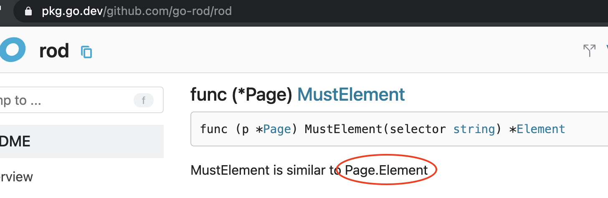

# أسئلة متكررة

## كيفية البحث عن الرموز في التعليقات أو الوثيقة؟

مثل الرمز `Page.Element` المعروض في لقطة الشاشة:

يمكنك القفز إليها عن طريق البحث عنها من هنا (اختصار لوحة المفاتيح هو `F`):

للمطورين ذوي الخبرة يرجى التحقق من [المصطلحات](https://github.com/go-rod/rod/blob/master/.github/CONTRIBUTING.md#terminology).
