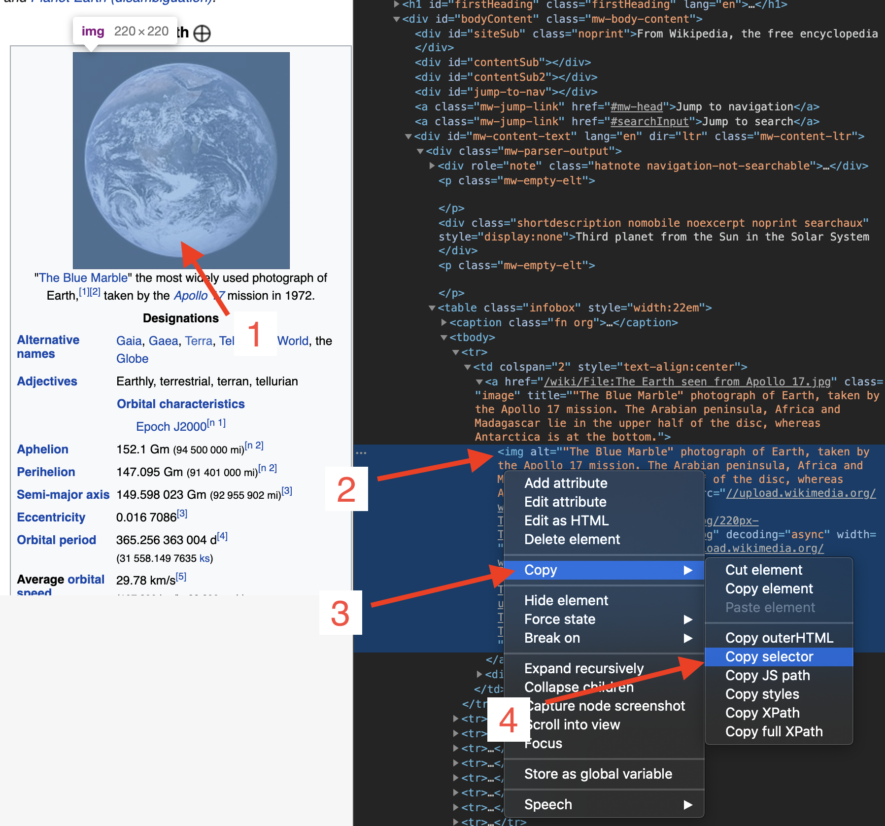

# ابدأ مع الرود

## المتطلبات

[جولانغ](https://golang.org/) هو الشرط الوحيد، لا تحتاج حتى إلى معرفة أي شيء عن HTML.

إذا كنت لم تستخدم جولانغ، [قم بتثبيته](https://golang.org/doc/install) ويمكنك إتقانه خلال ساعات: [جولة الذهاب](https://tour.golang.org/welcome).

## البرنامج الأول

دعونا نستخدم Rod لفتح صفحة وأخذ لقطة للشاشة، أولا، أنشئ ملف "main.go" مع المحتوى أدناه:

```go
استيراد الحزمة الرئيسية

"github.com/go-rod/rod"

func main() {
    صفحة := rod.New().MustConnect().MustPage("https://www.wikipedia.org/")
    page.MustWaitLoad().MustScreenshot("a.png")
}
```

يقوم `rod.New` بإنشاء كائن المتصفح، و `MustConnect` بإطلاق و الاتصال بالمتصفح. `MustPage` ينشئ كائن الصفحة، إنه مثل علامة تبويب الصفحة في المتصفح. `MustWaitLoad` ينتظر الصفحة بشكل كامل. `MustScreenلقة` تأخذ لقطة شاشة من الصفحة.

إنشاء وحدة:

```bash
انتقل إلى env -w GOPROXY=https://goproxy.io,مباشرة
انتقل إلى Mod init learn-rod
انتقل إلى Mod tidy
```

تشغيل الوحدة:

```bash
إذهب للتشغيل.
```

سيخرج البرنامج لقطة شاشة "a.png" مثل تلك أدناه:


## انظر إلى ما تحت التشكيلة

للمطورين الأقدم ، يمكنك تخطي كل شيء وقراءة هذا الملف: [رابط](https://github.com/go-rod/rod/blob/master/examples_test.go).

بشكل افتراضي، سيقوم الرود بتعطيل واجهة المستخدم للمتصفح لتعظيم الأداء. ولكن عند تطوير مهمة التشغيل الآلي عادة ما نهتم أكثر بسهولة تصحيح الأخطاء. يوفر رود الكثير من الحلول لمساعدتك على تصحيح الكود البرمجي.

دعونا ننشئ ملف تهيئة ".rod" تحت دليل العمل الحالي. المحتوى هو:

```txt
عرض
```

وهذا يعني "إظهار واجهة المتصفح على المقدمة". قبل تشغيل الوحدة مرة أخرى، دعونا نلحق `time.Sleep(وقت). ون)` حتى نهاية الكود البرمجي حتى لا يكون سريعا جدا لأعيننا لكي نلمس ذلك الكود رمز "الرئيسي". o" يصبح:

```go
استيراد الحزمة الرئيسية

(
    "الوقت"

    "github.com/go-rod/rod"
)

func main() {
    صفحة := rod.New().MustConnect().MustPage("https://www.wikipedia.org/")
    page.MustWaitLoad().MustScreenshot("png")
    time.Sleep(time.Hour)
}
```

إذا قمت بتشغيل الوحدة مرة أخرى، يجب أن ترى متصفح مثل هذا:


اضغط على [CTRL + C](https://en.wikipedia.org/wiki/Control-C) على لوحة المفاتيح لإيقاف البرنامج.

## الإدخال والنقر

دعونا نجعل الموقع أوتوماتيكياً للبحث عن الكلمة الرئيسية "الأرض". قد يحتوي الموقع على العديد من حقول الإدخال أو الأزرار، نحن بحاجة إلى أن نخبر البرنامج الذي يجب التلاعب به. عادة ما نستخدم [Devtools](https://developers.google.com/web/tools/chrome-devtools/) لمساعدتنا في تحديد مكان العنصر الذي نريد التحكم فيه. دعونا نلحق تكوين جديد إلى ملف ".rod" لتمكين أدوات Devtools، الآن يصبح:

```txt
show
devtools
```

تشغيل "الرئيسي". o" مرة أخرى، نقل الفأرة إلى حقل الإدخال وانقر بالزر الأيمن فوقه، سترى قائمة السياقات، ثم انقر فوق "تفحص":


يجب أن ترى `<مدخل id="مدخل البحث` مثل أدناه:


انقر بالزر الأيمن لنسخ [محدد css](css-selector.md) مثل الصورة أعلاه. المحتوى على الحافظة الخاصة بك سيكون "#searchInput". سوف نستخدمه لتحديد مكان العنصر لإدخال الكلمة الرئيسية. الآن "main.go" يصبح:

```go
استيراد الحزمة الرئيسية

(
    "الوقت"

    "github. om/go-rod/rod
)

func main() {
    صفحة := rod.New().MustConnect().MustPage("https://www.wikipedia. rg/").MustWindowFullscreen()

    page.MustElement("#searchInput").MustInput("الأرض")

    page.MustWaitLoad().MustScreenshot("a.png")
    time.Sleep(time.Hour)
}
```

يقوم `MustWindowFullscreen` بتعديل حجم نافذة المتصفح لجعلها أسهل لتصحيح الأخطاء. نحن نستخدم `MustElement` والمنتقي الذي قمنا بنسخه من لوحة الأدوات للحصول على العنصر الذي نريد التلاعب به. `MustElement` سينتظر تلقائياً حتى يظهر العنصر، حتى لا نحتاج إلى استخدام `MustWaitLoad` قبله. ثم نتصل بـ `MustInput` لإدخال الكلمة الرئيسية "الأرض" فيها. إذا قمت بإعادة تشغيل "main.go"، يجب أن ترى النتيجة تبدو كما هو أدناه:


مشابهة لحقل الإدخال دعنا نقر بزر البحث لنسخ المحدد له:


ثم أضف تعليمة برمجية للنقر على زر البحث، والآن يبدو "main.go":

```go
استيراد الحزمة الرئيسية

"github.com/go-rod/rod"

func main() {
    صفحة := rod.New().MustConnect().MustPage("https://www.wikipedia.org/").MustWindowFullscreen()

    page.MustElement("#searchInput").MustInput("earth")
    page.MustElement("#search-form > fieldset > button").MustClick()

    page.MustWaitLoad().MustScreenshot(".png")
}
```

إذا أعدنا تشغيل الوحدة، فإن "a.png" سوف تظهر نتيجة البحث:


## حركة بطيئة وتتبع بصري

إن العمليات الآلية أسرع من أن تتمكن أعين البشر من الصيد، لتصحيحها عادة نقوم بتمكين إعدادات التتبع البطيء والبصري، لنقوم بتحديث ". ح" الملف:

```txt
إظهار
ببطء =1s
تتبع
```

ثم أعد تشغيل الوحدة، الآن كل إجراء الآن سينتظر ثانية واحدة قبل تنفيذه. في الصفحة، سترى أثر التصحيح الذي تم إنشاؤه بواسطة Rod مثل أدناه:


كما ترون على زر البحث، سيقوم الرود بإنشاء مؤشر الماوس الوهمي.

في وحدة التحكم سترى سجل التتبع كما هو أدناه:

```txt
[rod] 2020/11/11 11:11:11 [eval] {"js":"rod.element","params":["#searchInput"]}
[rod] 2020/11/11 11:11 [eval] {"js": "rod. مقروء"، هذا":"input#searchInput"}
[rod] 20/11/11 11:11:11 [input] مرر إلى مشاهدة
[rod] 2020/11/11 11:11 [input] أرض المدخلات
[rod] 20/11/11 11:11 [eval] {"js": "قضية". lement","params":["#search-form > field set > button"]}
[rod] 20/11/11 11:11:11 [eval] {"js":"rod.visible","this":"button.pure-button. أوري-زر - بدائي تقدمي"}
[rod] 20/11/11 11:11:11 [input] التمرير إلى الشاشة
[rod] 20/11/11 11:11 [input] انقر بزر اليسار
```

## غير الملف ".rod"

": od" ملف هو مجرد اختصار لبعض واجهة برمجة التطبيقات الشائعة، يمكنك أيضًا تعيينها يدوياً في التعليمات البرمجية، مثل "بطيء"، التعليمات البرمجية لتعيينه مثل `قضيب. ew().SlowMotion(2 * time.Second)`. يمكنك أيضًا استخدام متغير البيئة لتعيينه، مثل Mac أو Linux: `rod=show go main.go`.

## الحصول على محتوى النص

يوفر Rod الكثير من الطرق المفيدة لاسترداد المحتويات من الصفحة.

دعونا نحاول الحصول على وصف للأرض ، استخدم نفس التقنية التي استخدمناها سابقا لنسخ منتقي من أدوات الدف:


الطريقة التي نستخدمها هي `MustText`، إليك التعليمة البرمجية الكاملة لها:

```go
استيراد الحزمة الرئيسية

(
    "fmt"

    "github. om/go-rod/rod/rod
)

Ch() func () {
    صفحة := قضيب. ew().MustConnect().MustPage("https://www.wikipedia.org/")

    page.MustElement("#searchInput"). ustInput("الأرض")
    page.MustElement("#search-form > field set > button").MustClick()

    el := صفحة. ustElement("#mw-content-text > div.mw-parser-output > p:nth-child(6)")
    fmt.Println(el.MustText())
}
```

إذا أعدنا تشغيل الوحدة، يجب أن نرى نواتج وحدة التحكم شيئًا مثل:

```txt
الأرض هي الكوكب الثالث من الشمس والجسم الفلكي الوحيد المعروف أنه يؤوي الحياة.
...
```

## الحصول على محتوى الصورة

نفس النص ، يمكننا أيضا الحصول على صور من الصفحة، دعونا نحصل على منتقي صورة الأرض ونستخدم `MustResource` للحصول على ثنائيات الصورة:



الرمز الكامل هو:

```go
استيراد الحزمة الرئيسية

(
    "github.com/go-rod/rod"
    "github. om/go-rod/rod/lib/utils
)

func main() {
    صفحة := rod. ew().MustConnect().MustPage("https://www.wikipedia.org/")

    page.MustElement("#searchInput").MustInput("earth")
    صفحة. ustElement("#search-form > fieldset > button").MustClick()

    el := page.MustElement("#mw-content-text > div.mw-parser-خرج > . nfobox > tbody > tr:nth-child(1) > td > a > img")
    _ = utils. utputFile("b.png", el.MustResource())
}
```

يجب أن يكون ملف الإخراج "b.png" كما يلي:


