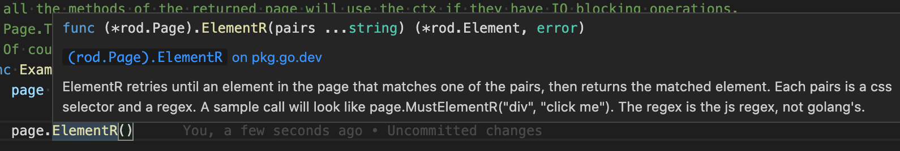

# محددات

يوفر رود الكثير من الطرق للحصول على العناصر. جميع أسمائهم مسبقة مع `MustElement` أو `عنصر`. إذا كنت تستخدم IDE بعد أن تكتب `عنصر`، فسوف ترى جميع المحددات المتاحة مثل أدناه:


إذا وضعت المؤشر فوق الطريقة، سوف ترى الكلب منها كما هو أدناه:



عادةً ، تحتاج فقط إلى بعض المعرفة الأساسية بـ [محدد CSS](css-selector) لتحقيق مهمة التشغيل الآلي التي تريد القيام بها. في بقية الوثائق سوف نستخدم محدد CSS فقط للحصول على عناصر من الصفحة.

## حسب محتوى النص

استخدم `ElementR` لمطابقة العناصر مع محتوى نصي محدد، مثل تحديد إدخال البحث في لقطة الشاشة أدناه:


```go
page.MustElementR("Input", "ابحث أو قفز")
page.MustElementR("input", "/click/i") // استخدم العلم "i" الذي لا يراعي كل حالة.
```

نظرًا لأننا نستخدم [js regex](https://developer.mozilla.org/en-US/docs/Web/JavaScript/Reference/Global_Objects/RegExp)، ليس علينا مطابقة سياق النص بأكمله. النص المراد تطابقه هو ما تراه بالفعل على الموقع، وليس الرمز المصدري، قارن 1 و 2 في لقطة الشاشة أدناه. يمكنك استخدام `نسخة` المساعد في Devtools لنسخ النص إلى الحافظة الخاصة بك (انظروا إلى 4):


## بواسطة XPath

منتقي CSS هو الطريقة الموصى بها لعناصر الاختيار، مثل لا يمكنك استخدام XPath لتحديد [نص تم إصداره](https://stackoverflow.com/questions/51992258/xpath-to-find-pseudo-element-after-in-side-a-div-element-with-out-any-content/51993454). ولكن قد يكون XPath في بعض الأحيان متشدداً للمبرمجين القادمين من لغات أخرى. استخدم `العنصر X` لXPath:

```go
page.MustElementX("//h2")
```

## بواسطة جافا سكريبت

إذا كان لديك استعلام معقد أو تريد استخدام محرك استعلام عالي المستوى، مثل [jQuery](https://jquery.com/):

```go
page.MustElementByJS(`() => jQuery('option:selected')[0]`)
```

في الواقع، إذا قمت بالتحقق من شفرة المصدر الخاصة بالمحددات الأخرى، مثل `العنصر` أو `العنصر R`، جميعها مبنية على `عنصر ByJS`و و `عنصر ByJS` مبني على صفحة `. تقييم`، لمزيد من التفاصيل حول كيفية تقييم js، تحقق من [Javascript Runtime](/javascript-runtime.md). عادةً ما تستخدم `ElementByJS` لإنشاء محدد خاص بك لتمديد رود.

## حدد قائمة العناصر

أسماء الطرق للحصول على عناصر متعددة كلها مسبقة مع `MustElements` أو `العناصر`. أحد الاختلافات الرئيسية بين محدد واحد ومحدد متعدد هو اختيار واحد سينتظر عنصر ليظهر. إذا لم يجد منتقي متعدد أي شيء، فإنه سوف يعيد على الفور قائمة فارغة.

## شجرة العناصر المتداولة

هناك أيضًا بعض المحددات المفيدة لتحديد العناصر داخل العنصر أو حوله، مثل `MustParent`, `MustNext`, `Mustvious`, الخ.

إليك مثال على كيفية استخدام مختلف المحددات لاسترداد المحتويات من الصفحة:

```go
// على صفحة رائعة - الذهاب ، العثور على القسم القسم ،
// / واستعادة المشاريع المرتبطة من الصفحة.
تمسك main() {
    صفحة := rod.New().MustConnect().MustPage("https://github.com/avelino/awesome-go")

    قسم := page.MustElementR("p", "Selenium and المتصفح"). ustNext()

    / / احصل على عناصر فرعية من عنصر
    مشروعات := قسم. ustElements("li")

    لـ _، المشروع := نطاق المشاريع {
        رابط := مشروع. ustElement("a")
        تسجيل الدخول. rintf(
            "المشروع %s (%s): '%s'", الرابط
            . رابط ustText(),
            . مشروع ustProperty("href")،
            . ustText(),
        )
    }
}
```

## الحصول على العناصر من iframes

على سبيل المثال، نحن نريد الحصول على الزر من الإطارات الداخلية المتداخلة:


ستبدو التعليمات البرمجية كالتالي:

```go
frame01 := page.MustElement("iframe").MustFrame()
iframe02 := iframe01.MustElement("iframe").MustFrame()
frame02.MustElement("button")
```

## البحث عن العناصر

هناك مساعِد قوي آخر للحصول على عناصر، `MustSearch`. إنه أقل دقة من المحددات المذكورة أعلاه، ولكن من المفيد إذا كنت تريد الحصول على عناصر من الإطارات المتداخلة العميقة أو الأقطاب الظلى.

الوظيفة هي نفس وظيفة البحث في [Devtools' عن العقد](https://developers.google.com/web/tools/chrome-devtools/dom#search)، يمكنك استخدامه لمعرفة ما هي الكلمة الرئيسية التي تريد استخدامها لتحديد العنصر الذي تريده، مثل لقطة الشاشة أدناه:


للحصول على نفس العنصر من [الحصول على العناصر من iframes](#get-elements-from-iframes)، يمكننا ببساطة البرمجة مثل هذا:

```go
الصفحةe.MustSearch("الزر")
```

## محددات السباق

يشجّع رود الأتمتة الخالية من النوم للحد من النكش. عندما يكون للإجراء نتائج متعددة، لا نستخدم النوم في انتظار إعادة توجيه الصفحة أو تسويتها. على سبيل المثال، عندما نقوم بتسجيل الدخول إلى صفحة، كلمة المرور قد تكون غير صحيحة، نريد التعامل مع النجاح والفشل بشكل منفصل. يجب أن نتجنب التعليمات البرمجية كما هو أدناه:

```go
تموج الرئيسي() {
    صفحة := rod.New().MustConnect().MustPage("https://leetcode.com/accounts/login/")

    page.MustElement("#id_login").MustInput("username")
    page.MustElement("#id_password").MustInput("كلمة المرور").MustPress(input.Enter

    time.Sleep(10 * time.Second)// الرجاء تجنب استخدام الوقت.Sleep!

    if page.MustHas(". رمز المستخدم") {
        // طباعة اسم المستخدم بعد تسجيل الدخول بنجاح
        rintln(*el.MustAttribute("title"))
    } أخرى إذا كانت الصفحة. ustHas("[data-cy=sign-in-error]") {
        // عند خطأ اسم المستخدم أو كلمة المرور
        fmt. rintln(el.MustText())
    }
}
```

بدلاً من ذلك، يجب أن نبرمج مثل هذا:

```go
تمسك main() {
    صفحة := rod.New().MustConnect().MustPage("https://leetcode.com/accounts/login/")

    page.MustElement("#id_login").MustInput("username")
    صفحة. ustElement("#id_password").MustInput("كلمة المرور").MustPress(input.Enter)

    // سوف يستمر في التصويت حتى يجد أحد المحددين تطابقًا
    page.Race().Element(". av-user-icon-base").MustHandle(دالة (e *add. إتاحة) {
        / / طبع اسم المستخدم بعد تسجيل الدخول الناجح
        fmt. rintln(*e.MustAttribute("title"))
    }). "[data-cy=sign-in-error]").MustHandle(function) (e *rod. lement) {
        // عندما يكون اسم المستخدم أو كلمة المرور خاطئة
        الذعر (e. ustText())
    }).MustDo()
}
```
