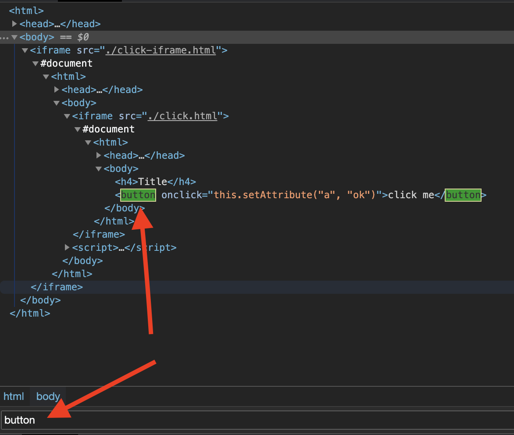

# Selektory

Bůh poskytuje spoustu metod, jak získat prvky. Všechna jejich jména jsou prefixována `MustElement` nebo `Element`. Pokud použijete IDE po zadání `Element`, uvidíte všechny dostupné selektory jako níže:


Pokud přejdete kurzorem přes metodu, uvidíte doc jako níže:


Obvykle potřebujete pouze nějaké základní znalosti [CSS Selector](css-selector) , abyste dosáhli automatizační úlohy, kterou chcete provést. Ve zbývající části dokumentace použijeme pouze CSS Selector pro získání prvků ze stránky.

## Podle textového obsahu

Použijte `ElementR` ke shodě prvků s konkrétním textovým obsahem, jako je výběr vyhledávacího vstupu v následujícím snímku:


```go
page.MustElementR("input", "Search or jump")
stránkae.MustElementR("input", "/click/i") // použijte příznak necitlivý na velikost písmen "i"
```

Protože používáme [js regex](https://developer.mozilla.org/en-US/docs/Web/JavaScript/Reference/Global_Objects/RegExp), nemusíme odpovídat celému textovému kontextu. Text ke shodě je to, co vidíte na webových stránkách, ne zdrojový kód, porovnat 1 a 2 v následujícím snímku. Můžete použít `kopii` nápovědu v Devtools ke zkopírování textu do schránky (podívejte se na 4):


## Podle XPath

CSS selektor je doporučeným způsobem výběru prvků, například nelze použít XPath pro výběr [vykresleného textu](https://stackoverflow.com/questions/51992258/xpath-to-find-pseudo-element-after-in-side-a-div-element-with-out-any-content/51993454). Někdy však XPath může být pro programátory pocházející z jiných jazyků moudřejší. Use the `ElementX` for XPath:

```go
page.MustElementX("//h2")
```

## Podle Javascriptu

Pokud máte složitý dotaz nebo chcete použít dotaz na vysoké úrovni, jako je [jQuery](https://jquery.com/):

```go
page.MustElementByJS(`() => jQuery('option:selected')[0]`)
```

Pokud kontrolujete zdrojový kód jiných selektorů, jako je `Element` nebo `ElementR`, všechny jsou založeny na `ElementByJS`, a `ElementByJS` je založeno na `stránce. hodnoťte`, pro více podrobností o hodnocení js, podívejte se na Javascript Runtime [](/javascript-runtime.md). Obvykle používáte `ElementByJS` k vytvoření vlastního selektoru pro rozšíření Rod.

## Vyberte seznam prvků

Názvy metod, jak získat více prvků, jsou všechny prefixovány `MustElements` nebo `Elements`. Jeden klíčový rozdíl mezi jedním selektorem a více selektory je jeden selektor, čeká na zobrazení prvku . Pokud vícenásobný selektor nic nenajdete, okamžitě vrátí prázdný seznam.

## Strom pohyblivých prvků

Existují také šikovné selektory pro výběr prvků uvnitř nebo kolem prvku, jako `MustParent`, `MustNext`, `MustPrevious`, atd.

Zde je příklad, jak používáme různé selektory k načtení obsahu ze stránky:

```go
// Na úžasné stránce, hledání zadané sekce
// a získávání přidružených projektů ze stránky.
func main() {
    page := rod.New().MustConnect().MustPage("https://github.com/avelino/awesome-go")

    section := page.MustElementR("p", "Selenium and browser control tools"). ustNext()

    // získání dětských prvků prvku
    projektů := sekce. ustElements("li")

    pro _, projekt := range projects {
        link := project. ustElement("a")
        log. rintf(
            „projekt %s (%s): '%s'",
            odkaz. ustText(),
            odkaz. projekt ustProperty("href"),
            . ustText(),
        )
    }
}
```

## Získat prvky z ifrám

Například musíme získat tlačítko z vnořených iframů:


Kód bude vypadat jako:

```go
frame01 := page.MustElement("iframe").MustFrame()
iframe02 := iframe01.MustElement("iframe").MustFrame()
frame02.MustElement("button")
```

## Hledat prvky

Další mocný pomocník pro získání prvků, `MustSearch`. Je to méně přesné než selektory uvedené výše, , ale je užitečné, pokud chcete získat prvky z hlubokých vnořených iframů nebo stínových domů.

Funkce je stejná jako [Devtools's Search for Nodes](https://developers.google.com/web/tools/chrome-devtools/dom#search), můžete jej použít k zjištění, jaké klíčové slovo použijete k výběru elementu, který chcete, jako je snímek obrazovky:



Chcete-li získat stejný prvek z [Získat prvky z iframů](#get-elements-from-iframes), můžeme jednoduše kódovat takto:

```go
page.MustSearch("tlačítko")
```

## Selektory závodů

Bůh povzbuzuje automatizaci bez spánku, aby omezil flakinky. Pokud má akce více výsledků, nepoužíváme spánek k čekání na přesměrování nebo nastavení. Například, když se přihlásíme, možná nesprávné heslo, chceme vyřešit úspěch a selhání zvlášť. Měli bychom se vyhnout kódu, jako je níže:

```go
func main() {
    stránka := rod.New().MustConnect().MustPage("https://leetcode.com/accounts/login/")

    page.MustElement("#id_login").MustInput("username")
    page.MustElement("#id_password").MustInput("password").MustPress(input.Enter)

    time.Sleep(10 * time.Second) // Nepoužívejte prosím čase.Sleep!

    na straně .MustHas(“. av-user-icon-base") {
        // print the username after successful login
        fmt. rintln(*el.MustAttribute("title"))
    } jinak na stránce. ustHas("[data-cy=sign-in-error]") {
        // when wrong username or password
        fmt. rintln(el.MustText())
    }
}
```

Namísto toho bychom měli kódovat takto:

```go
func main() {
    stránka := rod.New().MustConnect().MustPage("https://leetcode.com/accounts/login/")

    page.MustElement("#id_login").MustInput("username")
    stránka. ustElement("#id_password").MustInput("heslo").MustPress(input.Enter)

    // Bude pokračovat v průzkumu, dokud jeden selektor nenalezne zápas
    stránky.Race().Element(". av-user-icon-base").MustHandle(func(e *rod. lee) {
        // print the username after successfully login
        fmt. rintln(*e.MustAttribute("title"))
    }). lement("[data-cy=signin-error]").MustHandle(func(e *rod. lee) {
        // když je špatné uživatelské jméno nebo heslo
        panice. ustText())
    }).MustDo()
}
```
