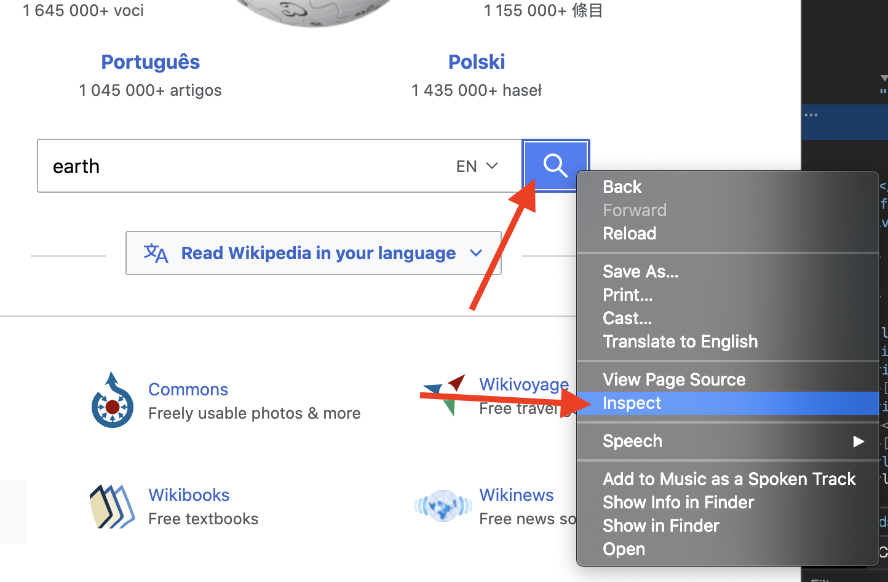

# Kom i gang med Rod

## Krav

[Golang](https://golang.org/) er det eneste krav, du behøver ikke engang at vide noget om HTML.

Hvis du aldrig har brugt Golang, [installere](https://golang.org/doc/install) det, og du kan mestre det i timer: [En tur i Go](https://tour.golang.org/welcome).

## Første program

Lad os bruge Rod til at åbne en side og tage et skærmbillede af den, først, oprette en "main.go" fil med indholdet nedenfor:

```go
pakke main

import "github.com/go-rod/rod"

func main() {
    side := rod.New().MustConnect().MustPage("https://www.wikipedia.org/")
    page.MustWaitLoad().MustScreenshot("a.png")
}
```

The `rod.New` create a browser object, the `MustConnect` launches and connects to a browser. The `MustPage` create a page object, it's like a page tab in the browser. (Automatic Copy) The `MustWaitLoad` wait for the page is fully loaded. (Automatic Copy) Det `MustScreenshot` tager et skærmbillede af siden.

Opret et modul:

```bash
go env -w GOPROXY=https://goproxy.io,direct
go mod init learn-rod
go mod tidy
```

Kør modulet:

```bash
go run .
```

Programmet vil output et skærmbillede "a.png" som den nedenfor:


## Se hvad der er under hætten

For senior udviklere, kan du springe alle og læse denne fil: [link](https://github.com/go-rod/rod/blob/master/examples_test.go).

Som standard vil Rod deaktivere browserens UI for at maksimere ydeevnen. Men når vi udvikler en automatisering opgave, vi plejer mere om den lette fejlfinding. Rod giver en masse løsninger til at hjælpe dig med at fejlfinde koden.

Lad os oprette en ".rod" config fil under den aktuelle arbejdsmappe. Indholdet er:

```txt
vis
```

Det betyder "Vis browser UI på forgrunden". Før vi kører modulet igen, lad os tilføje `time.Sleep( tid. vores)` til slutningen koden, så det ikke vil være for hurtigt for vores øjne at fange den, koden for "main. o" bliver nu:

```go
pakke main

import (
    "time"

    "github.com/go-rod/rod"
)

func main() {
    side := rod.New().MustConnect().MustPage("https://www.wikipedia.org/")
    page.MustWaitLoad().MustScreenshot("a.png")
    time.Sleep(time.Time)
}
```

Hvis du kører modulet igen, skal du se en browser sådan her:


Tryk på [CTRL + C](https://en.wikipedia.org/wiki/Control-C) på tastaturet for at stoppe programmet.

## Input og klik

Lad os automatisere hjemmesiden for at søge efter søgeordet "jord". En hjemmeside kan have mange input felter eller knapper, vi har brug for at fortælle det program, som en til at manipulere. Normalt bruger vi [Devtools](https://developers.google.com/web/tools/chrome-devtools/) til at hjælpe os med at finde det element, vi ønsker at styre. Lad os tilføje en ny config til ".rod" filen for at aktivere Devtools, nu bliver det:

```txt
show
devtools
```

Kør "main. o" igen, flyt musen til input-feltet og højreklik over det, vil du se den sammenhængsafhængige menu, og klik derefter på "inspekt":


Du bør se `<input id="searchInput` som nedenfor:


Højreklik for at kopiere [CSS-vælgeren](css-selector.md) som billedet ovenfor. Indholdet på dit udklipsholder vil være "#searchInput". Vi vil bruge den til at finde elementet til at indtaste søgeordet. Nu "main.go" bliver:

```go
pakke main

import (
    "time"

    "github. om/go-rod/rod"
)

func main() {
    side := rod.New().MustConnect().MustPage("https://www.wikipedia. rg/").MustWindowFullscreen()

    page.MustElement("#searchInput").MustInput("jord")

    side.MustWaitLoad().MustScreenshot("a.png")
    time.Sleep(time.Time)
}
```

The `MustWindowFullscreen` resize the browser window to make it easier to debug. (Automatic Copy) Vi bruger `MustElement` og den vælger, vi kopierede fra Devtools-panelet for at få det element, vi ønsker at manipulere. `MustElementet` vil automatisk vente, indtil elementet vises, så vi ikke behøver at bruge `MustWaitLoad` før det. Så kalder vi `MustInput` for at indtaste søgeordet "jord" ind i det. Hvis du genkalder "main.go", bør du se resultatet se ud som nedenfor:


Svarende til input-feltet lad os højreklikke på knappen for at kopiere vælgeren for det:




Tilføj derefter koden for at klikke på søgeknappen, nu ser "main.go" ud:

```go
pakke main

import "github.com/go-rod/rod"

func main() {
    side := rod.New().MustConnect().MustPage("https://www.wikipedia.org/").MustWindowFullscreen()

    side.MustElement("#searchInput").MustInput("jord")
    page.MustElement("#search-form > felteret > knap").MustClick()

    side.MustWaitLoad().MustScreenshot("a.png")
}
```

Hvis vi gensender modulet, vil "a.png" vise søgeresultatet:


## Langsom bevægelse og visuelt spor

De automatiserede operationer er for hurtige til, at mennesket kan fange, for at debug dem, vi normalt aktivere slow-motion og visuelle spor configs, lad os opdatere ". od" fil:

```txt
vis
slow=1s
trace
```

Derefter omdirigere modulet, nu vil hver handling nu vente på 1 sekund før sin udførelse. På siden, vil du se debug trace genereret af Rod som nedenfor:


Som du kan se på søgeknappen, vil Rod oprette en mock mus markør.

På konsollen vil du se sporloggen som nedenfor:

```txt
[rod] 2020/11/11 11:11:11 [eval] {"js":"rod.element","params":["#searchInput"]}
[rod] 2020/11/11 11:11:11 [eval] {"js":"rod. isible" this":"input#searchInput"}
[rod] 2020/11/11 11:11:11 [input] rulle ind i view
[rod] 2020/11/11 11:11:11 [input] input earth
[rod] 2020/11/11 11:11:11 [eval] {"js":"rod. lement","params":["#search-form > fieldset > button"]}
[rod] 2020/11/11 11:11:11 [eval] {"js":"rod.visible","this":"button.pure-button. ure-button-primary-progressive"}
[rod] 2020/11/11 11:11:11 [input] rulle ind i visning
[rod] 2020/11/11 11:11:11 [input] venstre klik
```

## Andre end ".rod"-filen

Den ". od" filen er blot en genvej for nogle almindeligt anvendte API, du kan også manuelt indstille dem i kode, såsom "langsom", koden til at indstille det er som `stang. ew().SlowMotion(2 * gang.sekunder)`. Du kan også bruge en miljøvariabel til at indstille den, såsom på Mac eller Linux: `rod=show go main.go`.

## Hent tekstindhold

Rod giver masser af praktiske metoder til at hente indholdet fra siden.

Lad os prøve at få beskrivelsen af Jorden, bruge den samme teknik, som vi tidligere brugte til at kopiere vælgeren fra Devtools:


Den metode, vi bruger, er `MustText`, her er den fulde kode af det:

```go
pakke main

import (
    "fmt"

    "github. om/go-rod/rod"
)

func main() {
    side := stang. ew().MustConnect().MustPage("https://www.wikipedia.org/")

    page.MustElement("#searchInput"). ustInput("jord")
    side.MustElement("#search-form > felteret > knap").MustClick()

    el := side. ustElement("#mw-content-text > div.mw-parser-output > p:nth-child(6)")
    fmt.Println(el.MustText())
}
```

Hvis vi gensender modulet, bør vi se konsollens udgange noget i retning af:

```txt
Jorden er den tredje planet fra Solen og det eneste astronomiske objekt, der vides at havne livet.
...
```

## Hent billedindhold

Samme som get tekst, kan vi også få billeder fra siden, Lad os få vælgeren af Jordens billede og bruge `MustResource` til at få den binære af billedet:


Den fulde kode er:

```go
pakke main

import (
    "github.com/go-rod/rod"
    "github. om/go-rod/rod/lib/utils"
)

func main() {
    side := stang. ew().MustConnect().MustPage("https://www.wikipedia.org/")

    page.MustElement("#searchInput").MustInput("jord")
    side. ustElement("#search-form > fieldset > knap").MustClick()

    el := page.MustElement("#mw-content-text > div.mw-parser-output > tabel. nfobox > tbody > tr:nth-child(1) > td > a > img")
    _ = utils. utputFile ("b.png", el.MustResource())
}
```

Output- filen "b.png" skal være:


