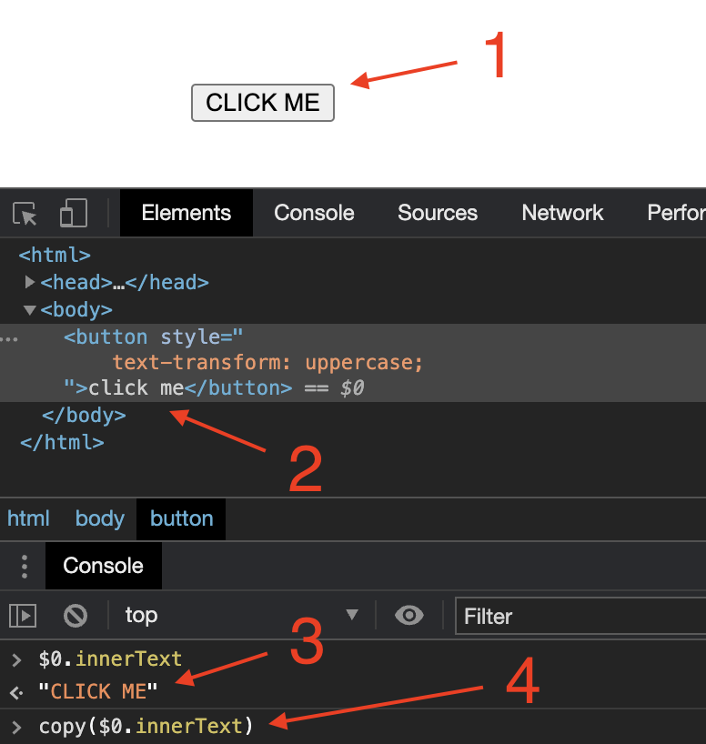

# Selektoren

Rod bietet viele Methoden, um Elemente zu erhalten. Their names are all prefixed with `MustElement` or `Element`. If you use an IDE after you type `Element`, you will see all the available selectors like below:


Wenn du mit dem Cursor über die Methode fährst, siehst du das Doc wie unten:


Normalerweise benötigen Sie nur ein paar grundlegende Kenntnisse von [CSS Selector](css-selector) um die Automatisierungsaufgabe zu erreichen, die Sie tun möchten. Im Rest der Dokumentation werden wir nur CSS Selector verwenden, um Elemente von der Seite zu erhalten.

## Nach Textinhalt

Verwende `ElementR` um Elemente mit bestimmten Textinhalten zu verknüpfen, wie zum Beispiel die Sucheingabe im folgenden Screenshot auszuwählen:


```go
page.MustElementR("input", "Suche oder springen")
Seite.MustElementR("input", "/click/i") // Groß-/Kleinschreibung "i" verwenden
```

Da wir [js regex](https://developer.mozilla.org/en-US/docs/Web/JavaScript/Reference/Global_Objects/RegExp)verwenden, müssen wir nicht mit dem gesamten Textkontext übereinstimmen. Der zu treffende Text ist das, was Sie tatsächlich auf der Website sehen, nicht der Quellcode, vergleiche 1 und 2 im untenstehenden Screenshot. Du kannst den `kopieren` Helfer in Devtools verwenden, um den Text in deine Zwischenablage zu kopieren (sieh dir die 4 an):



## Von XPath

CSS-Selektor ist die empfohlene Methode, um Elemente zu selektieren, wie zum Beispiel XPath nicht, um [gerenderten Text](https://stackoverflow.com/questions/51992258/xpath-to-find-pseudo-element-after-in-side-a-div-element-with-out-any-content/51993454) auszuwählen. Aber manchmal ist XPath für Programmierer, die aus anderen Sprachen kommen, handier. Nutze das `ElementX` für XPath:

```go
page.MustElementX("//h2")
```

## Mit Javascript

Wenn Sie eine komplexe Abfrage haben oder eine hochstufige Abfrage-Engine verwenden möchten, wie z.B. [jQuery](https://jquery.com/):

```go
page.MustElementByJS(`() => jQuery('option:selected')[0]`)
```

Actually, if you check the source code of other selectors, such as `Element` or `ElementR`, they are all based on `ElementByJS`, and `ElementByJS` is based on `Page.Evaluate`, for more details about how to evaluate js, check the [Javascript Runtime](/javascript-runtime.md). Normalerweise verwenden Sie `ElementByJS` um Ihren eigenen Selektor zu erweitern.

## Liste der Elemente auswählen

Die Namen der Methoden, um mehrere Elemente zu erhalten, sind alle mit `MustElements` oder `Elementen` vorangestellt. One key difference between a single-selector and a multi-selector is the single-selector will wait for the element to appear. Wenn ein Multi-Selektor nichts findet, wird sofort eine leere Liste zurückgegeben.

## Elementbaum Traverse

There are also some handy selectors to select elements inside or around an element, such as `MustParent`, `MustNext`, `MustPrevious`, etc.

Hier ist ein Beispiel dafür, wie wir verschiedene Selektoren verwenden, um Inhalte von einer Seite abzurufen:

```go
// Auf genialer Seite finden Sie den angegebenen Sektor,
// und holen die zugehörigen Projekte von der Seite ab.
func main() {
    page := rod.New().MustConnect().MustPage("https://github.com/avelino/awesome-go")

    section := page.MustElementR("p", "Selenium and browser control tools"). ustNext()

    // ermittelt untergeordnete Elemente eines Elements
    Projekte := Abschnitt. ustElements("li")

    für _, project := range projects {
        link := project. ustElement("a")
        Log. rintf(
            "Projekt %s (%s): '%s'",
            Link. ustText(),
            Link. ustProperty("href"),
            Projekt. ustText(),
        )
    }
}
```

## Elemente von iframes abrufen

Zum Beispiel wollen wir den Button von den verschachtelten iframes bekommen:


Der Code wird wie folgt aussehen:

```go
frame01 := page.MustElement("iframe").MustFrame()
iframe02 := iframe01.MustElement("iframe").MustFrame()
frame02.MustElement("button")
```

## Elemente suchen

Es gibt einen anderen mächtigen Helfer, um Elemente zu erhalten, die `MustSearch`. It's less precise than the selectors mentioned above, but it's handy if you want to get elements from deep nested iframes or shadow-doms.

The functionality is the same as the [Devtools' Search for nodes](https://developers.google.com/web/tools/chrome-devtools/dom#search), you can use it to find out what keyword to use to select the element you want, like the screenshot below:


Um das gleiche Element von [zu erhalten, erhalten Sie Elemente von iframes](#get-elements-from-iframes), können wir einfach so programmieren:

```go
page.MustSearch("Button")
```

## Rennenselektoren

Rod ermutigt die schlaffreie Automatisierung, um die Flakiness zu reduzieren. Wenn eine Aktion mehrere Ergebnisse hat, verwenden wir nicht den Schlaf, um darauf zu warten, dass die Seite weitergeleitet oder sich beruhigt. Zum Beispiel, wenn wir eine Seite einloggen, vielleicht das Passwort falsch, wollen wir den Erfolg und Misserfolg separat zu behandeln. Wir sollten Code wie unten vermeiden:

```go
func main() {
    Seite := rod.New().MustConnect().MustPage("https://leetcode.com/accounts/login/")

    page.MustElement("#id_login").MustInput("username")
    page.MustElement("#id_password").MustInput("password").MustPress(input.Enter)

    time.Sleep(10 * time.Second) // Bitte vermeide die Verwendung von time.Sleep!

    if page.MustHas(". av-user-icon-base") {
        // Den Benutzernamen nach erfolgreichem Login drucken
        fmt. rintln(*el.MustAttribute("title"))
    } Anderer, wenn Seite. ustHas("[data-cy=sign -in-error]") {
        // wenn falscher Benutzername oder Passwort
        fmt. rintln(el.MustText())
    }
}
```

Stattdessen sollten wir dies kodieren:

```go
func main() {
    Seite := rod.New().MustConnect().MustPage("https://leetcode.com/accounts/login/")

    page.MustElement("#id_login").MustInput("username")
    Seite. ustElement("#id_password").MustInput("password").MustPress(input.Enter)

    // Es wird die Umfrage, bis ein Selektor ein Match gefunden hat,
    page.Race().Element(". av-user-icon-base").MustHandle(func(e *rod. lement) {
        // Den Benutzernamen nach erfolgreichem Login ausdrucken
        fmt. rintln(*e.MustAttribute("title"))
    }). lement("[data-cy=sign-in-error]").MustHandle(func(e *rod. lement) {
        // wenn falscher Benutzername oder Passwort
        panic(e. ustText())
    }).MustDo()
}
```
