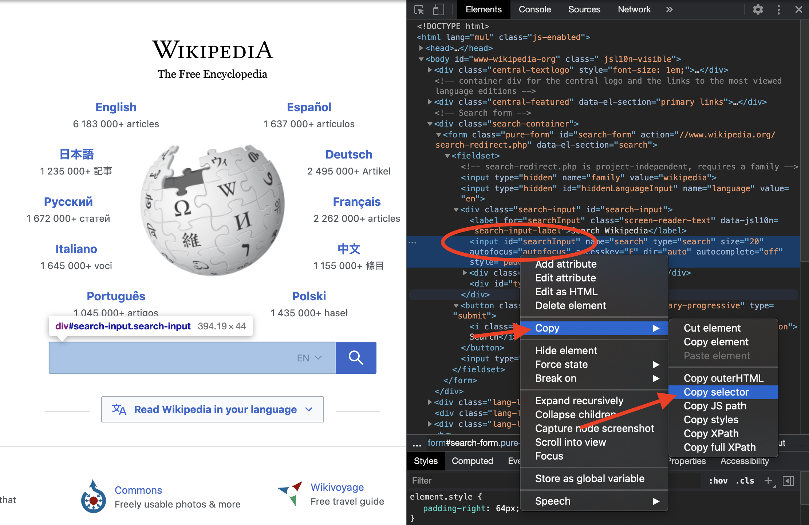
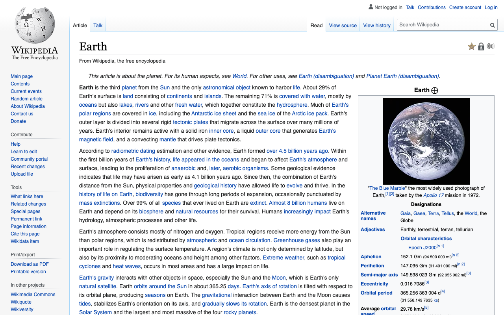

# Ξεκινήστε με Rod

## Απαιτήσεις

[Golang](https://golang.org/) είναι η μόνη απαίτηση, δεν χρειάζεται καν να γνωρίζετε τίποτα για HTML.

Αν δεν έχετε χρησιμοποιήσει ποτέ το Golang, [εγκαταστήστε το](https://golang.org/doc/install) και μπορείτε να το κυριαρχήσετε σε ώρες: [Μια περιοδεία του Go](https://tour.golang.org/welcome).

## Πρώτο πρόγραμμα

Ας χρησιμοποιήσουμε το Rod για να ανοίξουμε μια σελίδα και να λάβουμε ένα στιγμιότυπο οθόνης, πρώτα, δημιουργήστε ένα αρχείο "main.go" με το παρακάτω περιεχόμενο:

```go
package main

import "github.com/go-rod/rod"

func main() {
    page := rod.New().MustConnect().MustPage("https://www.wikipedia.org/")
    page.MustWaitLoad().MustScreenshot("a.png")
}
```

Η `rod.New` δημιουργεί ένα αντικείμενο περιήγησης, το `MustConnect` ξεκινά και συνδέεται με ένα πρόγραμμα περιήγησης. Το `MustPage` δημιουργεί ένα αντικείμενο σελίδας, είναι σαν μια καρτέλα σελίδας στο πρόγραμμα περιήγησης. Το `MustWaitLoad` περιμένει για τη σελίδα είναι πλήρως φορτωμένο. Το `MustScreenshot` λαμβάνει ένα στιγμιότυπο οθόνης της σελίδας.

Δημιουργία ενότητας:

```bash
πήγαινε env -w GOPROXY=https://goproxy.io,direct
go mod init learn-rod
go mod tidy
```

Εκτέλεση της ενότητας:

```bash
πήγαινε να τρέξεις .
```

Το πρόγραμμα θα παράγει ένα στιγμιότυπο οθόνης "a.png" όπως αυτό που ακολουθεί:


## Δείτε τι είναι κάτω από την κουκούλα

Για ανώτερους προγραμματιστές, μπορείτε να παραλείψετε όλους και να διαβάσετε αυτό το αρχείο: [σύνδεσμος](https://github.com/go-rod/rod/blob/master/examples_test.go).

Από προεπιλογή, η ράβδος θα απενεργοποιήσει το UI του προγράμματος περιήγησης για να μεγιστοποιήσει την απόδοση. Αλλά όταν αναπτύσσουμε μια εργασία αυτοματισμού που συνήθως νοιάζονται περισσότερο για την ευκολία του εντοπισμού σφαλμάτων. Rod παρέχει πολλές λύσεις για να σας βοηθήσει να αποσφαλματώσετε τον κώδικα.

Ας δημιουργήσουμε ένα αρχείο ρύθμισης ".rod" κάτω από τον τρέχοντα κατάλογο εργασίας. Το περιεχόμενο είναι:

```txt
εμφάνιση
```

Σημαίνει "εμφάνισε το UI του προγράμματος περιήγησης στο προσκήνιο". Πριν εκτελέσουμε ξανά το module, ας προσθέσουμε `time.Sleep(time. μας)` μέχρι το τέλος του κώδικα έτσι ώστε να μην είναι πολύ γρήγορο για τα μάτια μας να τον πιάσουν, ο κώδικας του «κύριο». ο" τώρα γίνεται:

```go
package main

import (
    "time"

    "github.com/go-rod/rod"
)

func main() Ş
    page := rod.New().MustConnect().MustPage("https://www.wikipedia.org/")
    page.MustWaitLoad().MustScreenshot("a.png")
    time.Sleep(time.Hour)
}
```

Αν εκτελέσετε ξανά την ενότητα, θα πρέπει να δείτε ένα πρόγραμμα περιήγησης όπως αυτό:


Πατήστε [CTRL + C](https://en.wikipedia.org/wiki/Control-C) στο πληκτρολόγιο για να σταματήσετε το πρόγραμμα.

## Είσοδος και κλικ

Ας αυτοματοποιήσουμε την ιστοσελίδα για να αναζητήσουμε τη λέξη-κλειδί "γη". Μια ιστοσελίδα μπορεί να έχει πολλά πεδία εισόδου ή κουμπιά, πρέπει να πούμε το πρόγραμμα που πρέπει να χειραγωγήσει. Συνήθως, χρησιμοποιούμε [Devtools](https://developers.google.com/web/tools/chrome-devtools/) για να μας βοηθήσουμε να εντοπίσουμε το στοιχείο που θέλουμε να ελέγξουμε. let's append a new config to the ".rod" file to enable the Devtools, now it becomes:

```txt
show
devtools
```

Εκτελέστε το "κύριο". o" πάλι, μετακινήστε το ποντίκι σας στο πεδίο εισόδου και κάντε δεξί κλικ πάνω του, θα δείτε το σχετικό μενού, στη συνέχεια κάντε κλικ στο "επιθεώρηση":


Θα πρέπει να δείτε το `<input id="searchInput` όπως παρακάτω:



Κάντε δεξί κλικ για να αντιγράψετε τον [επιλογέα css](css-selector.md) όπως η παραπάνω εικόνα. Το περιεχόμενο στο πρόχειρο σας θα είναι "#searchInput". Θα το χρησιμοποιήσουμε για να εντοπίσουμε το στοιχείο για να εισάγουμε τη λέξη-κλειδί. Τώρα το "main.go" γίνεται:

```go
package main

import (
    "time"

    "github. om/go-rod/rod"
)

func main() {
    σελίδα := rod.New().MustConnect().MustPage("https://www.wikipedia. rg/").MustWindowFullscreen()

    page.MustElement("#searchInput").MustInput("γείωση")

    σελίδα.MustWaitLoad().MustScreenshot("a.png")
    time.Sleep(time.Hour)
}
```

Το `MustWindowFullscreen` αλλάζει το μέγεθος του παραθύρου του περιηγητή για να γίνει ευκολότερη η αποσφαλμάτωση. Χρησιμοποιούμε το `MustElement` και τον επιλογέα που αντιγράψαμε από τον πίνακα Devtools για να αποκτήσουμε το στοιχείο που θέλουμε να χειραγωγήσουμε. Το `MustElement` θα περιμένει αυτόματα μέχρι να εμφανιστεί το στοιχείο, οπότε δεν χρειάζεται να χρησιμοποιήσουμε `MustWaitLoad` πριν από αυτό. Στη συνέχεια καλούμε το `MustInput` για να εισάγουμε τη λέξη κλειδί "γη" σε αυτό. Αν εκτελέσετε ξανά το "main.go", θα πρέπει να δείτε το αποτέλεσμα μοιάζει με παρακάτω:


Παρόμοια με το πεδίο εισαγωγής ας κάνουμε δεξί κλικ στο κουμπί αναζήτησης για να αντιγράψουμε τον επιλογέα για αυτό:


Στη συνέχεια, προσθέστε κώδικα για να κάνετε κλικ στο κουμπί αναζήτησης, τώρα το "main.go" φαίνεται:

```go
package main

import "github.com/go-rod/rod"

func main() mptom
    page := rod.New().MustConnect().MustPage("https://www.wikipedia.org/").MustWindowFullscreen()

    page.MustElement("#searchInput").MustInput("γείωση")
    page.MustElement("#search-form > fieldset > button").MustClick()

    page.MustWaitLoad().MustScreenshot("a.png")
}
```

Αν εκτελέσουμε ξανά το module, το "a.png" θα εμφανίσει το αποτέλεσμα αναζήτησης:



## Αργή κίνηση και οπτικό ίχνος

Οι αυτοματοποιημένες λειτουργίες είναι πολύ γρήγορες για τα ανθρώπινα μάτια για να πιάσουν, για να τους αποσφαλματώσουμε συνήθως ενεργοποιούμε τις παραμέτρους αργής κίνησης και οπτικού ίχνους, ας ενημερώσουμε το ". αρχείο od":

```txt
εμφάνισε
slow=1s
ίχνος
```

Στη συνέχεια, εκτελέστε ξανά την ενότητα, τώρα κάθε ενέργεια τώρα θα περιμένει για 1 δευτερόλεπτο πριν από την εκτέλεσή της. Στη σελίδα, θα δείτε το ίχνος αποσφαλμάτωσης που δημιουργείται από το Rod όπως παρακάτω:


Όπως μπορείτε να δείτε στο κουμπί αναζήτησης, Ράβδος θα δημιουργήσει ένα ψεύτικο ποντίκι δρομέα.

Στην κονσόλα θα δείτε το αρχείο καταγραφής ιχνών όπως παρακάτω:

```txt
[rod] 2020/11/11 11:11:11 [eval] {"js":"rod.element","params":["#searchInput"]}
[rod] 2020/11/11 11:11:11 [eval] {"js":"rod. Ορατό", this":"input#searchInput"}
[rod] 2020/11/11 11:11 [input] μετακινηθείτε στο view
[rod] 2020/11/11 11:11:11 [input] γη εισόδου
[rod] 2020/11/11 11:11:11 [eval] {"js":"ράβδος. lement","params":["#search-form > fieldset > button"]}
[rod] 2020/11/11 11:11:11 [eval] {"js":"rod.visible","this":"button.pure-button. ure-button-primary-progressive"}
[rod] 2020/11/11 11:11:11 [input] μετακινηθείτε στην προβολή
[rod] 2020/11/11 11:11:11 [input] αριστερό κλικ
```

## Εκτός από το αρχείο ".rod"

Το ". od" αρχείο είναι απλά μια συντόμευση για κάποια ευρέως χρησιμοποιούμενα API, μπορείτε επίσης να τα ρυθμίσετε χειροκίνητα στον κώδικα, όπως το "αργό", ο κώδικας για να τον ορίσετε είναι σαν ράβδος `. ew().SlowMotion(2 * time.Second)`. Μπορείτε επίσης να χρησιμοποιήσετε μια μεταβλητή περιβάλλοντος για να την ορίσετε, όπως σε Mac ή Linux: `rod=show go main.go`.

## Λήψη περιεχομένου κειμένου

Rod παρέχει πολλές εύχρηστες μεθόδους για να ανακτήσετε τα περιεχόμενα από τη σελίδα.

Ας προσπαθήσουμε να πάρουμε την περιγραφή της Γης, να χρησιμοποιήσουμε την ίδια τεχνική που χρησιμοποιήσαμε προηγουμένως για να αντιγράψουμε τον επιλογέα από τους Προγραμματιστές:


Η μέθοδος που χρησιμοποιούμε είναι `MustText`, εδώ είναι ο πλήρης κώδικας της:

```go
package main

import (
    "fmt"

    "github. om/go-rod/rod"
)

func main() {
    σελίδα := ράβδος. ew().MustConnect().MustPage("https://www.wikipedia.org/")

    page.MustElement("#searchInput"). ustInput("γείωση")
    σελίδα.MustElement("#search-form > fieldset > button").MustClick()

    el := σελίδα. ustElement ("#mw-content-text > div.mw- parser- output > p: nth-child(6)")
    fmt.Println(el.MustText())
}
```

Αν εκτελέσουμε ξανά την ενότητα, θα πρέπει να δούμε την κονσόλα να εξάγει κάτι όπως:

```txt
Η Γη είναι ο τρίτος πλανήτης από τον Ήλιο και το μόνο αστρονομικό αντικείμενο που είναι γνωστό ότι φιλοξενεί τη ζωή.
...
```

## Λήψη περιεχομένου εικόνας

Όπως και η λήψη κειμένου, μπορούμε επίσης να πάρουμε εικόνες από τη σελίδα, let's get the selector of the Earth image and use `MustResource` to get the binary of the image:


Ο πλήρης κωδικός είναι:

```go
package main

import (
    "github.com/go-rod/rod"
    "github. om/go-rod/rod/lib/utils"
)

func main() {
    σελίδα := ράβδος. ew().MustConnect().MustPage("https://www.wikipedia.org/")

    page.MustElement("#searchInput").MustInput("Γη")
    σελίδα. ustElement ("#search-form > fieldset > button").MustClick()

    el := page.MustElement("#mw-content-text > div.mw-parser-output > table. nfobox > tbody > tr:nth-child(1) > td > a > img")
    _ = utils. utputFile("b.png", el.MustResource())
}
```

Το αρχείο εξόδου "b.png" πρέπει να είναι:


