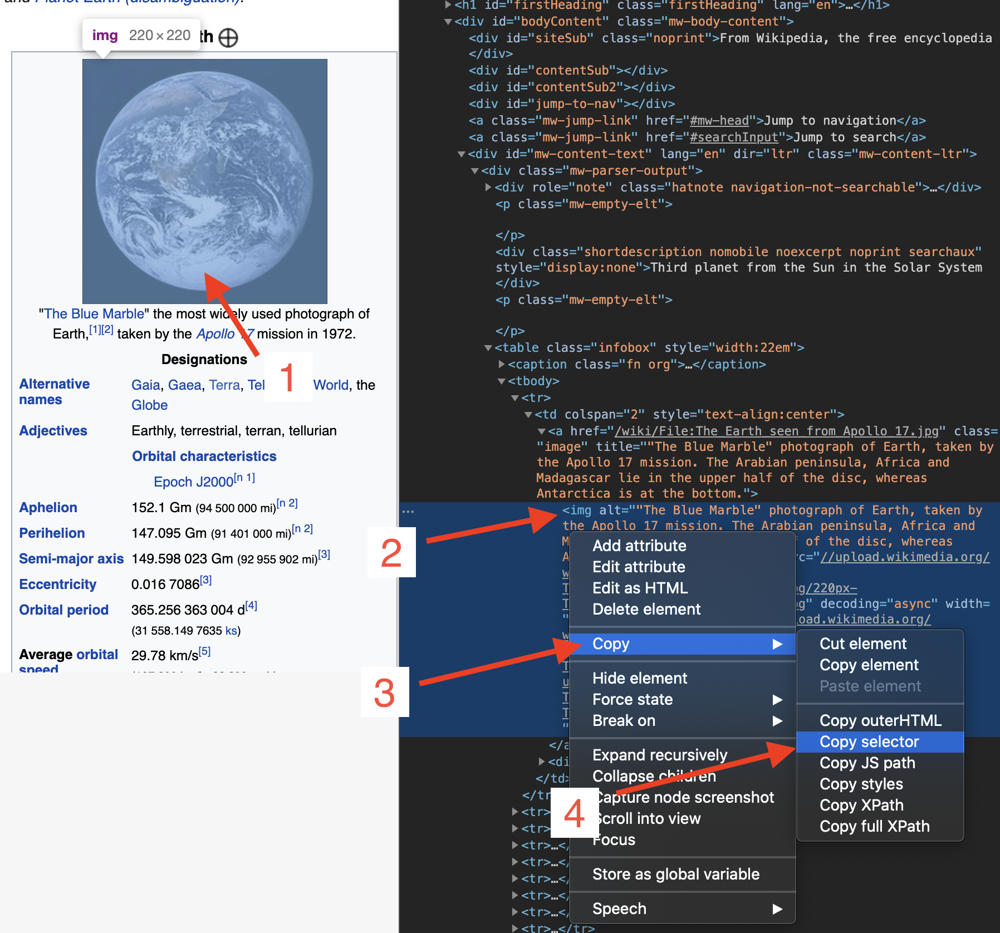

# Empezar con Rod

## Requisitos

[Golang](https://golang.org/) es el único requerimiento, ni siquiera necesitas saber nada sobre HTML.

Si nunca has usado Golang, [instala](https://golang.org/doc/install) y puedes dominarlo en horas: [Un tour de Ir](https://tour.golang.org/welcome).

## Primer programa

Vamos a usar Rod para abrir una página y tomar una captura de pantalla de ella, primero, crear un archivo "main.go" con el contenido de abajo:

```go
package main

import "github.com/go-rod/rod"

func main() {
    page := rod.New().MustConnect().MustPage("https://www.wikipedia.org/")
    page.MustWaitLoad().MustScreenshot("a.png")
}
```

El `rod.New` crea un objeto de navegador, el `MustConnect` se inicia y se conecta a un navegador. El `MustPage` crea un objeto de página, es como una pestaña de página en el navegador. The `MustWaitLoad` waits for the page is fully loaded. El `MustScreenshot` toma una captura de pantalla de la página.

Crear un módulo:

```bash
go env -w GOPROXY=https://goproxy.io,direct
go mod init learn-rod
go mod tidy
```

Ejecutar el módulo:

```bash
ir a correr .
```

El programa mostrará una captura de pantalla "a.png" como la siguiente:


## Mira lo que está debajo del capucha

Para desarrolladores superiores, puedes omitir todos y leer este archivo: [enlace](https://github.com/go-rod/rod/blob/master/examples_test.go).

De forma predeterminada, Rod desactivará la interfaz de usuario del navegador para maximizar el rendimiento. Pero cuando desarrollamos una tarea de automatización normalmente nos importa más la facilidad de depuración. Rod proporciona muchas soluciones para ayudarle a depurar el código.

Vamos a crear un archivo de configuración ".rod" en el directorio de trabajo actual. El contenido es:

```txt
ver
```

Significa "mostrar la interfaz de usuario del navegador en primer plano". Antes de volver a ejecutar el módulo, añadamos `time.Sleep(time. nuestro)` hasta el final el código para que no sea demasiado rápido para que nuestros ojos lo capturen, el código de "main. o" ahora se convierte:

```go
package main

import (
    "time"

    "github.com/go-rod/rod"
)

func main() {
    page := rod.New().MustConnect().MustPage("https://www.wikipedia.org/")
    page.MustWaitLoad().MustScreenshot("a.png")
    time.Sleep(time.Hour)
}
```

Si vuelves a ejecutar el módulo, deberías ver un navegador como esto:


Pulsa [CTRL + C](https://en.wikipedia.org/wiki/Control-C) en el teclado para detener el programa.

## Entrada y haga clic

Automatizemos el sitio web para buscar la palabra clave "tierra". Un sitio web puede tener muchos campos de entrada o botones, necesitamos decirle al programa cuál manipular. Generalmente, utilizamos [Devtools](https://developers.google.com/web/tools/chrome-devtools/) para ayudarnos a localizar el elemento que queremos controlar. añadiremos una nueva configuración al archivo ".rod" para activar Devtools, ahora se hace:

```txt
show
devtools
```

Ejecutar la "principal. o" otra vez, mueva el ratón al campo de entrada y haga clic derecho en encima de él, verá el menú contextual, luego haga clic en "inspeccionar":


Deberías ver la `<input id="searchInput` como a continuación:


Haga clic derecho para copiar el [selector cbr.](css-selector.md) como la imagen anterior. El contenido de su portapapeles será "#searchInput". Lo usaremos para localizar el elemento para introducir la palabra clave. Ahora el "main.go" se hace:

```go
paquete principal

import (
    "time"

    "github. om/go-rod/rod"
)

func main() {
    page := rod.New().MustConnect().MustPage("https://www.wikipedia. rg/").MustWindowFullscreen()

    page.MustElement("#searchInput").MustInput("earth")

    page.MustWaitLoad().MustScreenshot("a.png")
    time.Sleep(time.Hour)
}
```

`MustWindowFullscreen` cambia el tamaño de la ventana del navegador para facilitar la depuración. Utilizamos `MustElement` y el selector que hemos copiado desde el panel de Devtools para obtener el elemento que queremos manipular. El `MustElement` esperará automáticamente hasta que el elemento aparezca, así que no necesitamos usar `MustWaitLoad` antes de él. Luego llamamos a la `MustInput` para introducir la palabra clave "tierra" en ella. Si vuelves a ejecutar el "main.go", deberías ver el resultado que aparece a continuación:


Similar al campo de entrada vamos a hacer clic derecho en el botón de búsqueda para copiar el selector para el:


Luego agregue el código para hacer clic en el botón de búsqueda, ahora el "main.go" se ve como:

```go
package main

import "github.com/go-rod/rod"

func main() {
    page := rod.New().MustConnect().MustPage("https://www.wikipedia.org/").MustWindowFullscreen()

    page.MustElement("#searchInput").MustInput("earth")
    page.MustElement("#search-form > fieldset > button").MustClick()

    page.MustWaitLoad().MustScreenshot("a.png")
}
```

Si volvemos a ejecutar el módulo, el "a.png" mostrará el resultado de la búsqueda:


## Traza visual y movimiento lento

Las operaciones automatizadas son demasiado rápidas para que los ojos humanos puedan capturar, para depurarlos normalmente habilite las configuraciones de rastreo lento y visual, actualicemos el ". od" archivo:

```txt
muestra
lento=1s
rastro
```

Luego vuelva a ejecutar el módulo, ahora cada acción ahora esperará 1 segundo antes de su ejecución. En la página, verás la traza de depuración generada por Rod como a continuación:


Como puedes ver en el botón de búsqueda, Rod creará un cursor de ratón simulado.

En la consola verás el registro de trazas como a continuación:

```txt
[rod] 2020/11/11 11:11:11 [eval] {"js":"rod.element","params":["#searchInput"]}
[rod] 2020/11/11 11:11:11 [eval] {"js":"vara. isible", this":"input#searchInput"}
[rod] 2020/11/11 11:11:11 [input] se desplaza en la vista
[rod] 2020/11/11 11:11:11 [input] input earth
[rod] 2020/11/11 11:11:11 [eval] {"js":"rod. lement","params":["#formulario de búsqueda > fieldset > button"]}
[rod] 2020/11/11 11:11:11 [eval] {"js":"rod.visible","this":"button.pure-button. ure-button-primary-progressive"}
[rod] 2020/11/11 11:11:11 [input] desplazamiento en la vista
[rod] 2020/11/11 11:11:11 [input] clic izquierdo
```

## Aparte del archivo ".rod"

El ". El archivo od" es sólo un acceso directo para algunas API comúnmente usadas, también puede configurarlas manualmente en código, como el "lento", el código para establecerlo es como `varilla. ew().SlowMotion(2 * time.Segundd)`. También puedes usar una variable de entorno para configurarla, como en Mac o Linux: `rod=show go main.go`.

## Obtener contenido de texto

Rod proporciona muchos métodos prácticos para recuperar el contenido de la página.

Intentemos obtener la descripción de la Tierra, utilicemos la misma técnica que previamente usamos para copiar el selector de las Herramientas:


El método que utilizamos es `MustText`, aquí está el código completo del mismo:

```go
paquete principal

import (
    "fmt"

    "github. om/go-rod/rod"
)

func main() {
    page := rod. ew().MustConnect().MustPage("https://www.wikipedia.org/")

    page.MustElement("#searchInput"). ustInput("terre")
    page.MustElement("#search-form > fieldset > button").MustClick()

    el := page. ustElement("#mw-content-text > div.mw-parser-output > p:nth-child(6)")
    fmt.Println(el.MustText())
}
```

Si volvemos a ejecutar el módulo, deberíamos ver las salidas de la consola algo como:

```txt
La Tierra es el tercer planeta del Sol y el único objeto astronómico conocido por albergar la vida.
...
```

## Obtener contenido de imagen

Igual que obtener texto, también podemos obtener imágenes de la página, Vamos a obtener el selector de la imagen de la Tierra y usar `MustResource` para obtener el binario de la imagen:



El código completo es:

```go
paquete principal

import (
    "github.com/go-rod/rod"
    "github. om/go-rod/rod/lib/utils"
)

func main() {
    page := rod. ew().MustConnect().MustPage("https://www.wikipedia.org/")

    page.MustElement("#searchInput").MustInput("tercia") página
    . ustElement("#formulario de búsqueda > fieldset > button").MustClick()

    el := page.MustElement("#mw-content-text > div.mw-parser-output > table. nfobox > tbody > tr:nth-child(1) > td > a > img")
    _ = utils. utputFile("b.png", el.MustResource())
}
```

El archivo de salida "b.png" debería ser:


