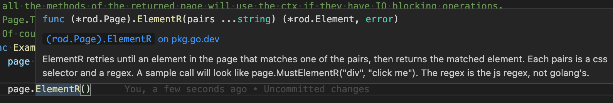

# Selectores

Rod proporciona muchos métodos para obtener elementos. Todos sus nombres tienen prefijo `MustElement` o `Elemento`. Si usas un IDE después de escribir `Element`, verás todos los selectores disponibles como a continuación:


Si pasa el cursor sobre el método, verá el documento como abajo:



Por lo general, solo necesitas algunos conocimientos básicos de [selector CSS](css-selector) para lograr la tarea de automatización que quieres hacer. En el resto de la documentación sólo usaremos el selector CSS para obtener elementos de la página.

## Por contenido de texto

Utilice `ElementR` para coincidir con elementos con contenido de texto específico, como seleccionar la entrada de búsqueda en la captura de pantalla de abajo:


```go
page.MustElementR("input", "Search or jump")
page.MustElementR("input", "/click/i") // utiliza la bandera "i"
```

Puesto que utilizamos [js regex](https://developer.mozilla.org/en-US/docs/Web/JavaScript/Reference/Global_Objects/RegExp), no tenemos que coincidir con todo el contexto de texto. El texto a coincidir es lo que realmente ves en el sitio web, no el código fuente, compara 1 y 2 en la captura de pantalla de abajo. Puedes utilizar el helper `copiar` en Devtools para copiar el texto al portapapeles (mira el 4):


## Por XPath

El selector CSS es la forma recomendada de seleccionar elementos, como no puede usar XPath para seleccionar [texto renderizado](https://stackoverflow.com/questions/51992258/xpath-to-find-pseudo-element-after-in-side-a-div-element-with-out-any-content/51993454). Pero a veces XPath puede ser handier para programadores procedentes de otros idiomas. Usa el `ElementX` para XPath:

```go
page.MustElementX("//h2")
```

## Por Javascript

Si tiene una consulta compleja o desea utilizar un motor de consulta de alto nivel, como [jQuery](https://jquery.com/):

```go
page.MustElementByJS(`() => jQuery('option:selected')[0]`)
```

En realidad, si comprueba el código fuente de otros selectores, como `Element` o `ElementR`, están basados en `ElementByJS`, y `ElementByJS` se basa en `Page. valuate`, para más detalles sobre cómo evaluar js, compruebe el [Javascript Runtime](/javascript-runtime.md). Generalmente, usas `ElementByJS` para crear tu propio selector para extender Rod.

## Seleccionar lista de elementos

Los nombres de los métodos para obtener múltiples elementos tienen prefijo `MustElements` o `Elementos`. Una diferencia clave entre un selector único y un multi-selector es que el selector único esperará a que aparezca el elemento . Si un selector múltiple no encuentra nada, devolverá inmediatamente una lista vacía.

## Árbol de elementos de recorrido

También hay algunos selectores útiles para seleccionar elementos dentro o alrededor de un elemento, tales como `MustParent`, `MustNext`, `MustPrevious`, etc.

Aquí hay un ejemplo de cómo utilizamos varios selectores para recuperar contenidos de una página:

```go
// En una página impresionante, encontrando la secta de sección especificada,
// y recuperando los proyectos asociados desde la página.
func main() {
    page := rod.New().MustConnect().MustPage("https://github.com/avelino/awesome-go")

    section := page.MustElementR("p", "Selenium and browser control tools"). ustNext()

    // obtiene elementos secundarios de un elemento
    projects := sección. ustElements("li")

    for _, project := range projects {
        link := project. ustElement("a")
        log. rintf(
            "proyecto %s (%s): '%s'",
            enlace. ustText(),
            enlace. ustProperty("href"),
            proyecto. ustText(),
        )
    }
}
```

## Obtener elementos de iframes

Por ejemplo, queremos obtener el botón de los iframes anidados:


El código se verá como:

```go
frame01 := page.MustElement("iframe").MustFrame()
iframe02 := iframe01.MustElement("iframe").MustFrame()
frame02.MustElement("button")
```

## Buscar elementos

Hay otro poderoso ayudante para obtener elementos, el `MustSearch`. Es menos preciso que los selectores mencionados arriba, pero es útil si quieres obtener elementos de iframes profundos anidados o domos de sombras.

La funcionalidad es la misma que la [Búsqueda de nodos](https://developers.google.com/web/tools/chrome-devtools/dom#search)de Devtools, puedes usarlo para averiguar qué palabra clave usar para seleccionar el elemento que quieras, como la captura de pantalla de abajo:


Para obtener el mismo elemento del [Obtener elementos de iframes](#get-elements-from-iframes), podemos simplemente codificar así:

```go
page.MustSearch("botón")
```

## Selectores de carreras

Rod alienta a la automatización sin dormir a reducir la falsedad. Cuando una acción tiene múltiples resultados, no usamos el sueño para esperar a que la página redireccione o se instale. Por ejemplo, cuando iniciamos sesión en una página, la contraseña tal vez incorrecta, queremos manejar el éxito y el fallo por separado. Deberíamos evitar el código como a continuación:

```go
func main() {
    page := rod.New().MustConnect().MustPage("https://leetcode.com/accounts/login/")

    page.MustElement("#id_login").MustInput("username")
    page.MustElement("#id_password").MustInput("password").MustPress(input.Enter)

    time.Sleep(10 * time.secondd) // ¡Por favor evita el uso de time.Sleep!

    if page.MustHas(". av-user-icon-base") {
        // imprime el nombre de usuario después de iniciar sesión con éxito
        fmt. rintln(*el.MustAttribute("title"))
    } más si la página. ustHas("[data-cy=sign-in-error]") {
        // cuando nombre de usuario o contraseña incorrectos
        fmt. rintln(el.MustText())
    }
}
```

En su lugar, deberíamos codificar así:

```go
func main() {
    page := rod.New().MustConnect().MustPage("https://leetcode.com/accounts/login/")

    page.MustElement("#id_login").MustInput("username") página
    . ustElement("#id_password").MustInput("password").MustPress(input.Enter)

    // Seguirá sondeando hasta que un selector haya encontrado una coincidencia
    page.Race().Element(". av-user-icon-base").MustHandle(func(e *rod. lement) {
        // imprime el nombre de usuario después de iniciar sesión con éxito
        fmt. rintln(*e.MustAttribute("title"))
    }). lement("[data-cy=sign-in-error]").MustHandle(func(e *rod. lement) {
        // cuando nombre de usuario o contraseña incorrectos
        pánico. ustText())
    }).MustDo()
}
```
