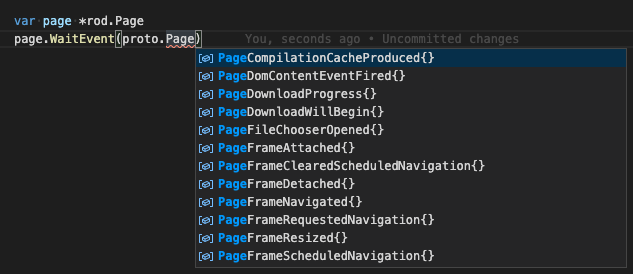

# Tapahtumat

Tapahtumat ovat toimintoja tai tapahtumia, jotka tapahtuvat ohjaamasi selaimessa, josta selain kertoo sinulle, jotta voit vastata niihin jollakin tavalla, jos haluat. Kuten silloin, kun annamme sivun navigoida uuteen URL, voimme tilata tapahtumat tietääksemme, milloin navigointi on valmis tai milloin sivu on suoritettu.

## Odota tapahtuma kerran

Yritetään navigoida sivulle ja odotetaan, kunnes sivun verkko on lähes identtinen:

```go
func main() {
    sivu := rod.New().MustConnect().MustPage()

    Odota := sivu.MustWaitNavigation()
    sivu.MustNavigate("https://www.wikipedia.org/")
    wait()
}
```

Käytämme `MustWaitNavigation` tilataksemme verkon käyttämättömän tapahtuman. Syy siihen, miksi tilaus on ennen navigointia ei ole sen jälkeen, koska navigoinnin käynnistävä koodi vie aikaa suoritettavaksi, sinä aikana tapahtuma on saattanut jo tapahtua. Kun `MustNavigoi` me kutsumme `odota` funktiota estääksesi koodin, kunnes seuraava verkon tyhjäkäynnillä tapahtuma tapahtuu.

Rod tarjoaa paljon muita tapahtumaauttajia, funktion nimet ovat valmiiksi `MustWait` tai `Odota`.

## Hanki tapahtuman tiedot

Joissakin tapahtumatyypeissä on tietoa itse tapahtumasta. Kuten me navigoida url ja käyttää tapahtumaa saada vastauksen tilakoodi navigointipyyntö:

```go
func main() {
    page := rod.New().MustConnect().MustPage()

    e := proto.NetworkResponseVastaanotettu {}
    odota := sivu.WaitEvent(&e)
    sivu.MustNavigate("https://www.wikipedia.org/")
    wait()

    fmt.Println(e.Response.Status)
}
```

## Käsittele useita tapahtumia

Jos haluat käsitellä kaikkia tyypillisiä tapahtumia, kuten kuunnella kaikki tapahtumat sivun konsoli tuotos, voimme tehdä jotain näin:

```go
go page.EachEvent(func(e *proto.RuntimeConsoleAPICalled) {
    fmt.Println(page.MustObjectsToJSON(e.Args))
})()
```

Tilata useita tapahtumatyyppejä samaan aikaan, kuten tilata `RuntimeConsoleAPICalled` ja `PageLoadEventFired`:

```go
go page.EachEvent(func(e *proto.RuntimeConsoleAPICalled) {
    fmt.Println(page.MustObjectsToJSON(e.Args))
}, func(e *proto.PageLoadEventFired) {
    fmt.Println("loaded")
})()
```

## Pysäytä tilaus

Mikä tahansa toiminto sauvassa, että lohkot voidaan peruuttaa [kontekstilla](context-and-timeout.md), se ei ole erityinen tapahtumille. Lisäksi voit myös lopettaa tapahtuman palaamalla totta tapahtuman käsittelijältä, esimerkiksi:

```go
odota := page.EachEvent(func(e *proto.PageLoadEventFired) (stop bool) {
    return true
})
sivu.MustNavigate("https://example.com")
wait()
```

Jos emme palaa totta, odotus odottaa `PageLoadEventFired` -tapahtumia ja estää ohjelman pysyvästi. Tämä on itse asiassa koodi kuinka `page.WaitEvent` toimii.

## Saatavilla olevat tapahtumat

Kaikki tapahtumatyypit toteuttavat `proto.Event` -käyttöliittymää, voit käyttää sitä löytääksesi kaikki tapahtumat. Yleensä IDE suodattaa käyttöliittymän kautta automaattisesti. Sellaisena kuin haluamme nähdä kaikki tapahtumat alla Page domain, voimme luoda tyhjän sivun objektin ja käyttää `WaitEvent( proto. venttiili)` luetella ja suodattaa kaikki tapahtumatyypit, kuten alla oleva kuvakaappaus:



Voit myös käyttää tätä [sivustoa](https://chromedevtools.github.io/devtools-protocol/tot/Page) tapahtumien selaamiseen.
