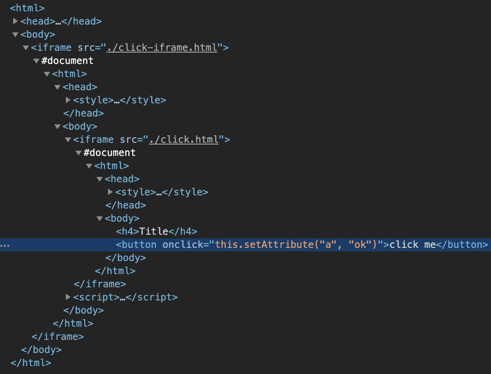

# Valitsimet

Rod tarjoaa paljon menetelmiä saada elementtejä. Heidän nimensä ovat kaikki valmiiksi `MustElement` tai `Element`. If you use an IDE after you type `Element`, you will see all the available selectors like below:


Jos osoitat kohdistimen menetelmän päälle, näet sen kohdan kuten alla:


Yleensä tarvitset vain joitakin perustietoja [CSS Selector](css-selector) saavuttaaksesi automaatiotehtävän jonka haluat tehdä. Muissa asiakirjoissa käytämme CSS Selector -sovellusta vain saadaksemme elementtejä sivulta.

## Tekstin sisällön mukaan

Käytä `ElementR` vastaamaan elementtejä, joilla on tietty tekstisisältö, kuten valitse haun syöte alla olevassa kuvakaappauksessa:


```go
sivu.MustElementR("input", "Search or jump")
sivu.MustElementR("input", "/click/i") // käytä tapaus-insensitive flag "i"
```

Koska käytämme [js regex](https://developer.mozilla.org/en-US/docs/Web/JavaScript/Reference/Global_Objects/RegExp), meidän ei tarvitse sovittaa yhteen koko tekstin kontekstin. Vastaava teksti on se, mitä näet verkkosivustolla, ei lähdekoodia, vertaa 1 ja 2 kuvakaappauksen alla. Voit käyttää `kopiota` auttajaa Devtools kopioida tekstin leikepöydälle (katso: 4):


## XPath

CSS-valitsin on suositeltu tapa valita elementtejä, kuten et voi käyttää XPath [renderöity teksti](https://stackoverflow.com/questions/51992258/xpath-to-find-pseudo-element-after-in-side-a-div-element-with-out-any-content/51993454). Mutta joskus XPath voi olla handier ohjelmoijille tulevat muista kielistä. Käytä `ElementX` XPath:ia varten:

```go
page.MustElementX("//h2")
```

## Javascriptin Mukaan

Jos sinulla on monimutkainen kysely tai haluat käyttää korkean tason kysely moottori, kuten [jQuery](https://jquery.com/):

```go
sivu.MustElementByJS(`jQuery('option:selected')[0]`)
```

Todellisuudessa jos tarkistat muiden valitsimien lähdekoodin, kuten `Element` tai `ElementR`, Ne kaikki perustuvat `ElementByJS`, ja `ElementByJS` perustuu `sivuun. arvostaa`, lisätietoja kuinka arvioida js, tarkista [Javascript Runtime](/javascript-runtime.md). Yleensä käytät `ElementByJS` luodaksesi oman valitsimesi pidentämään sauvaa.

## Valitse luettelo elementeistä

Niiden menetelmien nimet, joilla saadaan useita elementtejä, ovat valmiiksi `MustElements` tai `Elements`. Yksi keskeinen ero yhden valitsimen ja monen valitsimen välillä on yksivalitsimen odottaa, että elementti tulee näkyviin. Jos monivalitsin ei löydä mitään, se palauttaa välittömästi tyhjän listan.

## Traverse element tree

On myös joitakin käteviä valitsimia valita elementin sisällä tai sen ympärillä, kuten `MustParent`, `MustNext`, `MustPrevious`, jne.

Tässä on esimerkki siitä, miten käytämme eri valitsimia noutamaan sisältöä sivulta:

```go
// On awesome-go sivulla, löytää määritetyn osion osio,
// ja hakea liittyvät projektit sivulta.
func main() {
    page := rod.New().MustConnect().MustPage("https://github.com/avelino/awesome-go")

    § := page.MustElementR ("p", "Selenium and browser control tools"). ustNext()

    // saada lapset elementin
    projekteja := osio. ustElements("li")

    _, project := range projects {
        link := project. ustElement("a")
        logi. rintf(
            "project %s (%s): '%s'",
            linkki. ustText(),
            linkki. ustProperty("href"),
            projekti. ustText(),
        )
    }
}
```

## Hae elementtejä iframeista

Meillä on esimerkiksi halu saada nappi sisäkkäisistä iframeista:



Koodi näyttää, että

```go
frame01 := page.MustElement("iframe").MustFrame()
iframe02 := iframe01.MustElement("iframe").MustFrame()
frame02.MustElement("button")
```

## Etsi elementtejä

On toinen tehokas auttaja saada elementtejä, `MustSearch`. Se on vähemmän tarkka kuin edellä mainitut valitsimet , mutta se on kätevä jos haluat saada elementtejä syvältä iframeilta tai varjokupeilta.

Toiminto on sama kuin [Devtools' Search for nodes](https://developers.google.com/web/tools/chrome-devtools/dom#search), voit käyttää sitä selvittääksesi, mitä avainsanaa voit käyttää valitaksesi haluamasi elementin, kuten alla olevan kuvakaappauksen:


Saadaksesi saman elementin [Hanki elementtejä iframesista](#get-elements-from-iframes), voimme yksinkertaisesti koodata näin:

```go
sivu.MustSearch("painike")
```

## Rodun valitsimet

Rod kannustaa unettomaan automaatioon vähentää flakiness. Kun toiminnolla on useita tuloksia, emme käytä unta odottaaksemme sivun uudelleenohjaamista tai laskeutumista. Esimerkiksi, kun kirjaudumme sivulle, salasana voi olla virheellinen, haluamme käsitellä onnistumisen ja epäonnistumisen erikseen. Meidän pitäisi välttää koodia, kuten alla:

```go
func main() {
    sivu := rod.New().MustConnect().MustPage("https://leetcode.com/accounts/login/")

    sivu.MustElement("#id_login").MustInput("käyttäjänimi")
    sivu.MustElement("#id_password").MustInput("salasana").MustPress(input.Enter)

    aika.Sleep(10 * aika.Second) // Vältä aika.Sleep!

    jos sivu.MustHas(". av-user-icon-base") {
        // tulostaa käyttäjänimen onnistuneen kirjautumisen jälkeen
        fmt. rintln(*el.MustAttribute("otsikko"))
    } muu, jos sivu. ustHas("[data-cy=sign-in-error]") {
        // kun väärä käyttäjätunnus tai salasana
        fmt. rintln(el.MustText())
    }
}
```

Sen sijaan meidän pitäisi koodata näin:

```go
func main() {
    sivu := rod.New().MustConnect().MustPage("https://leetcode.com/accounts/login/")

    sivu.MustElement("#id_login").MustInput("käyttäjänimi")
    sivu. ustElement("#id_password").MustInput("salasana").MustPress(input.Enter)

    // Se pitää äänestyksen kunnes yksi valitsin on löytänyt ottelu
    sivu.Race().Element(". av-user-icon-base").MustHandle(func(e *rod. lement) {
        // tulosta käyttäjänimi onnistuneen kirjautumisen jälkeen
        fmt. rintln(*e.MustAttribute("title"))
    }). lement("[data-cy=sign-in-error]").MustHandle(func(e *rod. {
        // kun käyttäjätunnus tai salasana
        paniikki(e. ustText())
    }).MustDo()
}
```
