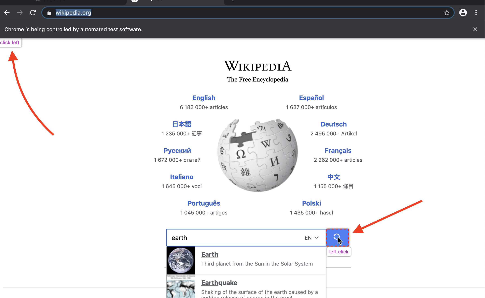

# Commencer avec le Tige

## Exigences

[Golang](https://golang.org/) est la seule exigence, vous n'avez même pas besoin de savoir quoi que ce soit sur le HTML.

Si vous n'avez jamais utilisé Golang, [installez](https://golang.org/doc/install) et vous pouvez le maîtriser en heures: [Une visite guidée](https://tour.golang.org/welcome).

## Premier programme

Utilisons Rod pour ouvrir une page et en prendre une capture d'écran, d'abord, créez un fichier "main.go" avec le contenu ci-dessous:

```go
package main

import "github.com/go-rod/rod"

func main() {
    page := rod.New().MustConnect().MustPage("https://www.wikipedia.org/")
    page.MustWaitStable().MustScreenshot("a.png")
}
```

Le `rod.New` crée un objet de navigateur, le `MustConnect` se lance et se connecte à un navigateur. Le `MustPage` crée un objet de page, c'est comme un onglet de page dans le navigateur. The `MustWaitStable` waits until the page rarely change. La `MustScreenshot` prend une capture d'écran de la page.

Créer un module :

```bash
go env -w GOPROXY=https://goproxy.io,direct
go mod init learn-rod
go mod tidy
```

Exécuter le module :

```bash
allez exécuter.
```

Le programme affichera une capture d'écran "a.png" comme celle ci-dessous:


## Voir ce qui est sous la capuche

Pour les développeurs seniors, vous pouvez sauter tout et lire ce fichier : [lien](https://github.com/go-rod/rod/blob/master/examples_test.go).

Par défaut, Rod désactivera l'interface utilisateur du navigateur pour maximiser les performances. Mais lors du développement d'une tâche d'automatisation, nous nous soucions plus de la facilité de débogage. Rod provides a lot of helpers to make your debugging experience great.

Before we run the module again, let's modify the code a little bit to make it easy to debug:

```go
package main

import (
    "time"

    "github.com/go-rod/rod"
)

func main() {
    page := rod.New().NoDefaultDevice().MustConnect().MustPage("https://www.wikipedia.org/")
    page.MustWindowFullscreen()
    page.MustWaitStable().MustScreenshot("a.png")
    time.Sleep(time.Hour)
}
```

The `NoDefaultDevice` and `MustWindowFullscreen` maximize the page viewport and browser window to make it more comfortable to overview the page. We added `time.Sleep(time.Hour)` at the end the code so that it won't be too fast for our eyes to catch it before the program exits.

Let's run the module again with the `-rod` command line flag:

```bash
go run . -rod=show
```

The `show` option means "show the browser UI on the foreground". Now you should see a browser like this:


To stop the program, let's go back to the terminal and press [CTRL + C](https://en.wikipedia.org/wiki/Control-C) on the keyboard.

## Saisie et clic

Let's automate the website to search the keyword "earth". A website may have many input fields or buttons, we need to tell the program which one to manipulate. Usually, we use [Devtools](https://developers.google.com/web/tools/chrome-devtools/) to help us locate the element we want to control. Let's append a new config to the `-rod` flag to enable the Devtools, now the command becomes:

```bash
go run . -rod=show,devtools
```

Run the command above, move your mouse to the input field and right-click above it, you will see the context menu, then click the "inspect":


You should see the `<input id="searchInput` like below:


Right-click to copy the [css selector](css-selector.md) like the image above. The content on your clipboard will be "#searchInput". We will use it to locate the element to input the keyword. Now the "main.go" becomes:

```go
package main

import (
    "time"

    "github.com/go-rod/rod"
)

func main() {
    browser := rod.New().MustConnect().NoDefaultDevice()
    page := browser.MustPage("https://www.wikipedia.org/").MustWindowFullscreen()

    page.MustElement("#searchInput").MustInput("earth")

    page.MustWaitStable().MustScreenshot("a.png")
    time.Sleep(time.Hour)
}
```

We use `MustElement` and the selector we copied from the Devtools panel to get the element we want to manipulate. The `MustElement` will automatically wait until the element appears, so we don't need to use `MustWaitStable` before it. Then we call the `MustInput` to input the keyword "earth" into it. If you rerun the "main.go", you should see the result looks like below:


Similar to the input field let's right-click the search button to copy the selector for it:


Then add code to click the search button, now the "main.go" looks like:

```go
package main

import (
    "time"

    "github.com/go-rod/rod"
)

func main() {
    browser := rod.New().MustConnect().NoDefaultDevice()
    page := browser.MustPage("https://www.wikipedia.org/").MustWindowFullscreen()

    page.MustElement("#searchInput").MustInput("earth")
    page.MustElement("#search-form > fieldset > button").MustClick()

    page.MustWaitStable().MustScreenshot("a.png")
    time.Sleep(time.Hour)
}
```

If we rerun the module, the "a.png" will show the search result:


## Ralentissement du mouvement et de la trace visuelle

The automated operations are too fast for human eyes to catch, to debug them we usually enable the slow-motion and visual trace configs, let's update run the module with extra options:

```bash
go run . -rod="show,slow=1s,trace"
```

Now every action now will wait for 1 second before its execution. On the page, you will see the debug trace generated by Rod like below:



As you can see on the search button, Rod will create a mock mouse cursor.

On console you will see the trace log like below:

```txt
[rod] 2020/11/11 11:11:11 [eval] {"js":"rod.element","params":["#searchInput"]}
[rod] 2020/11/11 11:11:11 [eval] {"js":"rod. isible", this":"input#searchInput"}
[rod] 2020/11/11 11:11:11 [input] faire défiler dans la vue
[rod] 2020/11/11 11:11:11 [input] terre d'entrée
[rod] 2020/11/11 11:11:11 [eval] {"js":"tr. élément","params":["#search-form > fieldset > button"]}
[rod] 2020/11/11 11:11 [eval] {"js":"rod.visible","this":"button.pure-button. ure-button-primary-progressive"}
[rod] 20/11/11/11 11:11:11 [input] défilez dans la vue
[rod] 2020/11/11 11:11:11 [input] clic gauche
```

## Other than the command line options

The the command line options is just a shortcut for some commonly used methods, you can also manually set them with code, such as the "slow", the code to set it is like `rod.New().SlowMotion(2 * time.Second)`.

## Obtenir le contenu du texte

Rod provides lots of handy methods to retrieve the contents from the page.

Let's try to get the description of the Earth, use the same technique we previously used to copy the selector from the Devtools:


The method we use is `MustText`, here's the full code of it:

```go
import du paquet main

(
    "fmt"

    "github. om/go-rod/rod"
)

func main() {
    page := rod. ew().MustConnect().MustPage("https://www.wikipedia.org/")

    page.MustElement("#searchInput"). ustInput("earth")
    page.MustElement("#search-form > fieldset > button").MustClick()

    el := page. ustElement("#mw-content-text > div.mw-parser-output > p:nth-child(6)")
    fmt.Println(el.MustText())
}
```

If we rerun the module, we should see the console outputs something like:

```txt
La Terre est la troisième planète du Soleil et le seul objet astronomique connu pour abriter la vie.
...
```

## Obtenir le contenu de l'image

Same as get text, we can also get images from the page, let's get the selector of the Earth image and use `MustResource` to get the binary of the image:


The full code is:

```go
import du paquet principal

(
    "github.com/go-rod/rod"
    "github. om/go-rod/lib/utils"
)

func main() {
    page := rod. ew().MustConnect().MustPage("https://www.wikipedia.org/")

    page.MustElement("#searchInput").MustInput("earth")
    page. ustElement("#search-form > fieldset > button").MustClick()

    el := page.MustElement("#mw-content-text > div.mw-parser-output > table. nfobox > tbody > tr:nth-child(1) > td > a > img")
    _ = utils. utputFile("b.png", el.MustResource())
}
```

The output file "b.png" should be:


