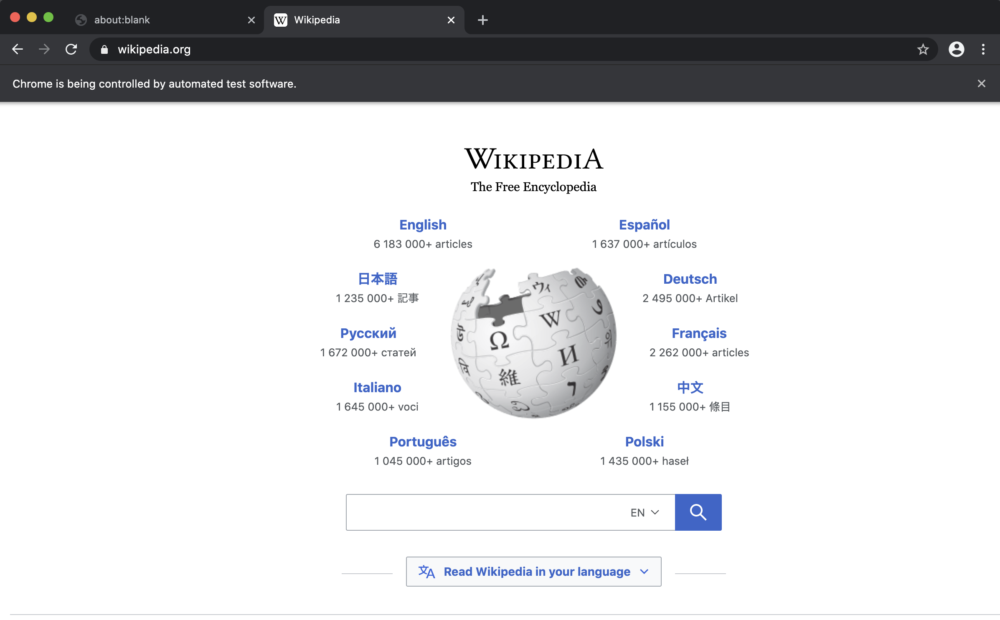

# Iniziare con Rod

## Requisiti

[Golang](https://golang.org/) è l'unico requisito, non devi nemmeno sapere nulla di HTML.

Se non hai mai usato Golang, [installalo](https://golang.org/doc/install) e puoi padroneggiare in ore: [Un tour di Go](https://tour.golang.org/welcome).

## Primo programma

Usiamo Rod per aprire una pagina e fare uno screenshot di esso, in primo luogo, creare un file "main.go" con il contenuto qui sotto:

```go
package main

import "github.com/go-rod/rod"

func main() {
    page := rod.New().MustConnect().MustPage("https://www.wikipedia.org/")
    page.MustWaitLoad().MustScreenshot("a.png")
}
```

La `rod.New` crea un oggetto del browser, il `MustConnect` avvia e si connette a un browser. La `MustPage` crea un oggetto pagina, è come una scheda pagina nel browser. Il `MustWaitLoad` attende che la pagina sia completamente caricata. Il `MustScreenshot` fa uno screenshot della pagina.

Crea un modulo:

```bash
go env -w GOPROXY=https://goproxy.io,direct
go mod init learn-rod
go mod tidy
```

Esegui il modulo:

```bash
vai a correre.
```

Il programma produrrà uno screenshot "a.png" come quello qui sotto:


## Vedi cosa c'è sotto il cofano

Per gli sviluppatori senior, puoi saltare tutti e leggere questo file: [link](https://github.com/go-rod/rod/blob/master/examples_test.go).

Per impostazione predefinita, Rod disabiliterà l'interfaccia utente del browser per massimizzare le prestazioni. Ma quando si sviluppa un'attività di automazione di solito ci interessa di più la facilità di debug. Rod fornisce un sacco di soluzioni per aiutare a debug il codice.

Creiamo un file di configurazione ".rod" nella directory di lavoro corrente. Il contenuto è:

```txt
mostra
```

Significa "mostrare l'interfaccia utente del browser sul primo piano". Prima di eseguire di nuovo il modulo, aggiungiamo `tempo.Sleep(tempo. nostro)` alla fine del codice in modo che non sia troppo veloce per i nostri occhi per catturarlo, il codice di "main. o" ora diventa:

```go
pacchetto main

import (
    "time"

    "github.com/go-rod/rod"
)

func main() {
    page := rod.New().MustConnect().MustPage("https://www.wikipedia.org/")
    page.MustWaitLoad().MustScreenshot("a.png")
    time.Sleep(time.Hour)
}
```

Se si esegue di nuovo il modulo, si dovrebbe vedere un browser come questo:



Premi [CTRL + C](https://en.wikipedia.org/wiki/Control-C) sulla tastiera per fermare il programma.

## Input e clic

Automatizziamo il sito web per cercare la parola chiave "terra". Un sito web può avere molti campi di input o pulsanti, abbiamo bisogno di dire al programma quale manipolare. Di solito, usiamo [Devtools](https://developers.google.com/web/tools/chrome-devtools/) per aiutarci a individuare l'elemento che vogliamo controllare. aggiungiamo una nuova configurazione al file ".rod" per abilitare il Devtools, ora diventa:

```txt
show
devtools
```

Eseguire il "main. o" ancora, spostare il mouse sul campo di input e fare clic con il tasto destro del mouse sopra di esso, si vedrà il menu di scelta rapida, quindi fare clic su "inspect":


Dovresti vedere il `<input id="searchInput` come sotto:


Click destro per copiare il selettore [css](css-selector.md) come l'immagine qui sopra. Il contenuto su gli appunti saranno "#searchInput". Lo useremo per individuare l'elemento per inserire la parola chiave. Ora il "main.go" diventa:

```go
pacchetto main

import (
    "time"

    "github. om/go-rod/rod"
)

func main() {
    page := rod.New().MustConnect().MustPage("https://www.wikipedia. rg/").MustWindowFullscreen()

    page.MustElement("#searchInput").MustInput("earth")

    page.MustWaitLoad().MustScreenshot("a.png")
    time.Sleep(time.Hour)
}
```

Il `MustWindowFullscreen` ridimensiona la finestra del browser per rendere più facile il debug. Usiamo `MustElement` e il selettore che abbiamo copiato dal pannello Devtools per ottenere l'elemento che vogliamo manipolare. Il `MustElement` aspetterà automaticamente fino a quando l'elemento apparirà, quindi non abbiamo bisogno di usare `MustWaitLoad` prima di esso. Poi chiamiamo il `MustInput` per inserire la parola chiave "terra" in esso. Se si riavvia il "main.go", si dovrebbe vedere il risultato sembra di seguito:


Simile al campo di input facciamo clic con il tasto destro del mouse sul pulsante di ricerca per copiare il selettore per esso:


Quindi aggiungere il codice per fare clic sul pulsante di ricerca, ora il "main.go" assomiglia:

```go
package main

import "github.com/go-rod/rod"

func main() {
    page := rod.New().MustConnect().MustPage("https://www.wikipedia.org/").MustWindowFullscreen()

    page.MustElement("#searchInput").MustInput("earth")
    page.MustElement("#search-form > fieldset > button").MustClick()

    page.MustWaitLoad().MustScreenshot("a.png")
}
```

Se riproduciamo il modulo, il "a.png" mostrerà il risultato della ricerca:


## Lento movimento e traccia visiva

Le operazioni automatizzate sono troppo veloci per catturare gli occhi umani, per debug loro di solito abilitare le configurazioni di traccia lenta e visiva, aggiorniamo il ". file od":

```txt
mostra
slow=1s
trace
```

Poi riavvia il modulo, ora ogni azione ora attenderà 1 secondo prima la sua esecuzione. Nella pagina, vedrai la traccia di debug generata da Rod come di seguito:


Come puoi vedere sul pulsante di ricerca, Rod creerà un cursore del mouse fittizio.

Sulla console vedrai il registro delle tracce come sotto:

```txt
[rod] 2020/11/11 11:11:11 [eval] {"js":"rod.element","params":["#searchInput"]}
[rod] 2020/11/11 11:11:11 [eval] {"js":"rod. isibile", this":"input#searchInput"}
[rod] 2020/11/11 11:11:11 [input] scorri in vista
[rod] 2020/11/11 11:11:11 [input] terra di ingresso
[rod] 2020/11/11 11:11:11 [eval] {"js":"rod. lement","params":["#search-form > fieldset > button"]}
[rod] 2020/11/11 11:11:11 [eval] {"js":"rod.visible","this":"button.pure-button. ure-button-primary-progressive"}
[rod] 2020/11/11 11:11:11 [input] scorri in vista
[rod] 2020/11/11 11:11:11 [input] click sinistro
```

## Altro che il file ".rod"

Il ". Il file od" è solo una scorciatoia per alcune API comunemente usate, puoi anche impostarle manualmente nel codice, come il "slow", il codice da impostare è come `rod. ew().SlowMotion(2 * tempo.Secondo)`. Puoi anche usare una variabile di ambiente per impostarla, come su Mac o Linux: `rod=show go main.go`.

## Ottieni contenuto testo

Rod fornisce un sacco di comodi metodi per recuperare i contenuti dalla pagina.

Cerchiamo di ottenere la descrizione della Terra, utilizzare la stessa tecnica che precedentemente usavamo per copiare il selettore dal Devtools:


Il metodo che utilizziamo è `MustText`, ecco il codice completo di esso:

```go
pacchetto main

import (
    "fmt"

    "github. om/go-rod/rod"
)

func main() {
    page := rod. ew().MustConnect().MustPage("https://www.wikipedia.org/")

    page.MustElement("#searchInput"). ustInput("earth")
    page.MustElement("#search-form > fieldset > button").MustClick()

    el := page. ustElement("#mw-content-text > div.mw-parser-output > p:nth-child(6)")
    fmt.Println(el.MustText())
}
```

Se riproduciamo il modulo, dovremmo vedere gli output della console qualcosa come:

```txt
La Terra è il terzo pianeta del Sole e l'unico oggetto astronomico conosciuto per la vita portuale.
...
```

## Ottieni contenuto immagine

Come ottenere testo, possiamo anche ottenere immagini dalla pagina, riceviamo il selettore dell'immagine Terra e usiamo `MustResource` per ottenere il binario dell'immagine:


Il codice completo è:

```go
pacchetto main

import (
    "github.com/go-rod/rod"
    "github. om/go-rod/rod/lib/utils"
)

func main() {
    page := rod. ew().MustConnect().MustPage("https://www.wikipedia.org/")

    page.MustElement("#searchInput").MustInput("earth")
    pagina. ustElement("#search-form > fieldset > button").MustClick()

    el := page.MustElement("#mw-content-text > div.mw-parser-output > tabella. nfobox > tbody > tr:nth-child(1) > td > a > img")
    _ = utils. utputFile("b.png", el.MustResource())
}
```

Il file di output "b.png" dovrebbe essere:


