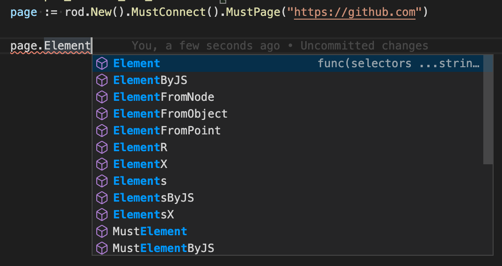

# Selettori

Rod fornisce un sacco di metodi per ottenere elementi. I loro nomi sono tutti prefissi con `MustElement` o `Element`. If you use an IDE after you type `Element`, you will see all the available selectors like below:



Se si passa il cursore sul metodo, si vedrà il documento di esso come di seguito:


Di solito, hai solo bisogno di una conoscenza di base di [CSS Selector](css-selector) per ottenere l'attività di automazione che vuoi fare. Nel resto della documentazione useremo solo CSS Selector per ottenere elementi dalla pagina.

## Per contenuto del testo

Usa `ElementR` per abbinare elementi con contenuti di testo specifici, come selezionare l'input di ricerca nella schermata sottostante:


```go
page.MustElementR("input", "Search or jump")
page.MustElementR("input", "/click/i") // utilizzare il contrassegno "i" insensibile alle maiuscole e minuscole
```

Dal momento che utilizziamo [js regex](https://developer.mozilla.org/en-US/docs/Web/JavaScript/Reference/Global_Objects/RegExp), non dobbiamo abbinare l'intero contesto del testo. Il testo da abbinare è quello che effettivamente vedi sul sito web, non il codice sorgente, confronta 1 e 2 nella schermata qui sotto. Puoi usare l'helper `copy` in Devtools per copiare il testo negli appunti (guarda i 4):


## Per XPath

Il selettore CSS è il modo consigliato per selezionare gli elementi di selezione, ad esempio non è possibile utilizzare XPath per selezionare [testo renderizzato](https://stackoverflow.com/questions/51992258/xpath-to-find-pseudo-element-after-in-side-a-div-element-with-out-any-content/51993454). Ma a volte XPath può essere handier per i programmatori provenienti da altre lingue. Usa `ElementX` per XPath:

```go
page.MustElementX("//h2")
```

## Per Javascript

Se hai una query complessa o vuoi usare un motore di query di alto livello, come [jQuery](https://jquery.com/):

```go
page.MustElementByJS(`() => jQuery('option:selected')[0]`)
```

In realtà, se si controlla il codice sorgente di altri selettori, come `Element` o `ElementR`, sono tutti basati su `ElementByJS`, e `ElementByJS` si basa su `Pagina. valuta`, per maggiori dettagli su come valutare js, controlla [Javascript Runtime](/javascript-runtime.md). Di solito, si utilizza `ElementByJS` per creare il proprio selettore per estendere Rod.

## Seleziona un elenco di elementi

I nomi dei metodi per ottenere più elementi sono tutti prefissi con `MustElements` o `Elements`. Una differenza chiave tra un selettore singolo e un selettore multiplo è il selettore singolo attenderà che l'elemento appaia. Se un multi-selettore non trova nulla, restituirà immediatamente una lista vuota.

## Traverse albero di elementi

Ci sono anche alcuni utili selettori per selezionare gli elementi all'interno o intorno ad un elemento, such as `MustParent`, `MustNext`, `MustPrevious`, etc.

Ecco un esempio di come utilizziamo vari selettori per recuperare contenuti da una pagina:

```go
// Nella pagina impressionante, trovare la sezione specificata,
// e recuperare i progetti associati dalla pagina.
func main() {
    page := rod.New().MustConnect().MustPage("https://github.com/avelino/awesome-go")

    section := page.MustElementR("p", "Selenium and browser control tools"). ustNext()

    // ottieni elementi figli di un elemento
    progetti := sezione. ustElements("li")

    for _, project := range projects {
        link := project. ustElement("a")
        log. rintf(
            "progetto %s (%s): '%s'",
            link. ustText(),
            link. ustProperty("href"),
            progetto. ustText(),
        )
    }
}
```

## Ottieni elementi da iframes

Ad esempio, abbiamo voglia di ottenere il pulsante dagli iframmi nidificati:


Il codice apparirà:

```go
frame01 := page.MustElement("iframe").MustFrame()
iframe02 := iframe01.MustElement("iframe").MustFrame()
frame02.MustElement("button")
```

## Cerca elementi

C'è un altro potente aiutante per ottenere elementi, il `MustSearch`. È meno preciso dei selettori di cui sopra, ma è utile se si desidera ottenere elementi da iframi profondamente annidati o cupole ombra.

La funzionalità è la stessa dei nodi di ricerca [Devtools'](https://developers.google.com/web/tools/chrome-devtools/dom#search), puoi usarlo per scoprire quale parola chiave usare per selezionare l'elemento che vuoi, come lo screenshot qui sotto:


Per ottenere lo stesso elemento dal [Ottieni elementi da iframes](#get-elements-from-iframes), possiamo semplicemente codificare così:

```go
page.MustSearch("pulsante")
```

## Selettori di gara

Rod incoraggia l'automazione senza sonno per ridurre la flakiness. Quando un'azione ha risultati multipli, non usiamo sonno per aspettare che la pagina reindirizzi o si stabilisca. Ad esempio, quando effettuiamo il login di una pagina, la password potrebbe non essere corretta, vogliamo gestire il successo e il fallimento separatamente. Dovremmo evitare il codice come di seguito:

```go
func main() {
    page := rod.New().MustConnect().MustPage("https://leetcode.com/accounts/login/")

    page.MustElement("#id_login").MustInput("username")
    page.MustElement("#id_password").MustInput("password").MustPress(input.Enter)

    time.Sleep(10 * time.Second) // Si prega di evitare l'uso di time.Sleep!

    if page.MustHas(". av-user-icon-base") {
        // print the username after successful login
        fmt. rintln(*el.MustAttribute("titolo"))
    } altrimenti se pagina. ustHas("[data-cy=sign-in-error]") {
        // when wrong username or password
        fmt. rintln(el.MustText())
    }
}
```

Dovremmo invece codificare così:

```go
func main() {
    page := rod.New().MustConnect().MustPage("https://leetcode.com/accounts/login/")

    page.MustElement("#id_login").MustInput("username")
    . ustElement("#id_password").MustInput("password").MustPress(input.Enter)

    // Continuerà il sondaggio finché un selettore non avrà trovato una pagina
    corrispondenza.Gara().Element(". av-user-icon-base").MustHandle(func(e *rod. lement) {
        // print the username after successful login
        fmt. rintln(*e.MustAttribute("title"))
    }). lement("[data-cy=sign-in-error]").MustHandle(func(e *rod. lement) {
        // when wrong username or password
        panic(e. ustText())
    }).MustDo()
}
```
