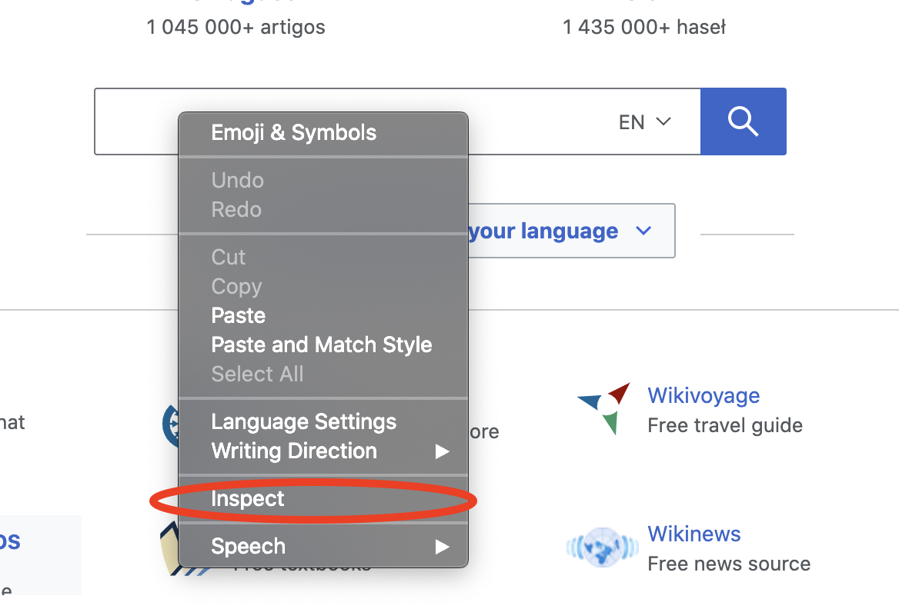
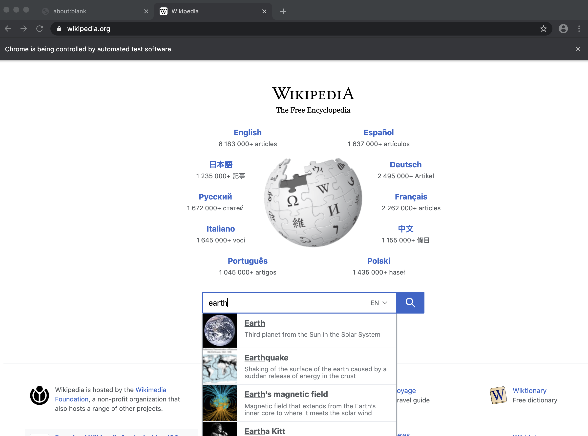

# Rodを始めましょう

## 要件

[Golang](https://golang.org/) が唯一の要件であり、HTML について何も知る必要はありません。

Golangを使用したことがない場合は、 [](https://golang.org/doc/install) をインストールし、数時間でマスターすることができます: [Go](https://tour.golang.org/welcome) ツアー。

## 最初のプログラム

Rod を使ってページを開き、そのスクリーンショットを撮りましょう。まず、以下の内容の "main.go" ファイルを作成します。

```go
package main

import "github.com/go-rod/rod"

func main() {
    page := rod.New().MustConnect().MustPage("https://www.wikipedia.org/")
    page.MustWaitLoad().MustScreenshot("a.png")
}
```

`rod.New` はブラウザオブジェクトを作成し、 `MustConnect` は起動してブラウザに接続します。 `MustPage` はページオブジェクトを作成し、ブラウザのタブのようなものです。 `MustWaitLoad` はページが完全に読み込まれるのを待ちます。 `MustScreenshot` はページのスクリーンショットを取得します。

モジュールを作成:

```bash
go env -w GOPROXY=https://goproxy.io,direct
go mod init learn-rod
go mod tidy
```

モジュールの実行:

```bash
走れ!
```

以下のようにスクリーンショット「a.png」を出力します:


## ボンネットの下にあるものを見る

上級開発者の場合は、このファイルをすべてスキップして読むことができます: [link](https://github.com/go-rod/rod/blob/master/examples_test.go).

デフォルトでは、Rodはパフォーマンスを最大化するためにブラウザのUIを無効にします。 しかし、自動化タスクを開発する際には、デバッグの容易さを重視します。 Rodはコードのデバッグに役立つ多くのソリューションを提供します。

現在の作業ディレクトリの下に ".rod" 設定ファイルを作成しましょう。 内容は:

```txt
表示
```

これは、「ブラウザのUIを前面に表示する」という意味です。 Before we run the module again, let's append `time.Sleep(time.Hour)` to the end the code so that it won't be too fast for our eyes to catch it, the code of "main.go" now becomes:

```go
package main

import (
    "time"

    "github.com/go-rod/rod"
)

func main() {
    page := rod.New().MustConnect().MustPage("https://www.wikipedia.org/")
    page.MustWaitLoad().MustScreenshot("a.png")
    time.Sleep(time.Hour)
}
```

モジュールを再度実行すると、次のようなブラウザが表示されます。


プログラムを停止するには、キーボードの [CTRL+C](https://en.wikipedia.org/wiki/Control-C) を押します。

## 入力してクリック

キーワード"earth"を検索するためにウェブサイトを自動化しましょう。 ウェブサイトには多くの入力フィールドやボタンがあるかもしれませんが、どの入力フィールドを操作するかをプログラムに伝える必要があります。 通常、制御したい要素を特定するために [Devtools](https://developers.google.com/web/tools/chrome-devtools/) を使用します。 開発ツールを有効にするために、".rod"ファイルに新しい設定を追加しましょう。これで次のようになります。

```txt
show
devtools
```

"main"を実行します。 " o, もう一度, 入力フィールドにマウスを移動し、その上にある を右クリックすると、コンテキストメニューが表示されます。そして、 "inspect":



`<input id="searchInput` は以下のように表示されます：


右クリックして [CSS セレクター](css-selector.md) を上の画像のようにコピーします。 クリップボードの の内容は"#searchInput"になります。 キーワードを入力するために 要素を見つけるために使用します。 「main.go」は次のようになります。

```go
package main

import (
    "time"

    "github.com/go-rod/rod"
)

func main() {
    page := rod.New().MustConnect().MustPage("https://www.wikipedia.org/").MustWindowFullscreen()

    page.MustElement("#searchInput").MustInput("earth")

    page.MustWaitLoad().MustScreenshot("a.png")
    time.Sleep(time.Hour)
}
```

`MustWindowFullscreen` は、デバッグを容易にするためにブラウザウィンドウのサイズを変更する。 `MustElement` と、Devtools パネル からコピーしたセレクターを使用して、操作したい要素を取得します。 `MustElement` は要素が表示されるまで自動的に待機します。 の前に `MustWaitLoad` を使用する必要はありません。 次に、 `MustInput` を呼び、その中にキーワード「地球」を入力します。 "main.go" を再度実行すると、 結果は以下のようになります。



入力フィールドと同様に、検索 ボタンを右クリックしてセレクターをコピーしましょう:


次に、検索ボタンをクリックするコードを追加し、「main.go」は次のようになります。

```go
package main

import "github.com/go-rod/rod"

func main() {
    page := rod.New().MustConnect().MustPage("https://www.wikipedia.org/").MustWindowFullscreen()

    page.MustElement("#searchInput").MustInput("地球")
    page.MustElement("#search-form > fieldset > button").MustClick()

    page.MustScreenshot("a.png") }

```

モジュールを再実行すると、"a.png" に検索結果が表示されます。


## スローモーションと視覚的なトレース

自動化された操作は、人間の目を捕まえるには速すぎます。 デバッグするには、通常、 スローモーションと視覚的なトレース設定を有効にします。 Od" ファイル:

```txt

slow=1s
のトレースを表示する
```

その後、モジュールを再実行すると、すべてのアクションが の実行前に 1 秒間待機するようになります。 このページには、Rodによって生成されたデバッグトレースが以下のように表示されます。


検索ボタンに表示されるように、ロッドはモックマウスカーソルを作成します。

コンソールには以下のようなトレースログが表示されます:

```txt
[rod] 2020/11/11 11:11:11 [eval] {"js":"rod.element","params":["#searchInput"]}
[rod] 2020/11/11 11:11:11 [eval] {"js":"rod.visible","this":"input#searchInput"}
[rod] 2020/11/11 11:11:11 [input] scroll into view
[rod] 2020/11/11 11:11:11 [input] input earth
[rod] 2020/11/11 11:11:11 [eval] {"js":"rod.element","params":["#search-form > fieldset > button"]}
[rod] 2020/11/11 11:11:11 [eval] {"js":"rod.visible","this":"button.pure-button.pure-button-primary-progressive"}
[rod] 2020/11/11 11:11:11 [input] scroll into view
[rod] 2020/11/11 11:11:11 [input] left click
```

## ".rod"ファイル以外のファイル

The ".rod" file is just a shortcut for some commonly used API, you can also manually set them in code, such as the "slow", the code to set it is like `rod.New().SlowMotion(2 * time.Second)`. また、 環境変数を使用して設定することもできます。例えば、Mac や Linux などです。 `rod=show go main.go`.

## テキストコンテンツを取得する

Rodはページからコンテンツを取得するための便利なメソッドをたくさん提供しています。

開発ツールからセレクター をコピーするために使用したのと同じテクニックを使用して、地球の説明を取得しましょう。


私たちが使用するメソッドは `MustText`です。以下のコードがあります:

```go
package main

import (
    "fmt"

    "github.com/go-rod/rod"
)

func main() {
    page := rod.New().MustConnect().MustPage("https://www.wikipedia.org/")

    page.MustElement("#searchInput").MustInput("earth")
    page.MustElement("#search-form > fieldset > button").MustClick()

    el := page.MustElement("#mw-content-text > div.mw-parser-output > p:nth-child(6)")
    fmt.Println(el.MustText())
}
```

モジュールを再実行すると、コンソールの出力が次のようになります。

```txt
地球は太陽から3番目の惑星であり、生命を持つことが知られている唯一の天体です。
...
```

## 画像コンテンツを取得する

テキストを取得するのと同じように、ページから画像を取得することもできます。 地球の画像のセレクターを取得し、 `MustResource` を使って画像の連立を取得しましょう。


完全なコードは:

```go
package main

import (
    "github.com/go-rod/rod"
    "github.com/go-rod/rod/lib/utils"
)

func main() {
    page := rod.New().MustConnect().MustPage("https://www.wikipedia.org/")

    page.MustElement("#searchInput").MustInput("earth")
    page.MustElement("#search-form > fieldset > button").MustClick()

    el := page.MustElement("#mw-content-text > div.mw-parser-output > table.infobox > tbody > tr:nth-child(1) > td > a > img")
    _ = utils.OutputFile("b.png", el.MustResource())
}
```

出力ファイル "b.png" は次のようにする必要があります:


