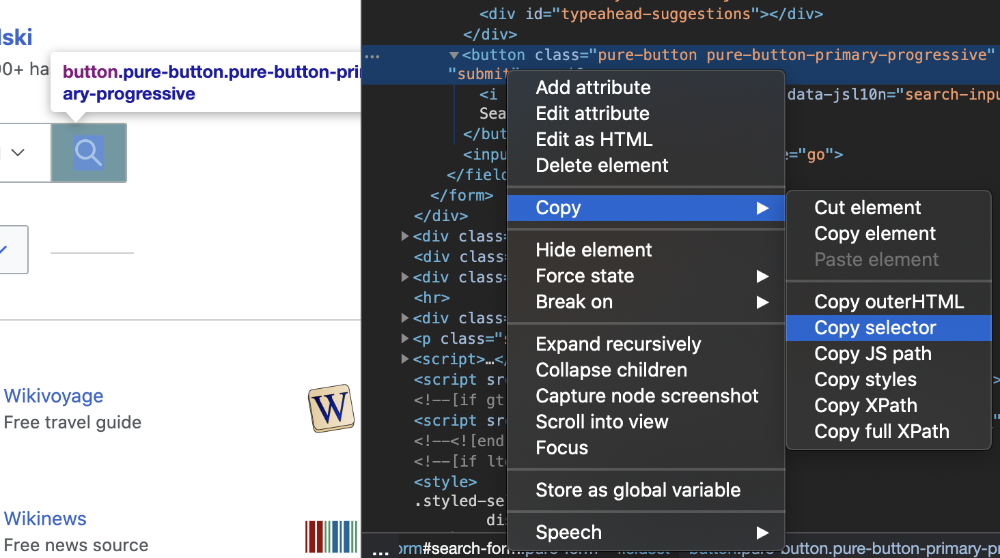

# Aan de slag met staaf

## Vereisten

[Gplor](https://golang.org/) is de enige vereiste, u hoeft niet eens iets te weten over HTML.

Als je nog nooit Golang hebt gebruikt, [installeer dan](https://golang.org/doc/install) het en je kunt het in uren beheersen: [Een tour of Go](https://tour.golang.org/welcome).

## Eerste programma

Laten we Rod gebruiken om een pagina te openen en er een schermafbeelding van te maken, maak eerst een "main.go" bestand met de onderstaande inhoud:

```go
pakket hoofd

import "github.com/go-rod/rod"

func main() {
    page := rod.New().MustConnect().MustPage("https://www.wikipedia.org/")
    page.MustWaitLoad().MustScreenshot("a.png")
}
```

De `rod.New` maakt een browser-object, de `MustConnect` launches en maakt verbinding met een browser. De `MoustPage` maakt een pagina-object aan als een paginabblad in de browser. De `MustWaitLoad` wacht op de pagina volledig geladen. De `MoustScreenshot` neemt een schermafbeelding van de pagina.

Een module aanmaken:

```bash
ga env -w GOPROXY=https://goproxy.io,direct
ga mod init learn-std
ga mod tidy
```

Voer de module uit:

```bash
ga uitvoeren .
```

Het programma zal een schermafbeelding "a.png" zoals hieronder uitvoeren:


## Bekijk wat er onder de capuchon zit

Voor ervaren ontwikkelaars kun je alles overslaan en dit bestand lezen: [link](https://github.com/go-rod/rod/blob/master/examples_test.go).

Standaard zal Rod de browser's UI uitschakelen om de prestaties te maximaliseren. Maar bij het ontwikkelen van een automatiseringstaak geven we meestal meer om het gemak van debuggen. Rod biedt een heleboel oplossingen om je te helpen de code te debuggen.

Laten we een configuratiebestand ".rod" aanmaken onder de huidige werkmap. De inhoud is:

```txt
toon
```

Dit betekent "toon de browser UI op de voorgrond". Voordat we de module opnieuw starten, laten we `tijd.Sleep(tijd toevoegen. onze)` tot het einde de code zodat het voor onze ogen niet te snel zal zijn om het op te vangen, de code van "main. o" wordt nu:

```go
pakket main

import (
    "time"

    "github.com/go-rod/rod
)

func main() {
    page := rod.New().MustConnect().MustPage("https://www.wikipedia.org/")
    page.MustWaitLoad().MustScreenshot("a.png")
    time.Sleep(time.Hour)
}
```

Als u de module opnieuw gebruikt, moet u een browser als volgt zien:


Druk op [CTRL + C](https://en.wikipedia.org/wiki/Control-C) op het toetsenbord om het programma te stoppen.

## Invoer en klik

Laten we de website automatiseren om te zoeken naar het sleutelwoord "aarde". Een website kan veel invoervelden of knoppen hebben, we moeten het programma vertellen welke er moet worden gemanipuleerd. Normaal gesproken gebruiken we [Devtools](https://developers.google.com/web/tools/chrome-devtools/) om ons te helpen het element te vinden dat we willen beheersen. Laten we een nieuwe configuratie toevoegen aan het ".rod" bestand om de Devtools in te schakelen, nu wordt het het:

```txt
show
devtools
```

Voer "main" uit. o" opnieuw, beweeg de muis naar het invoerveld en klik met de rechtermuisknop hierboven, u ziet het contextmenu en klik vervolgens op "inspecteren":


Je zou de `<input id="searchInput` zoals hieronder moeten zien:


Rechtsklik om de [css selector](css-selector.md) te kopiëren, zoals de afbeelding hierboven. De inhoud op je klembord zal "#searchInput" zijn. We zullen het gebruiken om het element te vinden om het trefwoord in te voeren. Nu wordt de "main.go" het volgende:

```go
Pakket main

import (
    "tijd"

    "github. om/go-rod/rod
)

func main() {
    page := rod.New().MustConnect().MustPage("https://www.wikipedia. rg/").MustWindowFullscreen()

    page.MustElement("#searchInput").MustInput("aard")

    page.MustWaitLoad().MustScreenshot("a.png")
    time.Sleep(time.Hour)
}
```

Het `MoustWindowFullscreen` vergroot het browservenster om het makkelijker te maken om te debuggen. We gebruiken `MustElement` en de selector die we gekopieerd hebben van het Devtools paneel om het element dat we willen manipuleren te krijgen. Het `meestselement` wacht automatisch tot het element verschijnt, dus hoeven we geen `MustWaitLoad` te gebruiken. Vervolgens noemen we de `MustInput` om het sleutelwoord "aard" erin te zetten. Als je de "main.go", opnieuw start, zou je het resultaat hieronder moeten zien:


Net als bij het invoerveld klik je met de rechtermuisknop op de zoekopdracht om de selector te kopiëren:




Voeg vervolgens code toe om op de zoekknop te klikken, nu ziet de "main.go" er als volgt uit:

```go
package main

import "github.com/go-rod/rod/rod"

func main() {
    page := rod.New().MustConnect().MustConnect().MustPage("https://www.wikipedia.org/").MustWindowFullscreen()

    page.MustElement("#searchInput").MustInput("earth")
    page.MustElement("#search-form > fieldset > button").MustClick()

    page.MustWaitLoad().MustScreenshot("png")
}
```

Als we de module herstarten, zal de "a.png" het zoekresultaat tonen:


## Trage beweging en visuele sporen

De geautomatiseerde operaties zijn te snel voor menselijke ogen om te vangen, om ze te debuggen hebben we meestal de slow-motion en visuele trace configuraties ingeschakeld, laten we de "updaten" gebruiken. od" bestand:

```txt
toon
slow=1s
trace
```

Herstart daarna de module, nu elke actie wacht 1 seconde voor de uitvoering ervan. Op de pagina ziet u de debug trace gegenereerd door Rod zoals hieronder:


Zoals je kunt zien op de zoekknop, zal Rod een nep-muisaanwijzer maken.

In de console zul je het trace-logboek hieronder zien:

```txt
[rod] 2020/11/11 11:11:11 [eval] {"js":"rod.element","params":["#searchInput"]}
[rod] 2020/11/11 11:11:11 [eval] {"js":"rod. Zichtbaar", deze":"input#searchInput"}
[rod] 2020/11/11 11:11:11 [input] scrollen in de weergave
[rod] 2020/11/11 11:11:11 [input] invoert aarde
[rod] 2020/11/11 11:11:11 [eval] [eval] {"js":"rod. lement","params":["#search-form > fieldset > button"]}
[rod] 2020/11/11 11:11:11 [eval] {"js":"rod.visible","this":"button.pure-button. ure-button-primary-progressive"}
[rod] 2020/11/11 11:11:11 [input] scroll in beeld
[rod] 2020/11/11 11:11:11 [input] klik links
```

## Anders dan het ".rod" bestand

De " od" bestand is slechts een snelkoppeling voor sommige vaak gebruikte API, je kan ze ook handmatig instellen in code, zoals de "langzaam", de code om hem in te stellen is als `stang. ew().SlowMotion(2 * tijd.Second)`. Je kunt ook een omgevingsvariabele gebruiken om deze in te stellen, zoals op Mac of Linux: `rod=show go main.go`.

## Verkrijg tekst inhoud

Staaf biedt veel handige methodes om de inhoud van de pagina op te halen.

Laten we proberen de beschrijving van de aarde op te halen, gebruik dezelfde techniek die we voorheen gebruikten om de selector te kopiëren uit de Devtools:


De methode die we gebruiken is `meustText`, hier is de volledige code van:

```go
Pakket main

import (
    "fmt"

    "github. om/go-rod/rod"
)

func main() {
    pagina := rod. ew().MustConnect().MustPage("https://www.wikipedia.org/")

    page.MustElement("#searchInput"). ustInput("aarde")
    page.MustElement("#search-form > fieldset > button").MustClick()

    el := pagina. ustElement("#mw-content-tekst > div.mw-parser-output > p:nth-child(6)")
    fmt.Println(el.MustText())
}
```

Als we de module opnieuw aanzetten, moeten we zien dat de console iets als ziet uitkomen:

```txt
De aarde is de derde planeet van de zon en het enige astronomische object dat bekend staat om het leven.
...
```

## Afbeelding inhoud ophalen

Hetzelfde als de tekst ophalen, we kunnen ook afbeeldingen van de pagina ophalen. Laten we de selector van de Aarde afbeelding ophalen en `MosterGrondstof` gebruiken om het binaire van de afbeelding te krijgen:


De volledige code is:

```go
Pakket main

import (
    "github.com/go-rod/rod"
    "github. om/go-rod/rod/lib/utils"
)

func main() {
    pagina := rod. ew().MustConnect().MustPage("https://www.wikipedia.org/")

    page.MustElement("#searchInput").MustInput("aarde")
    pagina. ustElement("#search-form > fieldset > button").MustClick()

    el := page.MustElement("#mw-content-text > div.mw-w-output > tabel. nfobox > tbody > tr:nth-child(1) > td > a > img")
    _ = gebruik. utputFile("b.png", el.MustResource())
}
```

Het uitvoerbestand "b.png" moet zijn:


