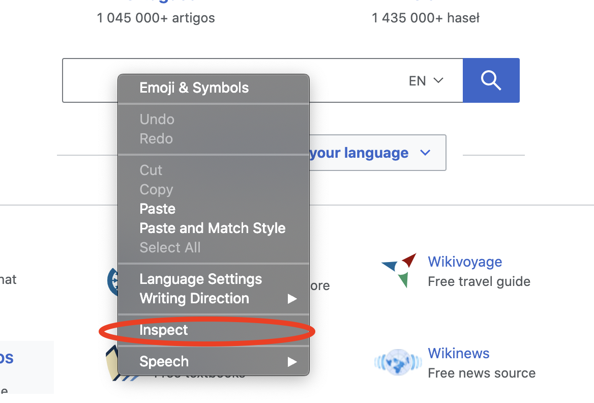
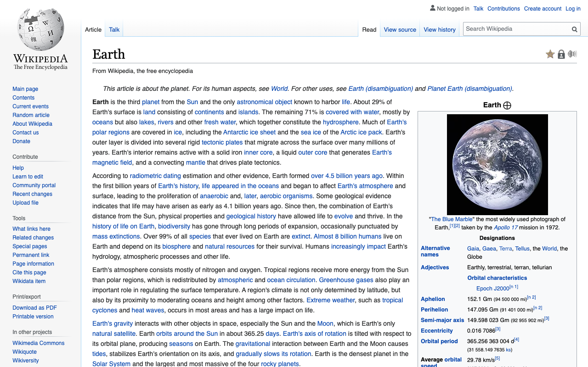

# Kom i gang med Rod

## Krav

[Golang](https://golang.org/) er det eneste kravet, du trenger ikke engang å vite noe om HTML.

Hvis du aldri har brukt Golang, [installer](https://golang.org/doc/install) det og du kan mestre det i tider: [En tur på Go](https://tour.golang.org/welcome).

## Første program

La oss bruke Rod til å åpne en side og ta et skjermbilde av den, først opprett en "hoved.go" fil med innholdet nedenfor:

```go
pakkehode

importer "github.com/go-rod/rod"

func main() {
    side := rod.New().MustConnect().MustPage("https://www.wikipedia.org/")
    page.MustWaitLoad().MustScreenshot("a.png")
}
```

The `rod.New` creates a browser object, the `MustConnect` launches and connects to a browser. `Måleside` skaper et sideobjekt, det er som en sidemerke i nettleseren. `MEventende last` venter på at siden lastes helt. `MustScreenshot` tar et skjermbilde av siden.

Opprett en modul:

```bash
gå env -w GOPROXY=https://goproxy.io,direct
go mod init learn-rod
go mod tidrett
```

Kjør modulen:

```bash
gå kjør .
```

Programmet vil skrive ut et skjermbilde "a.png" som nedenfor:


## Se hva som er under panseret

For senior utviklere, kan du hoppe over alle og lese denne filen: [link](https://github.com/go-rod/rod/blob/master/examples_test.go).

Som standard vil Rod deaktivere nettleserens brukergrensesnitt for å maksimere ytelsen. Men når vi utvikler en automatiseringsoppgave bryr vi oss om enkel feilsøking. Rod tilbyr mange løsninger som hjelper deg med å feilsøke koden.

La oss opprette en ".rod" config fil under gjeldende arbeidsmappe. Innholdet er:

```txt
vis
```

Det betyr at brukergrensesnittet i nettleseren vises i forgrunnen". Før vi kjører modulen igjen, la oss legge til `time.Sleep(time. vår)` til slutten av koden slik at det ikke blir for raskt at våre øyne kan få den fange, koden til "hovednøkkelen. o" bliblir:

```go
pakkehovednøkkelen

importerer (
    "tid"

    "github.com/go-rod/rod"
)

func main() {
    side := rod.New().MustConnect().MustPage("https://www.wikipedia.org/")
    page.MustWaitLoad().MustScreenshot("a.png")
    time.Sleep(time.Hour)
}
```

Dersom du kjører modulen på nytt, skal du se en nettleser som dette:


Trykk [CTRL + C](https://en.wikipedia.org/wiki/Control-C) på tastaturet for å stoppe programmet.

## Inngang og klikk

La oss automatisere nettsiden for å søke nøkkelordet "jord". Et nettsted kan ha mange inntastingsfelt eller knapper, vi må fortelle programmet som en å manipulere. Vanligvis bruker vi [Devtools](https://developers.google.com/web/tools/chrome-devtools/) for å hjelpe oss å finne det elementet vi vil kontrollere. la oss legge til en ny config i ".rod"-filen for å aktivere Devtools, nå blir det

```txt
show
devtools
```

Kjør "main". o" igjen, flytt musen til inntastingsfeltet og høyreklikk over det, du vil se kontekstmenyen, og klikk deretter på "befart":



Du bør se `<input id="searchInput` som nedenfor:


Høyreklikk for å kopiere [css-velgeren](css-selector.md) som bildet ovenfor. Innholdet på utklippstavlen er "#searchInput". Vi vil bruke det til å finne -elementet til å skrive inn nøkkelordet. Nå blir "main.go" følgende:

```go
pakkens viktigste

import (
    "time"

    "github. om/go-rod/rod"
)

func main() {
    side := rod.New().MustConnect().MustPage("https://www.wikipedia. rg/").MustWindowFullscreen()

    page.MustElement("#searchInput").MustInput("earth")

    page.MustWaitLoad().MustScreenshot(("a.png")
    time.Sleep(time.Hour)
}
```

`Måleskjerm` endre størrelsen på nettleservinduet for å gjøre det enklere å feilsøke. Vi bruker `Måtelement` og velgeren vi har kopiert fra Devtools panel for å få elementet vi vil manipulere. `Måleelement` vil automatisk vente til elementet vises, så vi trenger ikke bruke `MustWaitLoad` før det. Så kaller vi `MustInput` for å skrive inn nøkkelordet "jord" inn i den. Hvis du skrur på "main.go", bør du se resultatet, se nedenfor ut:


Lik inntastingsfeltets høyreklikk knappen for å kopiere velgeren for den:


Legg deretter til kode for å klikke på søkeknappen, nå ser "main.go" ut:

```go
package main

import "github.com/go-rod/rod"

func main() {
    page := rod.New().MustConnect().MustPage("https://www.wikipedia.org/").MustWindowFullscreen()

    page.MustElement("#searchInput").MustInput("earth")
    page.MustElement("#search-form > fieldset > button").MustClick()

    page.MustWaitLoad().MustScreenshot("a.png")
}
```

Dersom vi omringer modulen vil "a.png" vise søkeresultatet:



## Treg bevegelse og visuell rute

De automatiserte operasjonene er for raske for at mennesket skal kunne fange, for å feilsøke dem vil vi vanligvis aktivere treg bevegelse og visuelle sporkonfigurasjoner, la oss oppdatere ". o" fil:

```txt
vis
treg=1 s
spor
```

Så kjør modulen på nytt, nå vil hver handling nå vente i 1 sekund før dens utførelse. På siden vil du se feilsøkingssporet generert av Rod slik:


Som du kan se på søkeknappen, vil Rod lage en prog musepeker.

På konsollen vil du se sporloggen som nedenfor:

```txt
[rod] 2020/11/11 11:11:11 [eval] {"js":"rod.element","params":["#searchInput"]}
[rod] 2020/11/11 11:11:11 [eval] {"js":"rod.visible","this":"input#searchInput"}
[rod] 2020/11/11 11:11:11 [input] scroll into view
[rod] 2020/11/11 11:11:11 [input] input earth
[rod] 2020/11/11 11:11:11 [eval] {"js":"rod.element","params":["#search-form > fieldset > button"]}
[rod] 2020/11/11 11:11:11 [eval] {"js":"rod.visible","this":"button.pure-button.pure-button-primary-progressive"}
[rod] 2020/11/11 11:11:11 [input] scroll into view
[rod] 2020/11/11 11:11:11 [input] left click
```

## Bortsett fra ".rod"-filen

The ". od" fil er bare en snarvei for noen ofte brukte API, du kan også sette dem manuelt i kode, slik som "treg", koden som å sette den er som `stang. ew().lowMotion(2 * tid.Second)`. Du kan også bruke en miljøvariabel for å angi den, for eksempel på Mac eller Linux: `rod=show go main.go`.

## Hent tekstinnhold

Rod gir mange nyttige metoder for å hente innholdet fra siden.

La oss prøve å legge frem en beskrivelse av jorden. Bruk den samme teknikken vi tidligere har brukt til å kopiere velgeren fra Devtools:


Metoden vi bruker er `Måletekst`, her er hele koden for det:

```go
pakkens viktigste

import (
    "fmt"

    "github. om/go-gnager/gnager"
)

func main() {
    side := stang ew().MustConnect().MustPage("https://www.wikipedia.org/")

    page.MustElement("#searchInput"). ustInput("earth")
    page.MustElement("#search-form > fieldset > knapp").MustClick()

    := side. ustElement("#mw-content-text > div.mw-parser-output > p:nth-child(6)")
    fmt.Println(el.MustText())
}
```

Hvis vi omringer modulen, skal vi se konsollutene noe som:

```txt
Jorden er den tredje planeten fra solen og den eneste astronomiske gjenstanden som er kjent for å havne livet.
...
```

## Hent bilde innhold

Samme som tekst kan vi også få bilder fra siden, La oss hente velgeren av jordbildet og bruke `MustResource` for å få det binære bildet i:


Den fullstendige koden er:

```go
pakkens viktigste

import (
    "github.com/go-rod/rod"
    "github. om/go-rod/rod/lib/utils"
)

func main() {
    side := stette ew().MustConnect().MustPage("https://www.wikipedia.org/")

    page.MustElement("#searchInput").MustInput("earth")
    sin side. ustElement("#search-form > feltsett > knapp").MustClick()

    el := page.MustElement("#mw-content-text > div.mw-parser-output > tabell. nfobox > tbody > tr:nth-child(1) > td > en > img")
    _ = utnyttelse. utputFile("b.png", el.MustResource())
}
```

Utskriftsfilen "b.png" bør være:


