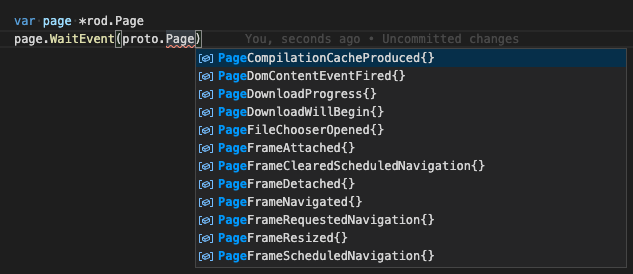

# Wydarzenia

Zdarzenia to akcje lub zdarzenia, które zdarzają się w kontrolowanej przeglądarce, , o którym mówi przeglądarka, dzięki czemu w razie potrzeby możesz na nie odpowiedzieć w jakiś sposób. Tak jak kiedy pozwalamy stronie przejść do nowego adresu URL, możemy subskrybować wydarzenia, aby wiedzieć kiedy nawigacja jest zakończona lub gdy strona jest renderowana.

## Poczekaj na wydarzenie raz

Spróbujmy przejść na stronę i poczekać, aż sieć strony będzie prawie bezczynna:

```go
func main() {
    page := rod.New().MustConnect().MustPage()

    wait := page.MustWaitNavigation()
    page.MustNavigate("https://www.wikipedia.org/")
    czeka()
}
```

Używamy `MustWAitNavigation` do subskrybowania bezczynnego zdarzenia sieciowego. Powodem, dla którego subskrypcja znajduje się przed nawigacją, nie jest to, że kod uruchamiający nawigację zajmie czasu, w tym czasie zdarzenie mogło już mieć miejsce. Po `MustNavigate` wywołujemy funkcję `zaczekaj` aby zablokować kod, aż nastąpi następne zdarzenie bezczynności.

Rod zapewnia wiele innych pomocników zdarzeń, wszystkie nazwy funkcji są prefiksowane `MustWait` lub `Czekaj`.

## Uzyskaj szczegóły wydarzenia

Niektóre rodzaje zdarzeń zawierają szczegóły dotyczące samego wydarzenia. Tak jak przechodzimy do adresu url i używamy wydarzenia, aby otrzymać kod statusu odpowiedzi żądania nawigacji:

```go
func main() {
    page := rod.New().MustConnect().MustPage()

    e := proto.NetworkResponseReceived{}
    czekaj := page.WaitEvent(&e)
    page.MustNavigate("https://www.wikipedia.org/")
    czeka()

    fmt.Println(e.Response.Status)
}
```

## Obsługa wielu zdarzeń

Jeśli chcesz obsługiwać wszystkie zdarzenia typu, na przykład nasłuchiwanie wszystkich wydarzeń na wyjściu konsoli strony, możemy zrobić coś takiego:

```go
go page.EachEvent(func(e *proto.RuntimeConsoleAPICalled) {
    fmt.Println(page.MustObjectsToJSON(e.Args))
})()
```

Aby subskrybować wiele typów zdarzeń w tym samym czasie, takich jak subskrybuj `RuntimeConsoleAPICalled` i `PageLoadEventFired`:

```go
go page.EachEvent(func(e *proto.RuntimeConsoleAPICalled) {
    fmt.Println(page.MustObjectsToJSON(e.Args))
}, func(e *proto.PageLoadEventFired) {
    fmt.Println("loaded")
})()
```

## Zatrzymaj subskrypcję

Jakakolwiek funkcja w Rod która blokuje może zostać anulowana z kontekstem [](context-and-timeout.md), nie jest specjalna dla zdarzeń. Ponadto możesz również zatrzymać wydarzenie zwracając prawdę od obsługi zdarzeń, na przykład:

```go
czekaj := page.EachEvent(func(e *proto.PageLoadEventFired) (stop bool) {
    return true
})
page.MustNavigate("https://example.com")
czekać()
```

Jeśli nie zwrócimy true, czekaj na zdarzenia `PageLoadEventFired` i zablokuj program na zawsze. To jest w rzeczywistości kod jak działa `page.WaitEvent`.

## Dostępne wydarzenia

Wszystkie typy zdarzeń implementują interfejs `proto.Event` , możesz go użyć do znalezienia wszystkich wydarzeń. Zwykle IDE automatycznie filtruje interfejs. Tak jak chcemy zobaczyć wszystkie wydarzenia w domenie Strony, możemy utworzyć pusty obiekt strony i użyć `WaitEvent(proto. zdarzenie)` aby wyświetlić i filtrować wszystkie typy zdarzeń takie jak zrzut ekranu poniżej:



Możesz również użyć tej [witryny](https://chromedevtools.github.io/devtools-protocol/tot/Page) , aby przeglądać wydarzenia.
