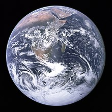

# Introdução a Rod

## Requisitos

[Golang](https://golang.org/) é o único requisito, você nem precisa saber nada sobre HTML.

Se você nunca usou Golang, [instale-o](https://golang.org/doc/install) e você pode dominá-lo em horas: [Um tour de Go](https://tour.golang.org/welcome).

## Primeiro programa

Vamos utilizar Rod para abrir uma página e realizar a captura de tela da mesma, primeiro, crie um arquivo "main.go" com o conteúdo abaixo:

```go
package main

import "github.com/go-rod/rod"

func main() {
    page := rod.New().MustConnect().MustPage("https://www.wikipedia.org/")
    page.MustWaitLoad().MustScreenshot("a.png")
}
```

A função `rod.New` cria um objeto do navegador, o `MustConnect` abre e se conecta a um navegador. O `MustPage` cria um objeto de página, é como uma aba de página no navegador. O `MustWaitLoad` espera pela página está totalmente carregada. O `Deve Screenshot` tira uma captura de tela da página.

Criar um módulo:

```bash
go env -w GOPROXY=https://goproxy.io,direct
go mod init learn-rod
go mod tidy
```

Executar o módulo:

```bash
vá correr .
```

O programa será criado "a.png" como o exemplo abaixo:


## Veja o que está sob o capuz

Para desenvolvedores principais, você pode pular todos e ler este arquivo: [link](https://github.com/go-rod/rod/blob/master/examples_test.go).

Por padrão, o Rod desativará a interface do navegador para maximizar o desempenho. Mas ao desenvolver uma tarefa de automação, geralmente nos preocupamos mais com a facilidade de depuração. Cajado fornece muitas soluções para ajudá-lo a depurar o código.

Vamos criar um arquivo de configuração ".rod" dentro do diretório de trabalho atual. O conteúdo é:

```txt
mostrar
```

Significa "mostrar a interface do navegador em primeiro plano". Antes de executarmos o módulo novamente, vamos acrescentar `time.Sleep(time. nosso)` até o final do código para que não seja muito rápido para nossos olhos pegá-lo, o código "main. o" agora fica:

```go
pacote principal

importação (
    "time"

    "github.com/go-rod/rod"
)

func main() {
    página := rod.New().MustConnect().MustPage("https://www.wikipedia.org/")
    page.MustWaitLoad().MustScreenshot("a.png")
    time.Sleep(time.Hour)
}
```

Se você executar o módulo novamente, verá um navegador como este:


Pressione [CTRL + C](https://en.wikipedia.org/wiki/Control-C) no teclado para parar o programa.

## Insira e clique

Vamos automatizar o site para pesquisar a palavra-chave "earth". Um site pode ter muitos campos de entrada ou botões, precisamos informar ao programa qual deve manipular. Geralmente, usamos [Devtools](https://developers.google.com/web/tools/chrome-devtools/) para nos ajudar a localizar o elemento que queremos controlar. vamos adicionar uma nova configuração ao arquivo ".rod" para ativar o Devtools, agora ele se torna:

```txt
show
devtools
```

Execute o "main. o" novamente, mova o mouse para o campo de entrada e clique direito acima dele, você verá o menu de contexto, e então clique em "inspeção":


Você deve ver o `<input id="searchInput` como abaixo:


Clique com o botão direito para copiar o [seletor css](css-selector.md) como a imagem acima. O conteúdo na sua área de transferência será "#searchInput". Vamos usá-lo para localizar o elemento para inserir a palavra-chave. Agora o "main.go" se torna:

```go
pacote principal

import (
    "time"

    "github. om/go-rod/rod"
)

func main() {
    página := rod.New().MustConnect().MustPage("https://www.wikipedia. rg/").MustWindowFullscreen()

    page.MustElement("#searchInput").MustInput("earth")

    page.MustWaitLoad().MustScreenshot("a.png")
    time.Sleep(time.Hour)
}
```

O `MustWindowFullscreen` redimensiona a janela do navegador para facilitar a depuração. Nós usamos `MustElement` e o seletor que copiamos do painel Devtools para obter o elemento que queremos manipular. O `Elemento` irá esperar automaticamente até que o elemento apareça, então não precisamos usar `MustWaitLoad` antes dele. Então chamamos o `MustInput` para inserir a palavra-chave "earth" nele. Se você executar novamente o "main.go", você deverá ver o resultado se parece com o resultado abaixo:


Semelhante ao campo de entrada vamos clicar com o botão direito na pesquisa para copiar o seletor:


Em seguida, adicione código para clicar no botão de pesquisa, agora o "main.go" se parece como:

```go
package principal

import "github.com/go-rod/rod"

func main() {
    página := rod.New().MustConnect().MustConnect().MustPage("https://www.wikipedia.org/").MustWindowFullscreen()

    page.MustElement("#searchInput").MustInput("earth")
    page.MustElement("#search-form > fieldset > button").MustClick()

    page.MustWaitLoad().MustScreenshot("a.png")
}
```

Se executarmos novamente o módulo, o "a.png" mostrará o resultado da pesquisa:


## Câmera lenta e rastreamento visual

As operações automatizadas são muito rápidas para os olhos humanos pegarem, para depurá-las, geralmente ativamos as configurações de movimento lento e rastreamento visual, vamos atualizar o ". arquivo od:

```txt
mostrar
lento =1s
rastreamento
```

Em seguida, execute novamente o módulo, agora cada ação agora irá esperar por 1 segundo antes de sua execução. Na página, você verá o rastro de depuração gerado pelo Roda como abaixo:


Como você pode ver no botão de busca, o Vara criará um cursor fictício do mouse.

No console você verá o registro de rastreamento abaixo:

```txt
[rod] 2020/11/11 11:11:11 [eval] {"js":"rod.element","params":["#searchInput"]}
[rod] 2020/11/11 11:11:11 [eval] {"js":"rod. visível", this":"input#searchInput"}
[rod] 2020/11/11 11:11:11 [input] rolagem para ver
[rod] 2020/11/11 11:11:11 [input] entrada
[rod] 2020/11/11 11:11:11 [eval] {"js":"rod. lement","parâmetros":["#search-form > fieldset > button"]}
[rod] 2020/11/11 11:11 [eval] {"js":"rod.visible","this":"button.pure-button. botão ure-button-primary-progressive"}
[rod] 2020/11/11 11:11:11 [input] rolagem em vista
[rod] 2020/11/11 11:11:11 [input] clique esquerdo
```

## Além do arquivo ".rod"

Os ". arquivo od" é apenas um atalho para alguns da API comumente usada, você também pode configurá-los manualmente no código, como o "lento", o código a ser definido é como uma vareta `. ew().SlowMotion(2 * vez.Segundo)`. Você também pode usar uma variável de ambiente para configurá-la, como no Mac ou no Linux: `rod=show go main.go`.

## Obter conteúdo de texto

Rod fornece muitos métodos úteis para recuperar o conteúdo da página.

Vamos tentar obter a descrição da Terra, use a mesma técnica que usamos anteriormente para copiar o seletor dos Devtools:


O método que usamos é `Deve Texto`, aqui está o código completo dele:

```go
pacote principal

importação (
    "fmt"

    "github. um/go-rod/rod"
)

func main() {
    página := rod. ew().MustConnect().MustPage("https://www.wikipedia.org/")

    page.MustElement("#searchInput"). ustInput("earth")
    page.MustElement("#search-form > fieldset > button").MustClick()

    el := page. ustElement("#mw-content-text > div.mw-parser-output > p:nth-child(6)")
    fmt.Println(el.MustText())
}
```

Se executarmos o módulo novamente, veremos que o console produz algo como:

```txt
A Terra é o terceiro planeta do Sol e o único objeto astronômico conhecido por abrigar a vida.
...
```

## Obter conteúdo da imagem

O mesmo que obter texto, também podemos obter imagens da página vamos obter o seletor da imagem da Terra e usar `DevestResource` para obter o binário da imagem:


O código completo é:

```go
pacote principal

import (
    "github.com/go-rod/rod"
    "github. om/go-rod/rod/lib/utils"
)

func main() {
    página: = rod. ew().MustConnect().MustPage("https://www.wikipedia.org/")

    page.MustElement("#searchInput").MustInput("earth")
    página. ustElement("#search-form > fieldset > button").MustClick()

    el := page.MustElement("#mw-content-text > div.mw-parser-output > tabela. nfobox > tbody > tr:nth-child(1) > td > a > img")
    _ = utils. utputFile("b.png", el.MustResource())
}
```

O arquivo de saída "b.png" deve ser:


