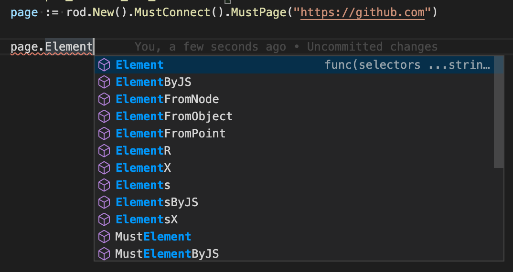

# Seletores

Cajado fornece muitos métodos para obter elementos. Seus nomes são todos prefixados com `MustElement` ou `Elemento`. Se usar um IDE depois de digitar um `Elemento`, verá todos os seletores disponíveis como abaixo:



Se você passar o cursor sobre o método, você verá o documento como abaixo:


Normalmente, você só precisa de algum conhecimento básico do [Seletor CSS](css-selector) para alcançar a tarefa de automação que você deseja fazer. No resto da documentação, só usaremos o Seletor CSS para obter elementos da página.

## Por conteúdo de texto

Use o `ElementR` para combinar elementos com conteúdo de texto específico, como selecionar a entrada de pesquisa na imagem abaixo:


```go
page.MustElementR("input", "Search or jump")
page.MustElementR("input", "/click/i") // use a flag insensível ao caso "i"
```

Como usamos [js regex](https://developer.mozilla.org/en-US/docs/Web/JavaScript/Reference/Global_Objects/RegExp), não precisamos corresponder ao contexto do texto inteiro. O texto correspondente é o que você realmente vê no site, não o código-fonte, compare 1 e 2 na captura de tela abaixo. Você pode usar o `copiar` auxiliar em Devtools para copiar o texto para a sua área de transferência (veja o 4):


## Por XPath

O seletor CSS é a forma recomendada para os elementos seletores, como você não pode usar XPath para selecionar [renderizado texto](https://stackoverflow.com/questions/51992258/xpath-to-find-pseudo-element-after-in-side-a-div-element-with-out-any-content/51993454). Mas às vezes o XPath pode ser um handier para programadores que vêm de outras línguas. Use o `ElementX` para XPath:

```go
page.MustElementX("//h2")
```

## Por Javascript

Se você tem uma consulta complexa ou quer usar um mecanismo de consulta de alto nível, como [jQuery](https://jquery.com/):

```go
page.MustElementByJS(`jQuery('opção:selected')[0]`)
```

Na verdade, se você verificar o código-fonte de outros seletores, como `Elemento` ou `ElementR`, todos eles são baseados em `ElementByJS`, e `ElementByJS` é baseado na página `. avalie`, para mais detalhes sobre como avaliar js, verifique o [Runtime Javascript](/javascript-runtime.md). Geralmente, você usa `ElementByJS` para criar seu próprio seletor para estender a Rod.

## Selecione a lista de elementos

Os nomes dos métodos para obter múltiplos elementos são todos prefixados com `MustElements` ou `Elementos`. Uma diferença de chave entre um seletor único e um seletor é o seletor único esperará que o elemento apareça. Se um multi-seletor não encontrar nada, retornará uma lista vazia imediatamente.

## Árvore de elementos Poligonal

Há também alguns seletores úteis para selecionar elementos dentro ou ao redor de um elemento, tal como `MustPai`, `MustNext`, `MustPrevious`, etc.

Aqui está um exemplo de como usamos vários seletores para recuperar o conteúdo de uma página:

```go
// Na página awesome-go, encontrando o setor de seção especificado,
// e recuperando os projetos associados da página.
func main() {
    página := rod.New().MustConnect().MustPage("https://github.com/avelino/awesome-go")

    seção := page.MustElementR("p", "Selenium e ferramentas de controle do navegador"). ustNext()

    // Obtém elementos filhos de um elemento
    projetos := seção. ustElements("li")

    for _, projeto := projetos de intervalo {
        link := projeto. ustElement("a")
        log. rintf(
            "projeto %s (%s): '%s'",
            link. ustText(),
            link. ustProperty("href"),
            projeto. ustText(),
        )
    }
}
```

## Obter elementos de iframes

Por exemplo, queremos obter o botão dos iframe aninhados:


O código vai se parecer com:

```go
frame01 := page.MustElement("iframe").MustFrame()
iframe02 := iframe01.MustElement("iframe").MustFrame()
frame02.MustElement("button")
```

## Elementos de pesquisa

Há outro poderoso auxiliar para obter elementos, o `dever Procurar`. É menos preciso do que os seletores mencionados acima, mas é útil se você quiser obter elementos de iframes aninhados profundamente ou sombras.

A funcionalidade é a mesma que a [Busca por nós do Devtools,](https://developers.google.com/web/tools/chrome-devtools/dom#search), você pode usá-la para descobrir qual palavra-chave usar para selecionar o elemento que você quiser, como a captura de tela abaixo:


Para obter o mesmo elemento do [Obter elementos de iframes](#get-elements-from-iframes), podemos simplesmente codificar assim:

```go
page.MustSearch("botão")
```

## Seletores de corrida

Rod encoraja automação sem sono para reduzir a bondade. Quando uma ação tem vários resultados, não usamos sono para esperar que a página redirecione ou resolva. Por exemplo, quando fazemos o login em uma página, a senha talvez incorreta, queremos lidar com o sucesso e a falha separadamente. Devemos evitar o código como abaixo:

```go
func main() {
    página := rod.New().MustConnect().MustPage("https://leetcode.com/accounts/login/")

    page.MustElement("#id_login").MustInput("username")
    page.MustElement("#id_password").MustInput("password").MustPress(input.Enter)

    time.Sleep(10 * time.Second) // Por favor, evite o uso do time.Sleep!

    if page.MustHas(". av-user-icon-base") {
        // imprime o nome de usuário após login com sucesso
        fmt. rintln(*el.MustAttribute("title"))
    } senão se página. ustHas("[data-cy=sign-in-error]") {
        // quando nome de usuário ou senha errados
        fmt. rintln(el.MustText())
    }
}
```

Em vez disso, devemos programar isto:

```go
func main() {
    página := rod.New().MustConnect().MustPage("https://leetcode.com/accounts/login/")

    page.MustElement("#id_login").MustInput("nome")
    página. ustElement("#id_password").MustInput("senha").MustPress(input.Enter)

    // Continuará fazendo sondagem até que um seletor tenha encontrado uma correspondência
    page.Race().Element(". av-icone-usuário-base").Manutenção(função(e *rod. lement) {
        // imprime o nome de usuário após login com sucesso
        fmt. rintln(*e.MustAttribute("title"))
    }). lement("[data-cy=sign-in-error]").MustHandle(func(e *rod. lement) {
        // quando nome de usuário ou senha
        errados(e. ustText())
    }).MustDo()
}
```
