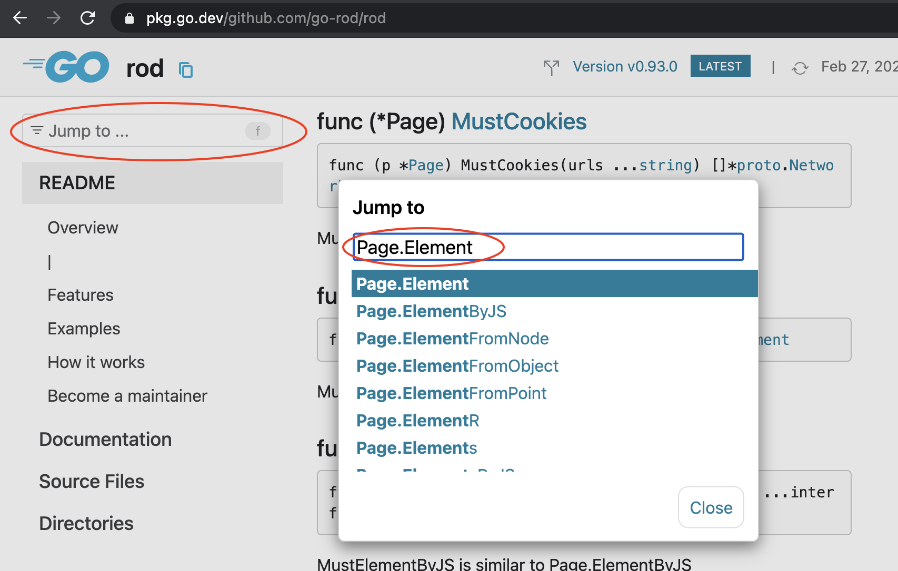

# ЧАВО

## Как искать символы в комментариях или документах?

Например, символ `Page.Element` , отображаемый на скриншоте экрана:

Вы можете перейти к нему, найдя его отсюда (сочетание клавиш `F`):

Для опытных разработчиков ознакомьтесь с [терминологией](https://github.com/go-rod/rod/blob/master/.github/CONTRIBUTING.md#terminology).
