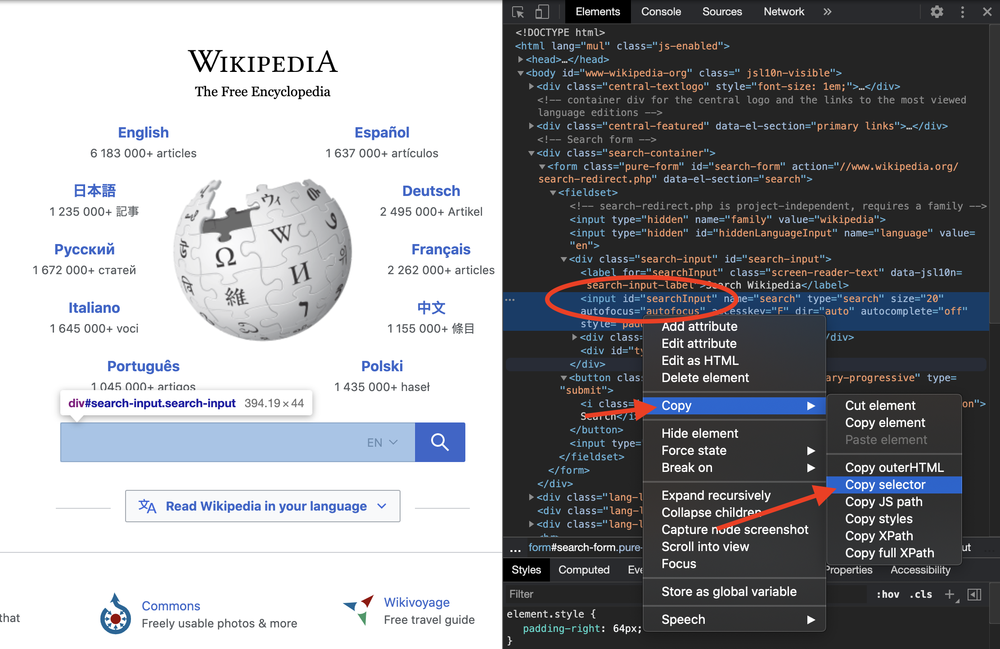
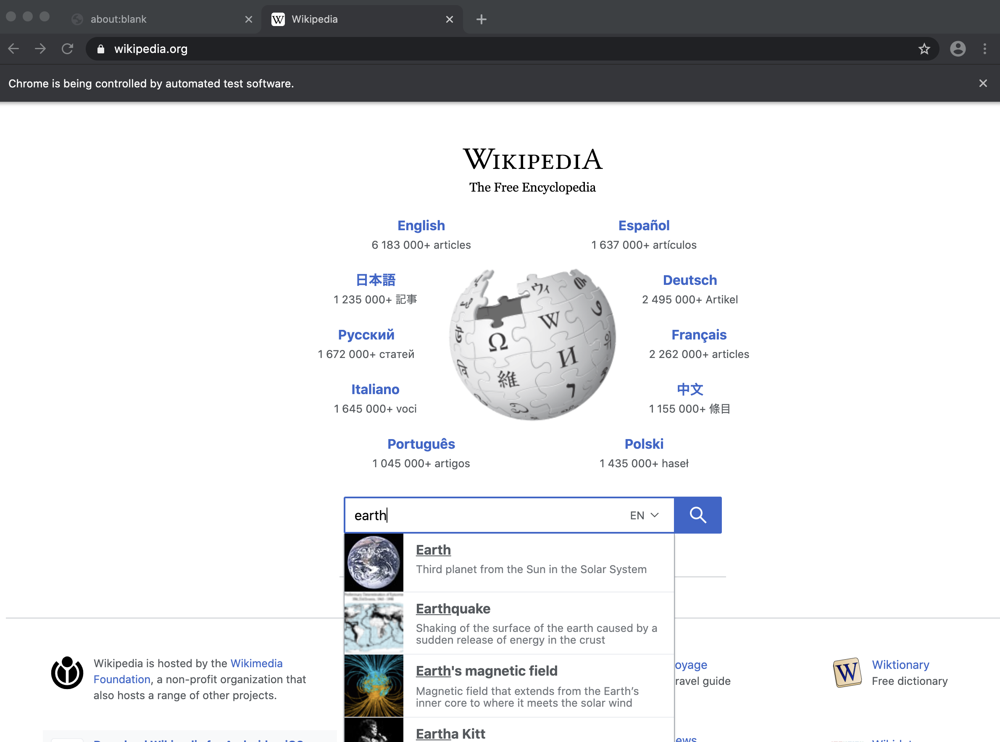
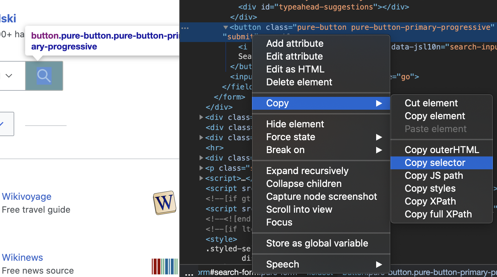

# Kom igång med Rod

## Krav

[Golang](https://golang.org/) är det enda kravet, du behöver inte ens veta något om HTML.

Om du aldrig har använt Golang, [installera](https://golang.org/doc/install) det och du kan bemästra det i timmar: [En rundtur på Go](https://tour.golang.org/welcome).

## Första programmet

Vi använder Rod för att öppna en sida och ta en skärmdump av den, först skapa en "main.go"-fil med innehållet nedan:

```go
package main

import "github.com/go-rod/rod"

func main() {
    sida := rod.New().MustConnect().MustPage("https://www.wikipedia.org/")
    sida.MustWaitLoad().MustScreenshot("a.png")
}
```

`rod.New` skapar ett webbläsarobjekt, `MustConnect` startar och ansluter till en webbläsare. `MustPage` skapar ett sidobjekt, det är som en sidflik i webbläsaren. `MustWaitLoad` väntar på att sidan är laddad. `MustScreenshot` tar en skärmdump av sidan.

Skapa en modul:

```bash
gå env -w GOPROXY=https://goproxy.io,direct
go mod init learn-rod
go mod städa
```

Kör modulen:

```bash
gå kör.
```

Programmet kommer att skriva ut en skärmdump "a.png" som den nedan:


## Se vad som är under huven

För seniora utvecklare kan du hoppa över alla och läsa den här filen: [länk](https://github.com/go-rod/rod/blob/master/examples_test.go).

Som standard inaktiverar Rod webbläsarens UI för att maximera prestandan. Men när vi utvecklar en automationsuppgift brukar vi bry oss mer om hur enkelt det är att felsöka. Rod tillhandahåller många lösningar som hjälper dig att felsöka koden.

Låt oss skapa en ".rod"-konfigurationsfil under den aktuella arbetskatalogen. Innehållet är:

```txt
visa
```

Det betyder "visa webbläsaren UI i förgrunden". Innan vi kör modulen igen, låt oss lägga till `tid.Sleep(tid. vår)` till slutet koden så att det inte blir för snabbt för våra ögon att fånga den, koden för "main. o" blir nu:

```go
package main

import (
    "time"

    "github.com/go-rod/rod"
)

func main() {
    page := rod.New().MustConnect().MustPage("https://www.wikipedia.org/")
    sida.MustWaitLoad().MustScreenshot("a.png")
    time.Sleep(time.Hour)
}
```

Om du kör modulen igen, bör du se en webbläsare så här:


Tryck [CTRL + C](https://en.wikipedia.org/wiki/Control-C) på tangentbordet för att stoppa programmet.

## Inmatning och klicka

Låt oss automatisera webbplatsen för att söka i sökordet "jord". En webbplats kan ha många inmatningsfält eller knappar, vi måste tala om för programmet vilken som ska manipuleras. Vanligtvis använder vi [Devtools](https://developers.google.com/web/tools/chrome-devtools/) för att hjälpa oss att hitta det element vi vill kontrollera. låt oss lägga till en ny konfiguration till ".rod" filen för att aktivera Devtools, nu blir det:

```txt
show
devtools
```

Kör "main". o" igen, flytta musen till inmatningsfältet och högerklicka på ovanför det, du kommer att se den sammanhangsberoende menyn och klicka sedan på "inspektera":


Du bör se `<indata id="searchInput` som nedan:



Högerklicka för att kopiera [css-väljaren](css-selector.md) som bilden ovan. Innehållet på ditt urklipp kommer att vara "#searchInput". Vi kommer att använda den för att hitta -elementet för att mata in nyckelordet. Nu blir "main.go":

```go
paket main

import (
    "time"

    "github. om/go-rod/rod"
)

func main() {
    sida := rod.New().MustConnect().MustPage("https://www.wikipedia. rg/").MustWindowFullscreen()

    sida.MustElement("#searchInput").MustInput("earth")

    sida.MustWaitLoad().MustScreenshot("a.png")
    tid.Sleep(time.Time)
}
```

`MustWindowFullscreen` ändrar storlek på webbläsarfönstret för att göra det lättare att felsöka. Vi använder `MustElement` och väljaren vi kopierade från Devtools panelen för att få det element vi vill manipulera. `MustElement` kommer automatiskt att vänta tills elementet visas, så vi behöver inte använda `MustWaitLoad` innan det. Sedan kallar vi `MustInput` för att mata in sökordet "jord" i det. Om du ringer om "main.go", bör du se resultatet se ut som nedan:



Liknande inmatningsfältet låt oss högerklicka på knappen Sök för att kopiera väljaren för det:




Lägg sedan till kod för att klicka på sökknappen, nu ser "main.go" ut som:

```go
package main

import "github.com/go-rod/rod"

func main() {
    page := rod.New().MustConnect().MustPage("https://www.wikipedia.org/").MustWindowFullscreen()

    sida.MustElement("#searchInput").MustInput("earth")
    sida.MustElement("#search-form > fieldset > knapp").MustClick()

    sida.MustWaitLoad().MustScreenshot("a.png")
}
```

Om vi ringer om modulen kommer "a.png" att visa sökresultatet:


## Långsam rörelse och visuell spårning

Den automatiserade verksamheten är för snabb för mänskliga ögon att fånga, för att felsöka dem vi vanligtvis aktivera slow-motion och visuella spår-konfigurationer, låt oss uppdatera ". od" fil:

```txt
visa
slow=1s
spår
```

Sedan omdirigera modulen, nu varje åtgärd nu kommer att vänta i 1 sekund innan dess utförande. På sidan kommer du att se felsökningsspårningen som genereras av Rod enligt nedan:


Som du kan se på sökknappen, kommer Rod att skapa en mock muspekare.

På konsolen ser du spårningsloggen som nedan:

```txt
[rod] 2020/11/11 11:11:11 [eval] {"js":"rod.element","params":["#searchInput"]}
[rod] 2020/11/11 11:11:11 [eval] {"js":"stav. överlåtbart", this":"input#searchInput"}
[rod] 2020/11/11 11:11:11 [input] scrolla till vy
[rod] 2020/11/11 11:11:11 [input] input earth
[rod] 2020/11/11 11:11:11 [eval] {"js":"stav. lement","params":["#search-form > fieldset > button"]}
[rod] 2020/11/11 11:11:11 [eval] {"js":"rod.visible","this":"button.pure-knapp. ure-button-primary-progressive"}
[rod] 2020/11/11 11:11:11 [input] scrolla till vy
[rod] 2020/11/11 11:11:11 [input] vänster klicka
```

## Annat än ".rod"-filen

Den ". od" fil är bara en genväg för vissa vanliga API, kan du också manuellt ställa in dem i kod, såsom "långsam", koden för att ställa in det är som `stav. ew().SlowMotion(2 * time.Second)`. Du kan också använda en -miljövariabel för att ställa in den, till exempel på Mac eller Linux: `rod=show go main.go`.

## Hämta textinnehåll

Rod ger massor av praktiska metoder för att hämta innehållet från sidan.

Vi försöker få beskrivningen av jorden, använda samma teknik som vi tidigare använde för att kopiera väljaren från Devtools:


Metoden vi använder är `MustText`, här är den fullständiga koden för det:

```go
paket main

import (
    "fmt"

    "github. om/go-rod/rod"
)

func main() {
    sida := stav. ew().MustConnect().MustPage("https://www.wikipedia.org/")

    sida.MustElement("#searchInput"). ustInput("earth")
    sida.MustElement("#search-form > fieldset > button").MustClick()

    el := sida. ustElement("#mw-content-text > div.mw-parser-output > p:nth-child(6)")
    fmt.Println(el.MustText())
}
```

Om vi återger modulen bör vi se konsolen utmatar något liknande:

```txt
Jorden är den tredje planeten från solen och det enda astronomiska objektet som är känt för att hysa livet.
...
```

## Hämta bildinnehåll

Samma som får text kan vi också få bilder från sidan, låt oss få väljaren av jordbilden och använda `MustResource` för att få binären av bilden:


Den fullständiga koden är:

```go
package main

import (
    "github.com/go-rod/rod"
    "github. om/go-rod/rod/lib/utils"
)

func main() {
    page := rod. ew().MustConnect().MustPage("https://www.wikipedia.org/")

    sida.MustElement("#searchInput").MustInput("earth")
    sida. ustElement("#search-form > fieldset > button").MustClick()

    el := page.MustElement("#mw-content-text > div.mw-parser-output > tabell. nfobox > tbody > tr:nth-child(1) > td > a > img")
    _ = utils. utputFile("b.png", el.MustResource())
}
```

Utdatafilen "b.png" bör vara:


