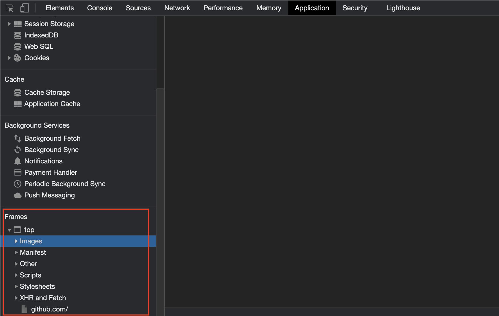

# Sidans resurser

Du kan använda metoden `Sida.GetResource` för att hämta filer från här:



Som att få en bild:

```go
bin, err := page.GetResource("https://test.com/a.png")
```

## Element resurs

Du kan också använda metoden `Element.Resource` för att hämta filen `src` attributet. Såsom för elementet ``, kan du använda koden så här för att få `a.jpg`:

```go
bin := sida.MustElement("img").MustResource()
```
