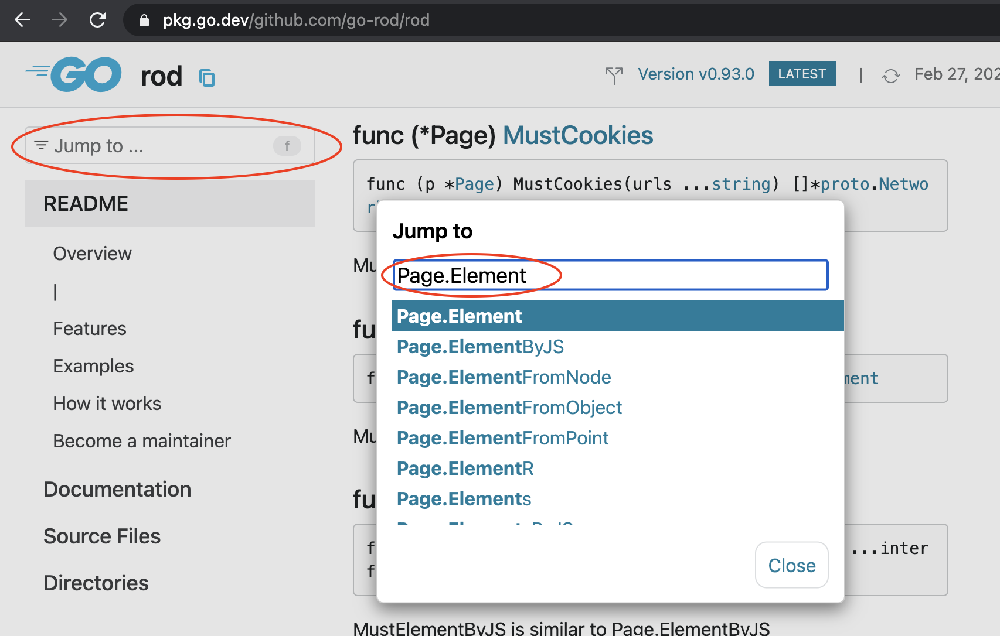

# ЧАП

## Як шукати символи в коментарях або документації?

Такий, як символ `Page.Element` показаний на скріншоті:

Для цього ви можете перейти до нього, шукаючи його звідси (ярлик клавіатури `F`):

Для досвідчених розробників перевірте [Terminology](https://github.com/go-rod/rod/blob/master/.github/CONTRIBUTING.md#terminology).
