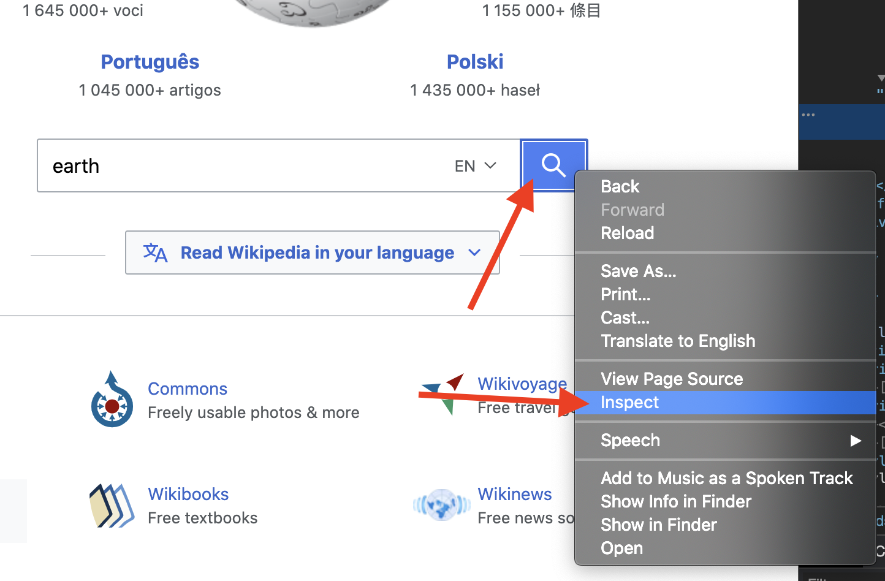

# Початок роботи з палицею

## Вимоги

[Golang](https://golang.org/) є єдиною вимогою, вам навіть не потрібно нічого знати про HTML.

Якщо ви ніколи не використовували Golang, [встановіть](https://golang.org/doc/install) його і можете промайструвати його за години: [Потурка Go](https://tour.golang.org/welcome).

## Перша програма

Давайте використаємо Rod для того, щоб відкрити сторінку і зробити знімок екрану, спочатку створіть файл "main.go" із вмістом нижче:

```go
пакет головний

імпорт "github.com/go-rod/rod"

func main() {
    page := rod.New().MustConnect().MustPage("https://www.wikipedia.org/")
    page.MustWaitLoad().MustScreenshot("a.png")

```

`rod.New` створює об'єкт браузера, `MustConnect` запускається та підключається до браузера. The `MustPage` create a page object, це як вкладка сторінки у браузері. Спроба `MustWaitLoad` чекати поки сторінка повністю завантажена. `MustScreenshot` робить знімок екрана сторінки.

Створити модуль:

```bash
go env -w GOPROXY=https://goproxy.io,direct
перейти по моду init learn-rod
перейдіть на tidy
```

Запустити модуль:

```bash
запустити.
```

Програма виведе знімок екрана "a.png", як нижче:


## Перегляньте, що в капоті

Для старих розробників ви можете пропустити все і прочитати цей файл: [посилання](https://github.com/go-rod/rod/blob/master/examples_test.go).

За замовчуванням Rod відключає інтерфейс браузера для максимізації продуктивності. Але при розробці завдання для автоматизації, яке ми зазвичай більше дбаємо про легкість налагодження. Тяжка надає безліч рішень, що допоможе вам налагодити код.

Давайте створимо файл конфігурації ".rod" під поточним робочим каталогом. Зміст:

```txt
показати
```

Це означає "показати інтерфейс браузера на передньому плані". Перед тим, як запустити цей модуль, давайте додамо туди `тайм-сн. (час. наш)` до кінця коду, щоб він не був занадто швидким для наших очей, щоб впіймати його, код "main. o" тепер стає:

```go
пакет головний

імпорт (
    "час"

    "github.com/go-rod/rod"
)

func main() {
    сторінка := rod.New().MustConnect().MustPage("https://www.wikipedia.org/")
    page.MustWaitLoad().MustScreenshot("a.png")
    час.Sleep(time.Hour)

```

Якщо ви знову запустите цей модуль, ви повинні побачити браузер на зразок цього:


Натисніть [CTRL + C](https://en.wikipedia.org/wiki/Control-C) на клавіатурі, щоб зупинити програму.

## Ввід та клік

Автоматизуймо веб-сайт для пошуку за ключовим словом "earth". У веб-сайту може бути багато полів або кнопок, ми повинні повідомити програмі з якою потрібно маніпулювати. Зазвичай ми використовуємо [розробник](https://developers.google.com/web/tools/chrome-devtools/) , щоб допомогти нам знайти елемент, який ми хочемо керувати. давайте підключимо новий файл конфігурації до файлу ".rod", щоб увімкнути інструменти пристроїв, тепер він стає:

```txt
show
devtools
```

Запустіть "осн. o" знову перемістіть курсор миші на поле введення і клацніть правою кнопкою миші над ним, ви побачите контекстне меню. Далі натисніть кнопку "інспектувати":


Ви повинні побачити `<вводу id="searchInput` , як показано нижче:


Клацніть правою кнопкою миші, щоб скопіювати [css селектор](css-selector.md) подібний до зображення вище. Вміст ваш буфер обміну буде "#searchInput". Ми будемо використовувати його, щоб знайти елемент для введення ключового слова. Тепер стає "main.go":

```go
імпорт основного

(
    "час"

    "github. om/go-rod/rod"
)

func main() {
    page := rod.New().MustConnect().MustPage("https://www.wikipedia. rg/").MustWindowFullscreen()

    page.MustElement("#searchInput").MustInput("earth")

    page.MustWaitLoad().MustScreenshot("a.png").
    тайм(и.Sleep(time.Hour)

```

`Режим MustWindowFullscreen` змінює розмір вікна браузера, щоб полегшити налагодження. Ми використовуємо `MustElement` і селектор, який ми скопіювали з панелі Devtools , щоб отримати елемент, який ми хотіли б маніпулювати. `Механізм` буде автоматично чекати поки не з'явиться цей елемент, тому нам не потрібно використовувати `MustWaitLoad` перед ним. Потім ми називаємо `Потужність` ввести в нього ключове слово "земля". Якщо вам потрібно перезапустити "main.go", ви повинні побачити, що результат виглядає нижче:


Подібно до поля вводу, давайте правою кнопкою пошуку , щоб скопіювати селектор для нього:




Потім додайте код, щоб натиснути кнопку пошуку, тепер вигляд "main.go" виглядає так:

```go
пакет головний

імпорт "github.com/go-rod/rod"

func main() {
    page := rod.New().MustConnect().MustConnect().MustPage("https://www.wikipedia.org/").MustWindowFullscreen()

    page.MustElement("#searchInput").MustInput("Земля ")
    сторінки.MustElement("MustElement') форму > fieldset > button").MustClick()

    page.MustWaitLoad().MustScreenshota.("png
}
```

Якщо ми об'єднаємо модуль, то дані "a.png" покажуть результат пошуку:


## Повільний рух і візуальний трасування

Автоматизовані операції занадто швидко, щоб їх можна було втягнути, для налагодження їх, як правило, вмикаємо повільний рух та візуальні налаштування трасування (натисніть ")". od" файл:

```txt
вивести
повільний шлях

```

Потім rerun модуль, тепер кожна дія тепер буде чекати на 1 секунду до його виконання. На сторінці ви побачите відлагодження, згенерований Rod наступним чином:


Як бачите на кнопці пошуку, Роуд створить показ курсорів миші.

На консолі ви побачите журнал слідів, як показано нижче:

```txt
[rod] 2020/11/11 11:11:11 [eval] {"js":"rod.element","params":["#searchInput"]}
[rod] 2020/11/11 11:11:11 [eval] {"js":"rod.visible","this":"input#searchInput"}
[rod] 2020/11/11 11:11:11 [input] scroll into view
[rod] 2020/11/11 11:11:11 [input] input earth
[rod] 2020/11/11 11:11:11 [eval] {"js":"rod.element","params":["#search-form > fieldset > button"]}
[rod] 2020/11/11 11:11:11 [eval] {"js":"rod.visible","this":"button.pure-button.pure-button-primary-progressive"}
[rod] 2020/11/11 11:11:11 [input] scroll into view
[rod] 2020/11/11 11:11:11 [input] left click
```

## Крім файлу ".rod"

Це ". od" файл є просто скороченням для деяких часто використовуваних API, ви можете також вручну встановити їх в коді, наприклад "повільно", код встановити його як `паличок. ew().SlowMotion(2 * секунда)`. Ви також можете використовувати змінну середовища, наприклад на Mac або Linux: `rod=show go main.go`.

## Отримати вміст тексту

Стежка надає безліч зручних методів для отримання вмісту з сторінки.

Давайте спробуємо отримати опис Землі, застосовуємо ту саму техніку, яку ми раніше використовували для копіювання селектора з інструментів розробника:


Метод, який ми використовуємо це `Довгий текст`, ось повний код додатка:

```go
пакет головний імпорт

(
    "fmt"

    "github. om/go-rod/rod"
)

func main() {
    page := rod. ew().MustConnect().MustPage("https://www.wikipedia.org/")

    page.MustElement("#searchInput"). ustInput("earth")
    сторінка.MustElement("#search-form > fieldset > button").MustClick()

    el := сторінка. ustElement("#mw-content-text > div.mw-parser-output > p:nth-child(6)")
    fmt.Println(el.MustText())
}
```

Якщо ми переправимо модуль, ми повинні бачити консоль виходів, щось на зразок:

```txt
Земля - третя планета з Сонця і єдиний астрономічний об'єкт, який може утримувати життя.
...
```

## Отримати вміст зображення

Так само, як і отримати текст, ми також можемо отримати зображення зі сторінки, візьмемо селектор зображення Землі і використаємо `Межа Ресурсів` , щоб отримати двійковий файл зображення:


Повний код:

```go
package main

import (
    "github.com/go-rod/rod"
    "github.com/go-rod/rod/lib/utils"
)

func main() {
    page := rod.New().MustConnect().MustPage("https://www.wikipedia.org/")

    page.MustElement("#searchInput").MustInput("earth")
    page.MustElement("#search-form > fieldset > button").MustClick()

    el := page.MustElement("#mw-content-text > div.mw-parser-output > table.infobox > tbody > tr:nth-child(1) > td > a > img")
    _ = utils.OutputFile("b.png", el.MustResource())
}
```

Вихідний файл "b.png" повинен бути:


