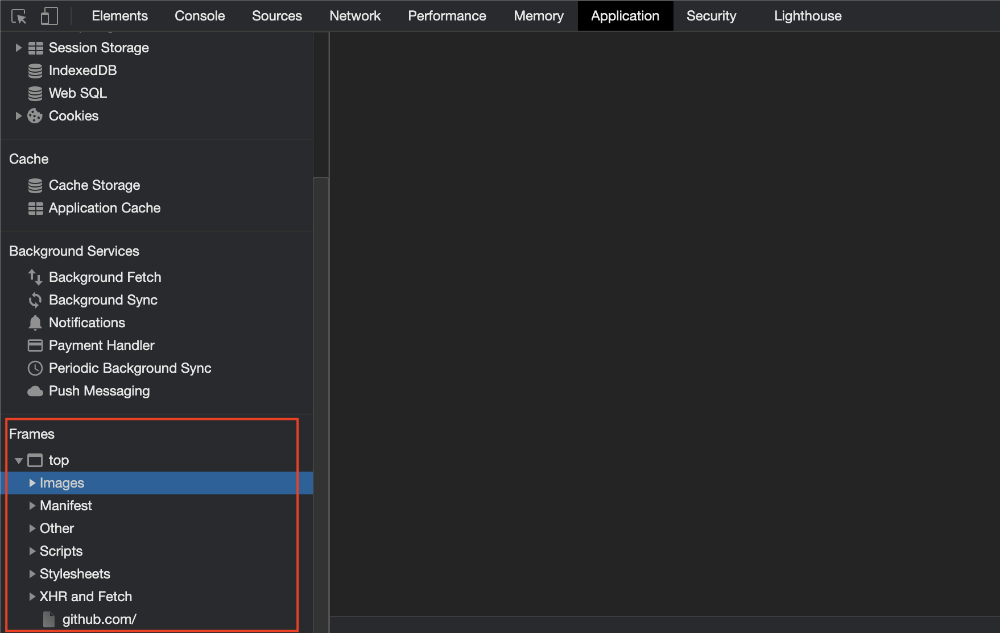

# Ресурси сторінки

Ви можете використати метод `Page.GetResource` для отримання файлів звідси:



Такі, як отримати зображення:

```go
bin, err := page.GetResource("https://test.com/a.png")
```

## Елементний ресурс

Ви також можете використати `Елемент.Ресурс` метод отримання файлу з `src` атрибуту. Такий як для елемента ``, ви можете використовувати код, як це, щоб отримати `a.jpg`:

```go
bin := page.MustElement("img").MustResource()
```
