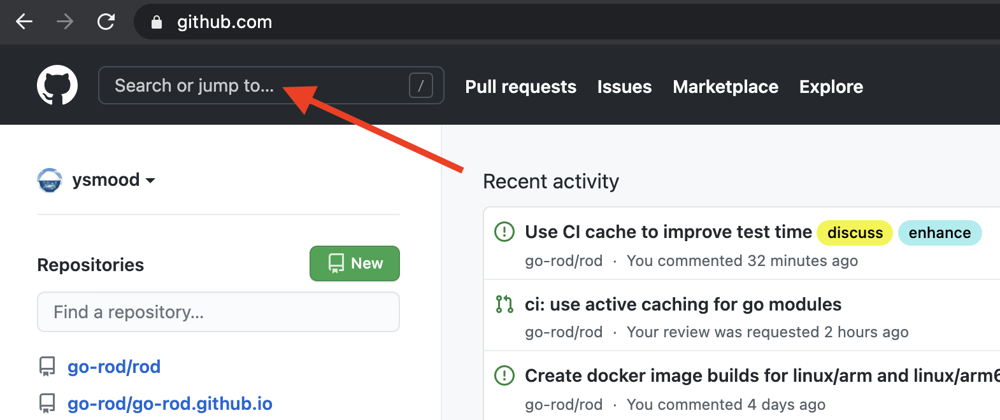

# Селектори

Тяга надає багато методів для отримання елементів. Їх всі вони були попередньо зафіксовані на `MustElement` or `Element`. Якщо ви використовуєте IDE після введення `елемента`, ви побачите всі доступні селектори як нижче:


Якщо ви наведете курсор на метод, то побачите крапку нижче:


Зазвичай вам потрібні лише деякі базові знання [CSS селектор](css-selector) для досягнення завдання автоматизації, яке ви хочете зробити. В іншій частині документації ми будемо використовувати лише CSS селектор для отримання елементів на сторінці.

## За вмістом тексту

Використовуйте `Елемент` для відповідності елементам із зазначеним текстовим вмістом, наприклад вибирати на скріншоті нижче:



```go
page.MustElementR("input", "Шукати або jump")
page.MustElementR("input", "/click/i") // використовувати вказаний регістр нечутливий прапор "i"
```

Оскільки ми використовуємо [js регулярний вираз](https://developer.mozilla.org/en-US/docs/Web/JavaScript/Reference/Global_Objects/RegExp), нам не потрібно відповідати будь-якому текстовому контексту. Текст для матчу - це те, що ви бачите на веб-сайті, а не початковий код, порівняйте 1 та 2 на скріншоті нижче. Ви можете використовувати `копіювати` помічника в інструментах пристрою, щоб скопіювати текст у ваш буфер обміну (подивіться на 4):


## Від XPath

CSS селектор є рекомендованим способом вибору елементів, таких як ви не можете використовувати XPath для вибору [тексту](https://stackoverflow.com/questions/51992258/xpath-to-find-pseudo-element-after-in-side-a-div-element-with-out-any-content/51993454). Але іноді XPath може бути прихильником програмістів, які йдуть з інших мов. Використовуйте `ElementX` для XPath:

```go
page.MustElementX("//h2")
```

## За Javascript

Якщо у вас є складний запит або ви хочете використовувати двигун запиту високого рівня, наприклад [jQuery](https://jquery.com/):

```go
page.MustElementByJS(`jQuery('option:selected')[0]`)
```

Насправді, якщо ви перевіряєте вихідний код інших селекторів, таких як `елемент` або `елемент`, всі вони засновані на `ElementByJS`, та `ElementByJS` засновані на `Сторінці. оцініть`, для більш детальної інформації про те, як обчислити js, перевірте [JavaScript Runtime](/javascript-runtime.md). Зазвичай ви використовуєте `ElementByJS` для створення власного селектора для розширення роду.

## Виберіть список елементів

Назви методів для отримання декількох елементів є попередньо визначеними за допомогою `MustElements` or `елементів`. Одна відмінність ключів між односелектором і мультиселектором - це єдиний селектор, який буде чекати на вказаний елемент . Якщо мультиселектор нічого не знайде, він негайно поверне порожній список.

## Дерево травертів

Також є кілька зручних селекторів для вибору елементів всередині або навколо елементу, таких як `символ`, `MustNext`, `MustPrevious`, і т. д.

Ось приклад того, як ми використовуємо різні селектори, щоб отримати вміст на сторінці:

```go
// На сторінці прекрасного пішла знайти вказаний сект
// та отримати пов'язані проекти зі сторінки.
func main() {
    сторінка := rod.New().MustConnect().MustPage("https://github.com/avelino/awesome-go")

    розділ := page.MustElementR("p", "Selenium та засоби керування браузером"). ustNext()

    // отримати дочірні елементи елемента
    проектів := section. ustElements("li")

    для _, проекту := діапазон проектів {
        link := проект. ustElement("a")
        журнал. rintf(
            "проект %s (%s): '%s'",
            посилання. ustText(),
            посилання. ustProperty("href"),
            проект. ustText(),
        )
    }
}
```

## Отримати елементи з iframes

Наприклад, ми хочемо отримати кнопку з вкладених iframe:


Код буде виглядати так:

```go
frame01 := page.MustElement("iframe").MustFrame()
iframe02 := iframe01.MustElement("iframe").MustFrame()
frame02.MustElement("button")
```

## Пошук елементів

Є інший потужний помічник для отримання елементів, `MustSearch`. Це менш точно, ніж вищезгадані селектори , але це дуже зручно, якщо бажаєш отримати елементи з глибоких вкладених iframe або тіньових доменів.

Ця функціональність така ж, як [пошук інструментів інструментів для вузлів](https://developers.google.com/web/tools/chrome-devtools/dom#search), ви можете використати його, щоб дізнатися, яке ключове слово для використання для вибору бажаного елементу, , як знімок нижче:


Щоб отримати той самий елемент з [Отримайте елементи з iframes](#get-elements-from-iframes), ми можемо просто написати наступний код:

```go
page.MustSearch("button")
```

## Селектори на Рейсі

Род заохочує до безсонних автоматизацій, щоб зменшити рівень яскравості. Якщо дія має декілька результатів, ми не використовуємо сон для очікування сторінки для перенаправлення або налаштування вниз. Наприклад, коли ми заходимо на сторінку, пароль може бути невірним, ми хочемо впоратися з успішними та помилками окремо. Нам слід уникати коду як нижче:

```go
func main() {
    сторінка := rod.New().MustConnect().MustPage("https://leetcode.com/accounts/login/")

    page.MustElement("#id_login").MustInput("username")
    page.MustElement("#id_password").MustInput("password").MustPress(input.Enter)

    time.Sleep(10 * Second) // Будь ласка, уникніть використання разів!

    якщо сторінка MustHas(". av-user-icon-base") {
        // виведіть ім'я користувача після успішного входу
        fmt. rintln(*el.MustAttribute("title"))
    } else якщо сторінка. ustHas("[data-cy=sign-in-error]") {
        // коли неправильне ім'я користувача або пароль
        fmt. rintln(el.MustText())
    }

```

Замість цього ми маємо програмувати наступним чином:

```go
func main() {
    сторінка := rod.New().MustConnect().MustPage("https://leetcode.com/accounts/login/")

    page.MustElement("id_login").MustInput("ім'я")
    сторінка. ustElement("#id_password").MustInput("password").MustPress(input.Enter)

    // Це зберігатиме опитування, поки один селектор не знайде збіг
    page.Race().Element(". av-user-icon-base").MustHandle(func(e *rod. lement) {
        // виведіть ім'я користувача після успішного входу
        fmt. rintln(*e.MustAttribute("title"))
    }). lement("[data-cy=sign-in-error]").MustHandle(func(e *rod. lement) {
        // коли невірне ім'я користувача або пароль
        паніка (e. ustText())
    }).MustDo()
}
```
