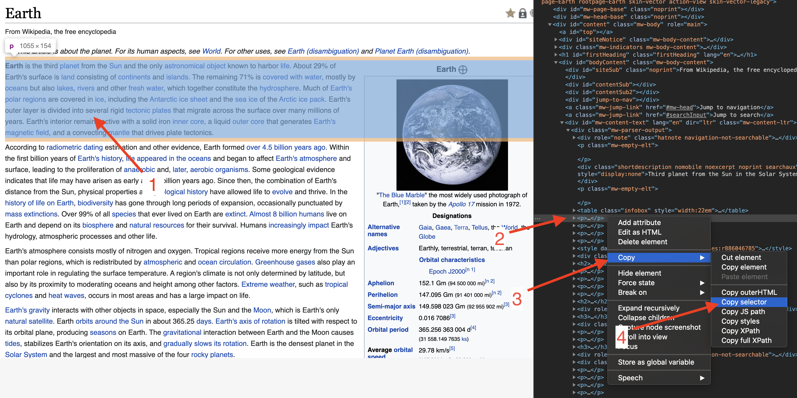

# 开始使用 Rod

## 依赖

[Golang](https://golang.org/) 是唯一的依赖，你甚至完全不需要了解 HTML。

如果你从未使用过 Golang，可以依照[这篇文档](https://golang.org/doc/install)安装 Golang，并通过[这个网站](https://tour.golang.org/welcome)在几个小时内掌握它。

## 第一个程序

让我们使用 Rod 来打开一个网页并获取它的截图。首先创建 "main.go"，并在其中输入以下内容：

```go
package main

import "github.com/go-rod/rod"

func main() {
    page := rod.New().MustConnect().MustPage("https://www.wikipedia.org/")
    page.MustWaitLoad().MustScreenshot("a.png")
}
```

`rod.New` 用于创建浏览器对象，而 `MustConnect` 则会启动并连接到浏览器。 `MustPage` 会创建一个页面对象（类似于浏览器中的一个标签页）。 `MustWaitLoad` 表示会一直等待直到页面加载完毕。 `MustScreenshot` 会获取页面的截图。

创建一个 module：

```bash
go mod init learn-rod
```

运行这个 module：

```bash
go run .
```

程序会输出如下的一张截图 "a.png"。


## 了解发生了什么

对于有经验的开发者，可以跳过这里的所有内容、阅读[这个文件](https://github.com/go-rod/rod/blob/master/examples_test.go)。

默认情况下，Rod 会禁用浏览器的 UI 来最大化性能。 但开发自动化任务时我们通常更加关心调试的难易程度。 Rod 为你提供了许多调试代码的方案。

让我们在当前工作目录下创建一个“.rod”配置文件， 内容为：

```txt
show
```

意思是“显示浏览器 UI”。 再次运行这个 module 之前，让我们在代码最后加上 `time.Sleep(time.Hour)`，这样可以保证程序不会太快结束，让我们可以看到程序的运行结果。“main.go”的代码现在变成了：

```go
package main

import (
    "time"

    "github.com/go-rod/rod"
)

func main() {
    page := rod.New().MustConnect().MustPage("https://www.wikipedia.org/")
    page.MustWaitLoad().MustScreenshot("a.png")
    time.Sleep(time.Hour)
}
```

如果再次运行这个 module，你可以看到像这样的一个浏览器：


在键盘上按 [CTRL + C](https://en.wikipedia.org/wiki/Control-C) 停止程序。

## 输入与点击

让我们控制浏览器来搜索关键词 "earth"。 一个网站可能有许多输入框和按钮。我们需要告诉程序它需要操控其中的哪一个。 通常我们会使用 [Devtools](https://developers.google.com/web/tools/chrome-devtools/) 来帮助定位我们想要控制的元素。 让我们在 ".rod" 文件中新增一行配置来启用 Devtools。现在配置文件变成了：

```txt
show
devtools
```

再次运行“main.go”。将鼠标移动到输入框，在上面右击，然后在弹出的菜单中点击“审查元素”：


你会看到如下的 `<input id="searchInput`。


如上图所示，右击复制 [css 选择器](css-selector.md)。 剪贴板中的内容会变成 "#searchInput"。 我们之后会使用它来定位用于输入关键字的元素。 现在“main.go”中的内容变为：

```go
package main

import (
    "time"

    "github.com/go-rod/rod"
)

func main() {
    page := rod.New().MustConnect().MustPage("https://www.wikipedia.org/").MustWindowFullscreen()

    page.MustElement("#searchInput").MustInput("earth")

    page.MustWaitLoad().MustScreenshot("a.png")
    time.Sleep(time.Hour)
}
```

`MustWindowFullscreen` 用于调整浏览器窗口的大小，以便调试。 我们使用 `MustElement` 与先前从 Devtools 面板复制的选择器来获取我们想要控制的元素。 `MustElement` 会自动等待直到元素出现为止，所以我们不需要在它之前使用 `MustWaitLoad`。 然后我们调用 `MustInput` 来输入关键词 "earth"。 再次运行 "main.go" 后你会看到如下的结果：


让我们用类似的方法，右击搜索按钮，复制它的选择器：


然后添加代码来点击这个搜索按钮。现在 "main.go" 的内容是：

```go
package main

import "github.com/go-rod/rod"

func main() {
    page := rod.New().MustConnect().MustPage("https://www.wikipedia.org/").MustWindowFullscreen()

    page.MustElement("#searchInput").MustInput("earth")
    page.MustElement("#search-form > fieldset > button").MustClick()

    page.MustWaitLoad().MustScreenshot("a.png")
}
```

重新运行这个 module，"a.png" 会显示搜索结果：


## 慢动作和可视化跟踪

自动化操作对人眼来说太快了，调试时我们通常会启用慢动作和可视化跟踪。让我们修改 ".rod" 文件：

```txt
show
slow=1s
trace
```

然后重新运行模块。现在每次操作都会在执行前等待 1 秒。 在页面上，你会看到 Rod 生成的如下的可视化跟踪：


如图所示，Rod 会在搜索按钮上创建一个虚拟的鼠标光标。

在控制台中，你会看到如下的跟踪日志：

```txt
[rod] 2020/11/11 11:11:11 [eval] {"js":"rod.element","params":["#searchInput"]}
[rod] 2020/11/11 11:11:11 [eval] {"js":"rod.visible","this":"input#searchInput"}
[rod] 2020/11/11 11:11:11 [input] scroll into view
[rod] 2020/11/11 11:11:11 [input] input earth
[rod] 2020/11/11 11:11:11 [eval] {"js":"rod.element","params":["#search-form > fieldset > button"]}
[rod] 2020/11/11 11:11:11 [eval] {"js":"rod.visible","this":"button.pure-button.pure-button-primary-progressive"}
[rod] 2020/11/11 11:11:11 [input] scroll into view
[rod] 2020/11/11 11:11:11 [input] left click
```

## 除 ".rod" 文件之外

".rod" 文件只是一些常用 API 的快捷方式。你也可以在代码中手动设置，比如 "slow" 可以通过 `rod.New().SlowMotion(2 * time.Second)` 这样的代码来实现。 你也可以使用环境变量来设置，比如在 Mac 或者 Linux 上：`rod=show go main.go`。

## 获取文本内容

Rod 提供了许多方便的方法来获取页面中的内容。

让我们试着来获取关于 Earth 的说明，依然和先前一样通过 Devtools 来复制 css 选择器：



我们使用的方法是 `MustText`，下面是它的完整代码：

```go
package main

import (
    "fmt"

    "github.com/go-rod/rod"
)

func main() {
    page := rod.New().MustConnect().MustPage("https://www.wikipedia.org/")

    page.MustElement("#searchInput").MustInput("earth")
    page.MustElement("#search-form > fieldset > button").MustClick()

    el := page.MustElement("#mw-content-text > div.mw-parser-output > p:nth-child(6)")
    fmt.Println(el.MustText())
}
```

重新运行，正常情况下，我们会在控制台中看到如下输出：

```txt
Earth is the third planet from the Sun and the only astronomical object known to harbor life.
...
```

## 获取图片内容

与获取文本内容一样，我们也可以从页面中获取图像。让我们找到 Earth 图像的选择器，并使用 `MustResource` 获取图像的二进制数据：


完整的代码如下：

```go
package main

import (
    "github.com/go-rod/rod"
    "github.com/go-rod/rod/lib/utils"
)

func main() {
    page := rod.New().MustConnect().MustPage("https://www.wikipedia.org/")

    page.MustElement("#searchInput").MustInput("earth")
    page.MustElement("#search-form > fieldset > button").MustClick()

    el := page.MustElement("#mw-content-text > div.mw-parser-output > table.infobox > tbody > tr:nth-child(1) > td > a > img")
    _ = utils.OutputFile("b.png", el.MustResource())
}
```

输出的文件 "b.png" 如下：


